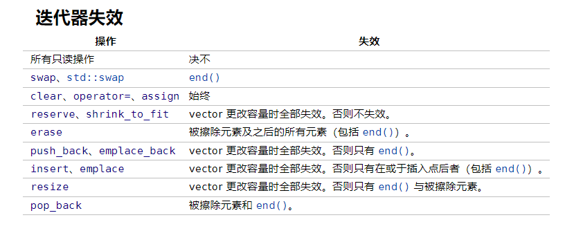

# C++ STL

## 概念

### STL六大组件及其作用

**容器**	容器就是存放各种数据的数据结构，从实现的角度上看容器就是一种类模板

**算法**	STL算法就是STL库提供的如sort、search等的实现数据处理的函数，从实现的角度上看STL算法就是一种函数模板

**迭代器**	容器与算法间的胶合剂，是所谓的“泛型指针”，是一种将operator++等指针操作予以重载的类模板

**仿函数**	行为类似函数，可作为算法的某种策略，从实现上看是重载了()的类或类模板

**配接器**	用来修饰容器/算法/仿函数接口的

**配置器**	负责空间配置与管理，从实现看配置器是实现了动态空间配置、管理、释放的类模板

### 空间配置器Allocator

**为什么是空间而不是内存**	空间不一定是内存，也可以是磁盘或其他辅助存储介质

**功能**	对给定容器的内存进行管理，内存空间的申请和释放

**allocator标准接口**

```
// 以下几种自定义类型是一种type_traits技巧，暂时不需要了解
allocator::value_type
allocator::pointer
allocator::const_pointer
allocator::reference
allocator::const_reference
allocator::size_type
allocator::difference

// 一个嵌套的(nested)class template，class rebind<U>拥有唯一成员other，那是一个typedef，代表allocator<U>
allocator::rebind

allocator::allocator() // 默认构造函数
allocator::allocator(const allocator&) // 拷贝构造函数
template <class U>allocator::allocator(const allocator<U>&) // 泛化的拷贝构造函数
allocator::~allocator() // 析构函数

// 返回某个对象的地址，a.address(x)等同于&x
pointer allocator::address(reference x) const
// 返回某个const对象的地址，a.address(x)等同于&x
const_pointer allocator::address(const_reference x) const

// 配置空间，足以存储n个T对象。第二个参数是个提示。实现上可能会利用它来增进区域性(locality)，或完全忽略之
pointer allocator::allocate(size_type n, const void* = 0)
// 释放先前配置的空间
void allocator::deallocate(pointer p, size_type n)

// 返回可成功配置的最大量
size_type allocator:maxsize() const

// 调用对象的构造函数，等同于 new((void*)p) T(x)
void allocator::construct(pointer p, const T& x)
// 调用对象的析构函数，等同于 p->~T()
void allocator::destroy(pointer p)
```

上面的标准接口实际只需要关注最后的`allocate`，`deallocate`，`construct`和`destroy`函数的实现即可。整个allocator最重要的函数就是这四个。从功能上，这四者可以简单理解为C++的`::operator new`和`::operator delete`，构造函数和析构函数，实际上，一个最简单的`allocator`就可以理解为对`new`，`delete`的简单封装,以及对构造函数和析构函数的直接调用。

## 顺序容器库

### array

**性质**	array是一个聚合类型，其语义等同于保有一个C风格数组作为其唯一非静态数据成员的结构体。与C风格数组不同，它不会自动退化成T*。他能作为聚合类型初始化，只要有至多N个能转换成T的初始化容器：std::array<int,3>a={1,2,3};

**注意**

​	1、array默认非空且进行交换的复杂度是线性的

​	2、当array长度为0时，array.begin() == array.end()有某个唯一值

​	3、在零长array上调用front()和back()是未定义的

**头文件**	`<array>`		

**模板定义**

```
template<class T,std::size_t N>
struct array;

**成员类型**
| 成员类型        | 定义              |
| --------------- | ----------------- |
| value_type      | T                 |
| size_type       | std::size_t       |
| difference_type | std::ptrdiff_t    |
| reference       | value_type&       |
| const_reference | const value_type& |
| pointer         | value_type*       |
| const_pointer   | const value_type* |
```

#### 函数

```
隐式定义的
 	构造函数：初始化array
    析构函数：销毁array每一个元素
    operator=：以来自另一个array的每个元素重写array的对应元素
```

#### 成员函数

**元素访问**

```
std::array<T,N>::at(size_type pos);	返回位于指定位置pos的元素的引用，有边界检查，若不存在抛出std::out_of_range异常
std::array<T,N>::operator[](size_type pos);	返回位于指定位置pos的元素的引用，无边界检查
std::array<T,N>::front();	返回容器首元素的引用
std::array<T,N>::back();	返回容器最后一个元素的引用

std::array<T,N>::data();	返回指向作为元素存储工作的底层数组的指针，返回的指针使得范围 [data(), data() + size()) 始终是有效范围，即使容器为空（此时 data() 不可解引用）；若size()==0，data()可能不返回空指针
```

**迭代器**

```
std::array<T,N>::begin()，std::array<T,N>::cbegin()	返回指向首元素的迭代器
std::array<T,N>::end()，std::array<T,N>::cend()	返回指向末尾元素的迭代器
std::array<T,N>::rbegin()，std::array<T,N>::crbegin()	返回指向起始的逆向迭代器
std::array<T,N>::rend()，std::array<T,N>::crend()	返回指向末尾的逆向迭代器
```

**容量**

```
std::array<T,N>::empty();	检查容器是否为空，是返回true，否则返回false
std::array<T,N>::size();	返回容器中元素个数，即std::distance(begin(),end())
std::array<T,N>::max_size();	返回可容纳元素数量的最大值，因为每个array大小固定
```

**操作**

```
std::array<T,N>::swap(array &other);	将容器内容与other交换
std::array<T,N>::fill(const T& value);	将给定值value赋给容器中的所有元素
```

#### 非成员函数

```
==;!=;<;<=;>;>=;<=>;的重载	按字典顺序比较array中的值（即逐个比较对应位置的两个array的值）//复杂度与容器大小成线性
		<=>	larr 与 rarr 中的首对不等价元素的相对顺序，如果有这种元素；否则是 larr.size() <=> rarr.size()
	
template< std::size_t I, class T, std::size_t N >
	T& get( std::array<T,N>& a ) noexcept;	从array提取第I个元素
	
template< class T, std::size_t N >
	void swap( std::array<T, N>& lhs,
    std::array<T, N>& rhs );	交换lhs和rhs两个容器内容//复杂度与容器大小成线性
```

### vector

**性质**	

​	1、std::vector是封装动态数组的顺序容器，可以连续存储元素，即不仅可以通过迭代器，也可以通过指向元素的常规指针访问元素，这意味着指向vector元素的指针能传递给任何期待指向数组元素的指针

​	2、vector的存储时自动管理，按需扩张收缩。vector通常占用多余静态数组的空间，因为要分配更多内存以管理将来的增长。

​	3、vector只在额外内存好耗尽时重分配，分配的内存总量可用capacity()查询，通过调用shrink_to_fit()返回多余的内存给系统

**操作复杂度**

​	1、随机访问	--	常数

​	2、在末尾插入或移除元素	--	均摊常数

​	3、插入或移除元素	--	与到vector结尾的距离成线性

**头文件**	`<vector>`

**模板定义**

```
template<
    class T,
    class Allocator = std::allocator<T>

> class vector;

模板形参
T	必须满足可复制赋值和可复制构造，且元素类型时完整类型并满足可擦除要求
Allocator	
	用于获取/释放内存及构造/析构内存中元素的分配器。类型必须满足分配器 (Allocator) 的要求。如果Allocator::value_type 与 T 不同，那么行为未定义 (C++20前)程序非良构(C++20起)
	
	
```

**成员类型**

| 成员类型               | 定义                                                         |
| ---------------------- | ------------------------------------------------------------ |
| value_type             | T                                                            |
| allocator_type         | Allocator                                                    |
| size_type              | 无符号整数类型（通常是 std::size_t）                         |
| difference_type        | 有符号整数类型（通常是 std::ptrdiff_t）                      |
| reference              | value_type&                                                  |
| const_reference        | const value_type&                                            |
| pointer                | Allocator::pointer(C++11 前)std::allocator_traits<Allocator>::pointer(C++11 起) |
| const_pointer          | Allocator::const_pointer(C++11 前)std::allocator_traits<Allocator>::const_pointer(C++11 起) |
| iterator               | 指向 value_type 的老式随机访问迭代器 (LegacyRandomAccessIterator) 及老式连续迭代器 (LegacyContiguousIterator)(C++20 前)指向 value_type 的老式随机访问迭代器 (LegacyRandomAccessIterator) 、contiguous_iterator 及常量表达式迭代器 (ConstexprIterator)(C++20 起) |
| const_iterator         | 指向 const value_type 的老式随机访问迭代器 (LegacyRandomAccessIterator) 及老式连续迭代器 (LegacyContiguousIterator)(C++20 前)指向 const value_type 的老式随机访问迭代器 (LegacyRandomAccessIterator) 、contiguous_iterator 及常量表达式迭代器 (ConstexprIterator)(C++20 起) |
| reverse_iterator       | std::reverse_iterator<iterator>                              |
| const_reverse_iterator | std::reverse_iterator<const_iterator>                        |

#### 函数

```
构造函数	初始化vector
析构函数	销毁vector每一个元素
vector& operator=(const vector& other);	复制赋值运算符。以 other 的副本替换内容。
void assign(size_type count,const T& value);	 以 count份value的副本替换内容
```

#### 成员函数

**元素访问**

```
std::vector<T,Allocator>::at(size_type pos);	返回位于指定位置pos的元素的引用，有边界检查，若不存在抛出std::out_of_range异常
std::vector<T,Allocator>::operator[](size_type pos);	返回位于指定位置pos的元素的引用，无边界检查
std::vector<T,Allocator>::front();	返回容器首元素的引用
std::vector<T,Allocator>::back();	返回容器最后一个元素的引用
std::vector<T,Allocator>::data();	返回指向作为元素存储工作的底层数组的指针，返回的指针使得范围 [data(), data() + size()) 始终是有效范围，即使容器为空（此时 data() 不可解引用）；若size()==0，data()可能不返回空指针
```

**迭代器**

```
std::vector<T,Allocator>::begin()，std::array<T,N>::cbegin()	返回指向首元素的迭代器
std::vector<T,Allocator>::end()，std::array<T,N>::cend()	返回指向末尾元素的迭代器
std::vector<T,Allocator>::rbegin()，std::array<T,N>::crbegin()	返回指向起始的逆向迭代器
std::vector<T,Allocator>::rend()，std::array<T,N>::crend()	返回指向末尾的逆向迭代器
```

**容量**

```
std::vector<T,Allocator>::empty();	检查容器是否为空，是返回true，否则返回false
std::vector<T,Allocator>::size();	返回容器中元素个数，即std::distance(begin(),end())
std::vector<T,Allocator>::max_size();	返回可容纳元素数量的最大值，因为每个array大小固定
        
void reserve( size_type new_cap );	预留存储空间
	增加 vector 的容量（即 vector 在不重新分配存储的情况下能最多能持有的元素的数量）到大于或等于 new_cap 的值。
	如果 new_cap 大于当前的 capacity()，那么就会分配新存储，否则该方法不做任何事。
	如果 new_cap 大于 capacity()，那么所有迭代器，包含 end() 迭代器和所有到元素的引用都会失效。否则，没有迭代器或引用会失效。在调用 reserve() 后，插入只会在它将导致 vector 的大小大于 capacity() 的值时触发重新分配。reserve() 不会更改 vector 的大小。
	
size_type capacity();	返回容器当前已为之分配空间的元素数
void shrink_to_fit();	请求移除未使用的容量,它是减少 capacity() 到 size()非强制性请求。请求是否达成依赖于实现
```

**修改器**

```
void clear();	从容器擦除所有元素。此调用后size()返回零。

iterator insert( const_iterator pos, T&& value );	在pos前插入value
iterator insert( const_iterator pos, size_type count, const T& value );		在pos前插入value的count个副本
iterator insert( const_iterator pos, size_type count, const T& value );		在pos前插入来自范围[first,last)的元素
template< class... Args >
iterator emplace( const_iterator pos, Args&&... args );	直接于pos前插入元素到容器中
		
iterator erase( const_iterator pos );	 移除位于 pos 的元素
iterator erase( const_iterator first, const_iterator last );	移除范围 [first, last) 中的元素
		
void push_back( T&& value );	移动value进新元素。如果新的size()大于capacity()，那么所有迭代器和引用(包含 end()迭代器)都会失效。否则只有end()迭代器会失效
template< class... Args >
void emplace_back( Args&&... args );
	添加新元素到容器尾。元素通过std::allocator_traits::construct构造，它典型地用布置new于容器所提供的位置原位构造元素。参数args...以std::forward<Args>(args)...转发到构造函数
	如果新的 size() 大于 capacity()，那么所有迭代器和引用（包含 end() 迭代器）都会失效。否则只有 end() 迭代器会失效。
		
void pop_back();	移除容器的末元素。
void resize(size_type count);	重设容器大小以容纳count个元素，在count == size()时不做任何事
void swap( vector& other );	将内容以及容量与 other 的交换。不在单独的元素上调用任何移动、复制或交换操作。所有迭代器和引用保持有效。end() 迭代器会失效。
```

#### 非成员函数

```
==;!=;<;<=;>;>=;<=>;(除第一和最后一个其余C++20已移除)的重载	按字典顺序比较vector中的值（即逐个比较对应位置的两个vector的值）//复杂度与容器大小成线性
		<=>	lvec 与 rvec 中的首对不等价元素的相对顺序，如果有这种元素；否则是 lvec.size() <=> rvec.size()
	
template< class T, class Alloc >
void swap( std::vector<T, Alloc>& lhs,
           std::vector<T, Alloc>& rhs );	交换lhs和rhs两个容器内容。调用 lhs.swap(rhs)//复杂度与容器大小成线性
    
template< class T, class Alloc, class U >
constexpr typename std::vector<T, Alloc>::size_type
    	erase( std::vector<T, Alloc>& c, const U& value );
		从容器中擦除所有比较等于 value 的元素
template< class T, class Alloc, class Pred >
constexpr typename std::vector<T, Alloc>::size_type
        erase_if( std::vector<T, Alloc>& c, Pred pred );
         从容器中擦除所有满足 pred 的元素
```




### deque

**头文件**	`<deque>`

**性质**	

​	1、std::deque（double-ended queue，双端队列）是有下标顺序容器，它允许在它的首尾两端快速插入及删除。另外，在 deque 任一端插入或删除不会使指向其余元素的指针或引用失效

​	2、与 std::vector 相反，deque 的元素不是相接存储的：典型实现用单独分配的固定尺寸数组的序列，外加额外的登记，这表示下标访问必须进行二次指针解引用，与之相比 vector 的下标访问只进行一次

​	3、deque 的存储按需自动扩展及收缩。扩张 deque 比扩张 std::vector 更优，因为它不涉及到复制既存元素到新内存位置。另一方面，deque 典型地拥有较大的最小内存开销；只保有一个元素的 deque 必须分配它的整个内部数组（例如 64 位 libstdc++ 上是对象尺寸的 8 倍；64 位 libc++ 上是对象尺寸的 16 倍和 4096 字节中的较大者）

**函数**	deuqe成员函数与vector成员函数名称与功能相同，只是底层运行逻辑有所差异

### list

**头文件**	`<list>`

**性质**

​	1、支持常熟时间从容器任何位置插入和一处元素，不支持快速随机访问

​	2、通常实现为双链表

​	3、在list内或在数个list间添加、移动和移除元素不会使迭代器或引用失效。迭代器只有在对应元素被删除时失效

**模板定义**

```
template<
    class T,
    class Allocator = std::allocator<T>
> class list;
```

**成员类型**

| 成员类型               | 定义                                                         |
| ---------------------- | ------------------------------------------------------------ |
| value_type             | T                                                            |
| allocator_type         | Allocator                                                    |
| size_type              | 无符号整数类型（通常是 std::size_t）                         |
| difference_type        | 有符号整数类型（通常是 std::ptrdiff_t）                      |
| reference              | value_type&                                                  |
| const_reference        | const value_type&                                            |
| pointer                | Allocator::pointer(C++11 前)std::allocator_traits<Allocator>::pointer(C++11 起) |
| const_pointer          | Allocator::const_pointer(C++11 前)std::allocator_traits<Allocator>::const_pointer(C++11 起) |
| iterator               | 指向 value_type 的老式双向迭代器 (LegacyBidirectionalIterator) |
| const_iterator         | 指向 const value_type 的老式双向迭代器 (LegacyBidirectionalIterator) |
| reverse_iterator       | std::reverse_iterator<iterator>                              |
| const_reverse_iterator | std::reverse_iterator<const_iterator>                        |

#### 函数

```
隐式定义的
 	构造函数	初始化list
    析构函数	销毁list每一个元素
    vector& operator=(list&& other);	复制赋值运算符。以 other 的副本替换内容。
    void assign(size_type count,const T& value);	 以 count份value的副本替换内容
```

#### 成员函数

**元素访问**

```
std::list<T,Allocator>::front();	返回容器首元素的引用
        std::list<T,Allocator>::back();	返回容器最后一个元素的引用
```

**迭代器**

```
std::list<T,Allocator>::begin()，std::array<T,N>::cbegin()	返回指向首元素的迭代器
std::list<T,Allocator>::end()，std::array<T,N>::cend()	返回指向末尾元素的迭代器
std::list<T,Allocator>::rbegin()，std::array<T,N>::crbegin()	返回指向起始的逆向迭代器
std::list<T,Allocator>::rend()，std::array<T,N>::crend()	返回指向末尾的逆向迭代器
```

**容量**

```
std::list<T,Allocator>::empty();	检查容器是否为空，是返回true，否则返回false
std::list<T,Allocator>::size();	返回容器中元素个数，即std::distance(begin(),end())
std::list<T,Allocator>::max_size();	返回可容纳元素数量的最大值，因为每个array大小固定
```

**修改器**

```
void clear();	从容器擦除所有元素。此调用后size()返回零。

iterator insert( const_iterator pos, T&& value );	在pos前插入value
iterator insert( const_iterator pos, size_type count, const T& value );	在pos前插入value的count个副本
iterator insert( const_iterator pos, size_type count, const T& value );	在pos前插入来自范围[first,last)的元素

template< class... Args >
iterator emplace( const_iterator pos, Args&&... args );	直接于pos前插入元素到容器中
		
iterator erase( const_iterator pos );	 移除位于 pos 的元素
iterator erase( const_iterator first, const_iterator last );	移除范围 [first, last) 中的元素
		
void push_back( T&& value );	后附给定元素 value 到容器尾
void push_front( T&& value );	前附给定元素 value 到容器起始
		
template< class... Args >
void emplace_back( Args&&... args );
	添加新元素到容器尾。元素通过std::allocator_traits::construct构造，它典型地用布置new于容器所提供的位置原位构造元素。参数args...以std::forward<Args>(args)...转发到构造函数
template< class... Args >
void emplace_front( Args&&... args );
	插入新元素到容器起始。通过std::allocator_traits::construct构造元素，它典型地用布置new在容器所提供的位置原位构造元素。将参数args...作为std::forward<Args>(args)...转发给构造函数。		
		
void pop_back();	移除容器的末元素。
void pop_front();	移除容器首元素。
		
void resize(size_type count);	重设容器大小以容纳count个元素，在count == size()时不做任何事
void resize( size_type count, const value_type& value );	如果当前大小小于 count，那么后附额外的默认插入的元素/那么后附额外的 value 的副本
		
void swap( vector& other );	将内容以及容量与 other 的交换。不在单独的元素上调用任何移动、复制或交换操作。所有迭代器和引用保持有效。end() 迭代器会失效。
```

**操作**

```
void merge( list& other );
void merge( list&& other );	用 operator< 比较元素	
template < class Compare >
void merge( list& other, Compare comp );
template < class Compare >
void merge( list&& other, Compare comp );	用 comp 比较元素
	如果 other 与 *this 指代同一对象，那么什么也不做
	否则，将 other 合并到 *this。两个链表都应有序。不复制元素，并且在操作后容器 other 会变为空。此操作是稳定的：对于两个链表中的等价元素，来自 *this 的元素始终在来自 other 的元素之前，并且 *this 和 other 的等价元素顺序不更改。
	如果 other 或 *this 没有按对应的比较器有序，或者 get_allocator() != other.get_allocator()，那么行为未定义
	
void splice( const_iterator pos, list& other );(1)	
void splice( const_iterator pos, list&& other );(2)	(C++11 起)
void splice( const_iterator pos, list& other, const_iterator it );(3)	
void splice( const_iterator pos, list&& other, const_iterator it );(4)	(C++11 起)
void splice( const_iterator pos, list& other,
             const_iterator first, const_iterator last);(5)	
void splice( const_iterator pos, list&& other,
             const_iterator first, const_iterator last );(6)
从一个 list 转移元素给另一个。
不复制或移动元素，仅重指向链表结点的内部指针。没有迭代器或引用会失效，指向被移动元素的迭代器保持有效，但现在指代到 *this 中，而不是到 other 中。
1,2) 从 other 转移所有元素到 *this 中。元素被插入到 pos 指向的元素之前。操作后容器 other 变为空。
3,4) 从 other 转移 it 指向的元素到 *this。元素被插入到 pos 指向的元素之前。
5,6) 从 other 转移范围 [first, last) 中的元素到 *this。元素被插入到 pos 指向的元素之前。
在以下情况下行为未定义：
get_allocator() != other.get_allocator()。
对于重载 (1,2)，*this 和 other 指代同一对象。
对于重载 (3,4)，it 不是到 other 中的可解引用迭代器。
对于重载 (5,6)：
[first, last) 不是 other 中的有效范围。
pos 在 [first, last) 中。

（1）
void remove( const T& value );
size_type remove( const T& value );
（2）
template< class UnaryPredicate >
void remove_if( UnaryPredicate p );
template< class UnaryPredicate >
size_type remove_if( UnaryPredicate p );
移除所有满足特定标准的元素。只有到被移除元素的迭代器和引用会失效。
1) 移除所有等于 value 的元素（用 operator== 判断）。
2) 移除所有谓词 p 对它返回 true 的元素。

std::list<T,Allocator>::reverse	逆转容器中的元素顺序

（1）
void unique();
size_type unique();
(2)	
template< class BinaryPredicate >
void unique( BinaryPredicate p );
template< class BinaryPredicate >
size_type unique( BinaryPredicate p );
从容器移除所有相继 的重复元素。只留下相等元素组中的第一个元素。只有到被移除元素的迭代器和引用会失效。
1) 用 operator== 比较元素。
2) 用二元谓词 p 比较元素。
如果对应的的比较器没有建立等价关系，那么行为未定义。

（1）
void sort();
（2）	
template< class Compare >
void sort( Compare comp );
排序元素，并保持等价元素的顺序。迭代器和引用不会失效。
1) 用 operator< 比较元素。
2) 用 comp 比较元素。
如果抛出了异常，那么 *this 中元素的顺序未指定。
```

#### 非成员函数

```
==;!=;<;<=;>;>=;<=>;(除第一和最后一个其余C++20已移除)的重载	按字典顺序比较list中的值（即逐个比较对应位置的两个list的值）//复杂度与容器大小成线性
		<=>	lvec 与 rvec 中的首对不等价元素的相对顺序，如果有这种元素；否则是 lvec.size() <=> rvec.size()
	
template< class T, class Alloc >
void swap( std::vector<T, Alloc>& lhs,
           std::vector<T, Alloc>& rhs );	交换lhs和rhs两个容器内容。调用 lhs.swap(rhs)//复杂度与容器大小成线性
    
template< class T, class Alloc, class U >
constexpr typename std::vector<T, Alloc>::size_type
erase( std::vector<T, Alloc>& c, const U& value );
	从容器中擦除所有比较等于 value 的元素
template< class T, class Alloc, class Pred >
constexpr typename std::vector<T, Alloc>::size_type
	erase_if( std::vector<T, Alloc>& c, Pred pred );
	从容器中擦除所有满足 pred 的元素
```

#### 辅助类

```
//tuple_size
template< class T, std::size_t N >
struct tuple_size< std::array<T, N> > :
        std::integral_constant<std::size_t, N>
        { };	
    提供作为编译时常量表达式访问std::array中元素数量的方法
    示例
    	template<class T>
        void test(T t)
        {
            int a[std::tuple_size<T>::value]; // 能用于编译时
            std::cout << std::tuple_size<T>::value << '\n';
        }
    
//tuple_element
//仍有疑问
template< std::size_t I, class T, std::size_t N >
struct tuple_element<I, std::array<T, N> >; 
    使用tuple接口，提供array元素类型的编译时带下标访问，成员类型type，定义为array的元素类型
    可能的实现
        template<std::size_t I, class T>
        struct tuple_element;

        template<std::size_t I, class T, std::size_t N>
        struct tuple_element<I, std::array<T,N> >
        {
            using type = T;
        };
```


## 关联容器

### set

**头文件**	`<set>`

**性质**	std::set 是关联容器，含有 Key 类型对象的已排序集。用比较函数 比较 (Compare) 进行排序。搜索、移除和插入拥有对数复杂度。set 通常以红黑树实现。

**模板定义**

```
template<
    class Key,
    class Compare = std::less<Key>,
    class Allocator = std::allocator<Key>
> class set;
```

**成员类型**

| 成员类型                     | 定义                                                         |
| ---------------------------- | ------------------------------------------------------------ |
| key_type                     | Key                                                          |
| value_type                   | Key                                                          |
| size_type                    | 无符号整数类型（通常是 std::size_t）                         |
| difference_type              | 有符号整数类型（通常是 std::ptrdiff_t）                      |
| key_compare                  | Compare                                                      |
| value_compare                | Compare                                                      |
| allocator_type               | Allocator                                                    |
| reference                    | value_type&                                                  |
| const_reference              | const value_type&                                            |
| pointer                      | Allocator::pointer(C++11 前)std::allocator_traits<Allocator>::pointer(C++11 起) |
| const_pointer                | Allocator::const_pointer(C++11 前)std::allocator_traits<Allocator>::const_pointer(C++11 起) |
| iterator                     | 指向 value_type 的常老式双向迭代器 (LegacyBidirectionalIterator) |
| const_iterator               | 指向 const value_type 的老式双向迭代器 (LegacyBidirectionalIterator) |
| reverse_iterator             | std::reverse_iterator<iterator>                              |
| const_reverse_iterator       | std::reverse_iterator<const_iterator>                        |
| node_type(C++17 起)          | 表示容器节点的节点把柄特化                                   |
| insert_return_type(C++17 起) | 描述插入 node_type 结果的类型，下列类型的特化 template<class Iter, class NodeType> struct /*未指定*/ {   Iter   position;   bool   inserted;   NodeType node; }; 以模板实参 iterator 和 node_type 实例化。 |

#### 函数

```
隐式定义的
 	构造函数	初始化set
    析构函数	销毁set每一个元素
    vector& operator=(set&& other);	复制赋值运算符。以 other 的副本替换内容。
    allocator_type get_allocator() const;	返回与容器关联的分配器
```

#### **成员函数**

**迭代器**

```
std::set<Key,Compare,Allocator>::begin()，std::set<Key,Compare,Allocator>::cbegin()	返回指向首元素的迭代器

std::set<Key,Compare,Allocator>::end()，std::set<Key,Compare,Allocator>::cend() 返回指向末尾元素的迭代器

std::set<Key,Compare,Allocator>::rbegin()，std::set<Key,Compare,Allocator>::crbegin()	返回指向起始的逆向迭代器

 std::set<Key,Compare,Allocator>::rend()，std::set<Key,Compare,Allocator>::crend()	返回指向末尾的逆向迭代器
```

**容量**

```
std::set<Key,Compare,Allocator>::empty();	检查容器是否为空，是返回true，否则返回false

std::set<Key,Compare,Allocator>::size();	返回容器中元素个数，即std::distance(begin(),end())

std::set<Key,Compare,Allocator>::max_size();	返回可容纳元素数量的最大值，因为每个array大小固定
```

**修改器**

```
void clear();	从容器擦除所有元素。此调用后size()返回零。
    	
std::pair<iterator, bool> insert( value_type&& value );	插入value

iterator insert( iterator pos, const value_type& value );
iterator insert( const_iterator pos, const value_type& value );
iterator insert( const_iterator pos, value_type&& value );
	插入 value 到尽可能接近正好在 pos 之前的位置
			 
template< class InputIt >
void insert( InputIt first, InputIt last );//（1）模板函数
void insert( std::initializer_list<value_type> ilist );//（2）普通函数
	插入来自范围 [first, last) 的元素。 如果范围中的多个元素的键比较相等，那么未指定哪个元素会被插入
			
template< class... Args >
std::pair<iterator,bool> emplace( Args&&... args );
	若容器中无拥有该关键的元素，则插入以给定的 args 原位构造的新元素到容器
template <class... Args>
iterator emplace_hint( const_iterator hint, Args&&... args );
	插入新元素到容器中尽可能接近于恰在 hint 前的位置。原位构造元素，即不进行复制或移动操作。
	以提供给函数的参数准确相同者，以 std::forward<Args>(args)... 转发调用元素的构造函数。
	没有迭代器或引用会失效
		
iterator erase( const_iterator pos );	 移除位于 pos 的元素
iterator erase( iterator first, iterator last );
iterator erase( const_iterator first, const_iterator last );				移除范围 [first, last) 中的元素
	
void swap( set& other );	将内容以及容量与 other 的交换。不在单独的元素上调用任何移动、复制或交换操作。所有迭代器和引用保持有效。end() 迭代器会失效。
		
node_type extract( const_iterator position );
	解链含 position 所指向元素的结点并返回占有它的结点柄。
	任何情况下，均不复制或移动元素，只重指向容器结点的内部指针（可能出现再平衡，和 erase() 一样）。
	释出结点只会非法化指向被释出元素的迭代器。指向被释出元素的指针和引用保持合法，但在结点柄占有该元素时不能使用：若元素被插入容器，就能使用它们。
	
template<class C2>
void merge( std::set<Key, C2, Allocator>& source );
template<class C2>
void merge( std::set<Key, C2, Allocator>&& source );
template<class C2>
void merge( std::multiset<Key, C2, Allocator>& source );
template<class C2>
void merge( std::multiset<Key, C2, Allocator>&& source );
	试图提取（“接合”） source 中每个元素，并用 *this 的比较对象插入到 *this 。 若 *this 中有元素，其键等价于来自 source 中元素的键，则不从 source 提取该元素。 不复制或移动元素，只会重指向容器结点的内部指针。指向被转移元素的所有指针和引用保持合法，但现在指代到 *this 中而非到 source 中。
	若 get_allocator() != source.get_allocator() 则行为未定义
```

**查找**

```
size_type count( const Key& key ) const;
	返回拥有关键比较等价于指定参数的元素数，因为此容器不允许重复故为 1 或 0。

iterator find( const Key& key );
const_iterator find( const Key& key ) const;
	寻找键等于 key 的的元素
template< class K > iterator find( const K& x );
template< class K > const_iterator find( const K& x ) const;
	寻找键比较等价于值 x 的元素。此重载只有在有限定标识 Compare::is_transparent 合法并指代类型时才会参与重载决议。它允许无需构造 Key 的实例就调用此函数。
	
bool contains( const Key& key ) const;	检查容器中是否有键等价于 key 的元素。
template< class K > bool contains( const K& x ) const;
	检查是否有键比较等价于值 x 的元素。此重载只有在有限定标识 Compare::is_transparent 合法并指代类型时才会参与重载决议。它允许无需构造 Key 的实例就调用此函数。
	
std::pair<iterator,iterator> equal_range( const Key& key );
std::pair<const_iterator,const_iterator> equal_range( const Key& key ) const;
	比较关键与 key
template< class K >
std::pair<iterator,iterator> equal_range( const K& x );
template< class K >
std::pair<const_iterator,const_iterator> equal_range( const K& x ) const;
	比较关键与值 x 。此重载只有在有限定标识 Compare::is_transparent 合法并指代类型时才会参与重载决议。它允许无需构造 Key 的实例就调用此函数
	
iterator lower_bound( const Key& key );
const_iterator lower_bound( const Key& key ) const;
	返回指向首个不小于 key 的元素的迭代器。
template< class K >
iterator lower_bound(const K& x);
template< class K >
const_iterator lower_bound(const K& x) const;
	返回指向首个比较不小于值 x 的元素的迭代器。此重载只有在有限定标识 Compare::is_transparent 合法并指代类型时才会参与重载决议。它允许无需构造 Key 的实例就调用此函数
	
iterator upper_bound( const Key& key );
const_iterator upper_bound( const Key& key ) const;
	返回指向首个大于 key 的元素的迭代器。
template< class K >
iterator upper_bound( const K& x );
template< class K >
const_iterator upper_bound( const K& x ) const;
	返回指向首个比较大于值 x 的元素的迭代器。此重载只有在有限定标识 Compare::is_transparent 合法并指代类型时才会参与重载决议。它允许无需构造 Key 的实例就调用此函数。
```

**观察器**

```
key_compare key_comp() const;	返回用于比较关键的函数对象，它是此容器构造函数参数 comp 的副本，它与 value_comp 相同
std::set::value_compare value_comp() const;	返回比较值的函数对象。它与 key_comp 相同。
```

#### 非成员函数

```
==;!=;<;<=;>;>=;<=>;(除第一和最后一个其余C++20已移除)的重载	按字典顺序比较set中的值（即逐个比较对应位置的两个vector的值）//复杂度与容器大小成线性
		<=>	lvec 与 rvec 中的首对不等价元素的相对顺序，如果有这种元素；否则是 lvec.size() <=> rvec.size()
	
template< class Key, class Compare, class Alloc >
void swap( std::set<Key, Compare, Alloc>& lhs,
           std::set<Key, Compare, Alloc>& rhs );
	为 std::set 特化 std::swap 算法。交换 lhs 与 rhs 的内容。调用 lhs.swap(rhs)
	
template< class Key, class Compare, class Alloc, class Pred >
typename std::set<Key, Compare, Alloc>::size_type
    erase_if(std::set<Key, Compare, Alloc>& c, Pred pred);
    从容器中擦除所有满足谓词 pred 的元素
```

### map

**头文件**	`<map>`

**性质**	std::map 是有序键值对容器，它的元素的键是唯一的。用比较函数 Compare 排序键。搜索、移除和插入操作拥有对数复杂度。map 通常实现为红黑树。

**模板定义**

```
template<
    class Key,
    class T,
    class Compare = std::less<Key>,
    class Allocator = std::allocator<std::pair<const Key, T>>
> class map;
```

**成员类型**

| 成员类型                     | 定义                                                         |
| ---------------------------- | ------------------------------------------------------------ |
| key_type                     | Key                                                          |
| mapped_type                  | T                                                            |
| value_type                   | std::pair<const Key, T>                                      |
| size_type                    | 无符号整数类型（通常是 std::size_t）                         |
| difference_type              | 有符号整数类型（通常是 std::ptrdiff_t）                      |
| key_compare                  | Compare                                                      |
| allocator_type               | Allocator                                                    |
| reference                    | value_type&                                                  |
| const_reference              | const value_type&                                            |
| pointer                      | Allocator::pointer(C++11 前)std::allocator_traits<Allocator>::pointer(C++11 起) |
| const_pointer                | Allocator::const_pointer(C++11 前)std::allocator_traits<Allocator>::const_pointer(C++11 起) |
| iterator                     | 指向 value_type 的老式双向迭代器 (LegacyBidirectionalIterator) |
| const_iterator               | 指向 const value_type 的老式双向迭代器 (LegacyBidirectionalIterator) |
| reverse_iterator             | std::reverse_iterator<iterator>                              |
| const_reverse_iterator       | std::reverse_iterator<const_iterator>                        |
| node_type(C++17 起)          | 表示容器节点的节点把柄特化                                   |
| insert_return_type(C++17 起) | 描述插入 node_type 结果的类型，下列类型的特化 template<class Iter, class NodeType> struct /*未指定*/ {   Iter   position;   bool   inserted;   NodeType node; }; 以模板实参 iterator 和 node_type 实例化。 |

 **成员类**

```
std::map<Key,T,Compare,Allocator>::value_compare	
	是函数对象，通过比较 pair 的首组分比较 std::map::value_type （关键-值 pair ）类型对象。
	std::map<Key,T,Compare,Alloc>::value_compare::operator()
	bool operator()( const value_type& lhs, const value_type& rhs ) const;
		通过调用存储的比较器比较 lhs.first 与 rhs.first 。
```

#### 函数

```
隐式定义的
 	构造函数	初始化map
    析构函数	销毁map每一个元素
    vector& operator=(map&& other);	复制赋值运算符。以 other 的副本替换内容。
    allocator_type get_allocator() const;	返回与容器关联的分配器
```

#### 成员函数

**元素访问**

```
T& at( const Key& key );	返回到拥有等于 key 的关键的元素被映射值的引用。如果没有这种元素，那么就会抛出 std::out_of_range 类型异常。

T& operator[]( Key&& key );	返回到映射到等于 key 的键的值的引用，这种键不存在的情况下就会进行插入
```

**迭代器**

```
std::map<Key,Compare,Allocator>::begin()，std::map<Key,Compare,Allocator>::cbegin()	返回指向首元素的迭代器

std::map<Key,Compare,Allocator>::end()，std::map<Key,Compare,Allocator>::cend() 返回指向末尾元素的迭代器

std::map<Key,Compare,Allocator>::rbegin()，std::map<Key,Compare,Allocator>::crbegin()	返回指向起始的逆向迭代器

std::map<Key,Compare,Allocator>::rend()，std::map<Key,Compare,Allocator>::crend()	返回指向末尾的逆向迭代器
```

**容量**

```
std::map<Key,Compare,Allocator>::empty();	检查容器是否为空，是返回true，否则返回false

std::map<Key,Compare,Allocator>::size();	返回容器中元素个数，即std::distance(begin(),end())

std::map<Key,Compare,Allocator>::max_size();	返回可容纳元素数量的最大值，因为每个array大小固定
```

**修改器**

```
void clear();	从容器擦除所有元素。此调用后size()返回零。
    	
std::pair<iterator, bool> insert( value_type&& value );	插入value

iterator insert( iterator pos, const value_type& value );
iterator insert( const_iterator pos, const value_type& value );
iterator insert( const_iterator pos, value_type&& value );
	插入 value 到尽可能接近正好在 pos 之前的位置
			 
template< class InputIt >
void insert( InputIt first, InputIt last );//（1）模板函数
void insert( std::initializer_list<value_type> ilist );//（2）普通函数
	插入来自范围 [first, last) 的元素。 如果范围中的多个元素的键比较相等，那么未指定哪个元素会被插入
	
template <class M>
std::pair<iterator, bool> insert_or_assign(const key_type& k, M&& obj);
template <class M>
iterator insert_or_assign(const_iterator hint, const key_type& k, M&& obj);
	若等价于 k 的键已存在于容器中，则赋值 std::forward<M>(obj) 给对应于键 k 的 mapped_type 。若键不存在，则如同用 insert 插入从 value_type(k, std::forward<M>(obj)) 构造的新值。

template <class M>
std::pair<iterator, bool> insert_or_assign(key_type&& k, M&& obj);
template <class M>
iterator insert_or_assign(const_iterator hint, key_type&& k, M&& obj);
	除了从 value_type(std::move(k), std::forward<M>(obj)) 构造被映射值。
若 std::is_assignable_v<mapped_type&, M&&> 为 false 则行为未定义 (C++20 前)程序非良构 (C++20 起)。
没有迭代器或引用会失效。
    
template< class... Args >
std::pair<iterator,bool> emplace( Args&&... args );
	若容器中无拥有该关键的元素，则插入以给定的 args 原位构造的新元素到容器
template <class... Args>
iterator emplace_hint( const_iterator hint, Args&&... args );
	插入新元素到容器中尽可能接近于恰在 hint 前的位置。原位构造元素，即不进行复制或移动操作。
	准确地与提供给函数的参数相同者，再以 std::forward<Args>(args)... 转发调用元素类型（ value_type ，即 std::pair<const Key, T> ）的构造函数。
	没有迭代器或引用会失效。
template <class... Args>
pair<iterator, bool> try_emplace(key_type&& k, Args&&... args);
	若容器中已存在等价于 k 的关键，则不做任何事。否则行为类似 emplace
template <class... Args>
iterator try_emplace(const_iterator hint, key_type&& k, Args&&... args);
	若容器中已存在等价于 k 的关键，则不做任何事。否则行为类似 emplace_hint
	
		
iterator erase( const_iterator pos );	 移除位于 pos 的元素
iterator erase( iterator first, iterator last );
iterator erase( const_iterator first, const_iterator last );				移除范围 [first, last) 中的元素
	
void swap( map& other );	将内容以及容量与 other 的交换。不在单独的元素上调用任何移动、复制或交换操作。所有迭代器和引用保持有效。end() 迭代器会失效。
		
node_type extract( const_iterator position );
	解链含 position 所指向元素的结点并返回占有它的结点柄。
	任何情况下，均不复制或移动元素，只重指向容器结点的内部指针（可能出现再平衡，和 erase() 一样）。
	释出结点只会非法化指向被释出元素的迭代器。指向被释出元素的指针和引用保持合法，但在结点柄占有该元素时不能使用：若元素被插入容器，就能使用它们。
	
template<class C2>
void merge( std::map<Key, C2, Allocator>& source );
template<class C2>
void merge( std::map<Key, C2, Allocator>&& source );
template<class C2>
void merge( std::multimap<Key, C2, Allocator>& source );
template<class C2>
void merge( std::multimap<Key, C2, Allocator>&& source );
	试图提取（“接合”） source 中每个元素，并用 *this 的比较对象插入到 *this 。 若 *this 中有元素，其键等价于来自 source 中元素的键，则不从 source 提取该元素。 不复制或移动元素，只会重指向容器结点的内部指针。指向被转移元素的所有指针和引用保持合法，但现在指代到 *this 中而非到 source 中。
	若 get_allocator() != source.get_allocator() 则行为未定义
```

**查找**

```
size_type count( const Key& key ) const;
	返回拥有关键比较等价于指定参数的元素数，因为此容器不允许重复故为 1 或 0。

iterator find( const Key& key );
const_iterator find( const Key& key ) const;
	寻找键等于 key 的的元素
template< class K > iterator find( const K& x );
template< class K > const_iterator find( const K& x ) const;
	寻找键比较等价于值 x 的元素。此重载只有在有限定标识 Compare::is_transparent 合法并指代类型时才会参与重载决议。它允许无需构造 Key 的实例就调用此函数。
	
bool contains( const Key& key ) const;	检查容器中是否有键等价于 key 的元素。
template< class K > bool contains( const K& x ) const;
	检查是否有键比较等价于值 x 的元素。此重载只有在有限定标识 Compare::is_transparent 合法并指代类型时才会参与重载决议。它允许无需构造 Key 的实例就调用此函数。
	
std::pair<iterator,iterator> equal_range( const Key& key );
std::pair<const_iterator,const_iterator> equal_range( const Key& key ) const;
	比较关键与 key
template< class K >
std::pair<iterator,iterator> equal_range( const K& x );
template< class K >
std::pair<const_iterator,const_iterator> equal_range( const K& x ) const;
	比较关键与值 x 。此重载只有在有限定标识 Compare::is_transparent 合法并指代类型时才会参与重载决议。它允许无需构造 Key 的实例就调用此函数
	
iterator lower_bound( const Key& key );
const_iterator lower_bound( const Key& key ) const;
	返回指向首个不小于 key 的元素的迭代器。
template< class K >
iterator lower_bound(const K& x);
template< class K >
const_iterator lower_bound(const K& x) const;
	返回指向首个比较不小于值 x 的元素的迭代器。此重载只有在有限定标识 Compare::is_transparent 合法并指代类型时才会参与重载决议。它允许无需构造 Key 的实例就调用此函数
	
iterator upper_bound( const Key& key );
const_iterator upper_bound( const Key& key ) const;
	返回指向首个大于 key 的元素的迭代器。
template< class K >
iterator upper_bound( const K& x );
template< class K >
const_iterator upper_bound( const K& x ) const;
	返回指向首个比较大于值 x 的元素的迭代器。此重载只有在有限定标识 Compare::is_transparent 合法并指代类型时才会参与重载决议。它允许无需构造 Key 的实例就调用此函数。
```

**观察器**

```
key_compare key_comp() const;	返回用于比较关键的函数对象，它是此容器构造函数参数 comp 的副本，它与 value_comp 相同
std::set::value_compare value_comp() const;	返回比较值的函数对象。它与 key_comp 相同。
```

#### 非成员函数

```
==;!=;<;<=;>;>=;<=>;(除第一和最后一个其余C++20已移除)的重载	按字典顺序比较set中的值（即逐个比较对应位置的两个vector的值）//复杂度与容器大小成线性
		<=>	lvec 与 rvec 中的首对不等价元素的相对顺序，如果有这种元素；否则是 lvec.size() <=> rvec.size()
	
template< class Key, class Compare, class Alloc >
void swap( std::set<Key, Compare, Alloc>& lhs,
           std::set<Key, Compare, Alloc>& rhs );
	为 std::map 特化 std::map 算法。交换 lhs 与 rhs 的内容。调用 lhs.swap(rhs)
	
template< class Key, class Compare, class Alloc, class Pred >
typename std::set<Key, Compare, Alloc>::size_type
    erase_if(std::set<Key, Compare, Alloc>& c, Pred pred);
    从容器中擦除所有满足谓词 pred 的元素
```

## 容器适配器

容器适配器为顺序容器提供了不同的接口

### stack

**头文件**	`<stack>`

**性质**	std::stack 类是容器适配器，它给予程序员栈的功能——特别是 FILO（先进后出）数据结构

**模板定义**

```
template<
    class T,
    class Container = std::deque<T>
> class stack;
```

**成员类型**

| 成员类型        | 定义                       |
| --------------- | -------------------------- |
| container_type  | Container                  |
| value_type      | Container::value_type      |
| size_type       | Container::size_type       |
| reference       | Container::reference       |
| const_reference | Container::const_reference |

#### 函数

```
隐式定义的
 	构造函数	初始化stack
    析构函数	销毁stack每一个元素
    vector& operator=(stack&& other);	复制赋值运算符。以 other 的副本替换内容。
```

#### 成员函数

**元素访问**

```
std::stack<T,Container>::top	返回 stack 中顶元素的引用。它是最近推入的元素。此元素将在调用 pop() 时被移除。等效于调用 c.back()
```

**容量**

```
std::stack<T,Container>::empty	检查底层容器是否为空，即是否 c.empty()
std::stack<T,Container>::size	返回底层容器中的元素数，即 c.size()
```

**修改器**

```
void push( value_type&& value );	推给定的元素 value 到 stack 顶。

template< class... Args >
void emplace( Args&&... args );
	推入新元素到 stack 顶。原位构造元素，即不进行移动或复制操作。以与提供给函数者准确相同的参数调用元素的构造函数
	
std::stack<T,Container>::pop	从 stack 移除顶元素

std::stack<T,Container>::swap	交换容器适配器与 other 的内容，等效地调用 using std::swap; swap(c, other.c);
```

#### 非成员函数

```
==;!=;<;<=;>;>=;<=>;(除第一和最后一个其余C++20已移除)的重载	按字典顺序比较vector中的值（即逐个比较对应位置的两个vector的值）//复杂度与容器大小成线性
		<=>	lvec 与 rvec 中的首对不等价元素的相对顺序，如果有这种元素；否则是 lvec.size() <=> rvec.size()
	
template< class T, class Alloc >
void swap( std::vector<T, Alloc>& lhs,
           std::vector<T, Alloc>& rhs );	交换lhs和rhs两个容器内容。调用 lhs.swap(rhs)//复杂度与容器大小成线性
```

#### 辅助类

```
template< class T, class Container, class Alloc >
struct uses_allocator<stack<T,Container>,Alloc> :
    std::uses_allocator<Container, Alloc>::type { };
	为 std::stack 提供 std::uses_allocator 类型特性的通透特化：容器适配器使用分配器，若且唯若底层容器使用。  
```


### queue

**头文件**	`<queue>`

**性质**	std::queue 类是容器适配器，它给予程序员队列的功能——尤其是 FIFO （先进先出）数据结构。

​			类模板表现为底层容器的包装器——只提供特定的函数集合。queue 在底层容器尾端推入元素，从首端弹出元素。

**模板定义**

```
template<
    class T,
    class Container = std::deque<T>
> class queue;
```

**成员类型**

| 成员类型        | 定义                       |
| --------------- | -------------------------- |
| container_type  | Container                  |
| value_type      | Container::value_type      |
| size_type       | Container::size_type       |
| reference       | Container::reference       |
| const_reference | Container::const_reference |

#### 函数

```
隐式定义的
 	构造函数	初始化queue
    析构函数	销毁queue每一个元素
    vector& operator=(queue&& other);	复制赋值运算符。以 other 的副本替换内容。
```

#### 成员函数

**元素访问**

```
std::queue<T,Container>::front	返回到 queue 中首元素的引用
std::queue<T,Container>::back	返回到 queue 中末元素的引用
```

**容量**

```
std::queue<T,Container>::empty	检查底层容器是否为空，即是否 c.empty()
std::queue<T,Container>::size	返回底层容器中的元素数，即 c.size()
```

**修改器**

```
void push( value_type&& value );	推给定的元素 value 到 queue 尾。

template< class... Args >
void emplace( Args&&... args );
	推入新元素到 queue 尾。原位构造元素，即不进行移动或复制操作。以与提供给函数者准确相同的参数调用元素的构造函数
	
std::queue<T,Container>::pop	从 queue 移除前端元素

std::queue<T,Container>::swap	交换容器适配器与 other 的内容，等效地调用 using std::swap; swap(c, other.c);
```

#### 非成员函数

```
==;!=;<;<=;>;>=;<=>;(除第一和最后一个其余C++20已移除)的重载	按字典顺序比较vector中的值（即逐个比较对应位置的两个vector的值）//复杂度与容器大小成线性
		<=>	lvec 与 rvec 中的首对不等价元素的相对顺序，如果有这种元素；否则是 lvec.size() <=> rvec.size()
	
template< class T, class Alloc >
void swap( std::queue<T, Container>& lhs,
           std::queue<T, Container>& rhs );	交换lhs和rhs两个容器内容。调用 lhs.swap(rhs)//复杂度与容器大小成线性
```

#### 辅助类

```
template< class T, class Container, class Alloc >
struct uses_allocator<queue<T,Container>,Alloc> :
    std::uses_allocator<Container, Alloc>::type { };
    为 std::queue 提供 std::uses_allocator 类型特性的通透特化：容器适配器使用分配器，若且唯若底层容器使用
```

## 底层实现

|   容器   | 特点                                                         |                       内存结构                       |
| :------: | :----------------------------------------------------------- | :--------------------------------------------------: |
|  vector  | 随机访问：O(1)                                                                                                                                                          随机插入与删除：O(n)，中间插入会引起后面数据的拷贝，尾部可快速增删；                                                  扩容：新建时初始化一片空间 插入元素引起扩容的时候，gcc会申请2倍的空间，拷贝原有数据，释放原来空间                                                                                                                                                                                 在进行迭代器相关的修改操作时（包括扩容），迭代器会失效，类似地址失效的感觉 |                         数组                         |
|  deque   | 随机访问：两次解引用，O(1)                                                                                                                                   随机增删：O(n)，和vector一样，扩容时增加节点 双端队列 | 类似二维数组的缓冲区，缓冲区指后面实际存储数据的地方 |
|   list   | 随机访问：O(n)，实际上就是不支持随机访问                                                                                                        随机增删：O(1) 扩容时新增单节点即可 |                       双向链表                       |
| 关联容器 | 如set，map等                                                 |                        红黑树                        |

