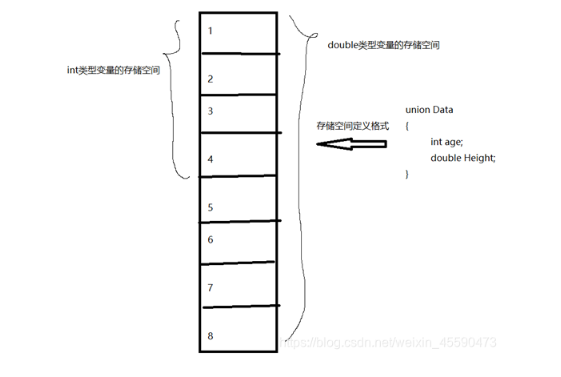
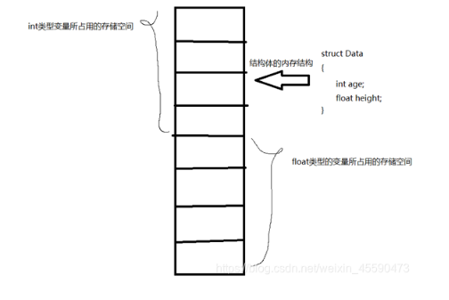

# 数据类型

## union

**概念** 联合,又称为共用体,C提供的类似于C++强制类型转换,是一种特殊的类,可有多个数据成员

​	1、任意时刻联合中只能由一个成员可以有值,该成员赋值后,联合中其他成员变为未定义状态,故而定义一个union对象时分配的内存空间大小为其最大成员的大小

​	2、与类相似,联合可以指定成员访问权限,默认public

​	3、联合的所有成员共享内存空间,即起始地址相同

​	4、Union在C++内存模型，可以理解为一块“共享内存”(不是多线（进）程概念中的共享内存)。Union开辟的大小，是其内部定义的所有元素中最大的元素

**定义声明**

```
union 名称{
	类型 名称;
    类型 名称;
    ...
}

联合可以指定成员长度
联合定义{
    类型 名称:长度;
}
```

**性质**

​	共用体正如“共有”关键字所描述的一样，共用体所占的数据空间是共用体中最大的数据类型成员所占用的空间，这些成员并不是随意放置，而是用有相同的首地址。因此，我们在任意时刻只可以按照一个数据类型对共用体进行赋值，共用体中这些成员的关系是“或”，即“不是你死就是我活”。

​	其实我们可以这样说“共用体其实可以在任意时刻被当作其任意一个数据成员来赋值使用”。共用体的出现基本上实现了我们追求的“万能数据类型”。

**共用体和结构体的区别**

​	数据成员在结构体数据内存存储中是顺序排列的，因此结构体完成的是数据成员的“和”操作，相反我们看union联合体则是完成的是数据成员之间的“与“操作。

​	结构体变量中3个成员相当于3个人，每个人必须要住一间屋子，优点是空间包容性强，但是内存空间必须全部分配，不管房子住不住人。联合体变量3个成员，它们可以共用一间屋子，但是每个屋子同一时间只能容纳一个成员，因此不够包容，成员是互斥的，但是可以大大节省内存空间。

​	在实际应用中我们一般都使用结构体来定义数据组合而成的结构型变量，而在各数据类型各变量占用空间差不多并且对各变量同时使用要求不高的场合（单从内存使用上)也可以灵活的使用union。

​	即在某种情况下，使用联合体比使用结构体更能节省内存空间





## enum

**概念**	枚举类型是C++中的一种派生数据类型,它是由用户定义的若干枚举常量的集合

**目的** 枚举类型的主要目的是增加程序的可读性,枚举类型最常见用处就是用来描述状态量

**性质**
	1、枚举变量的值只能取枚举常量表中所列的值,就是整型数的一个子集

​	2、枚举变量占用内存的大小与整型数相同

​	3、枚举变量只能参与赋值和关系运算以及输出操作,参与运算时用其本身的整数值

**语法** `enum<类型>{<枚举常量表>};`

**应用举例**

```
enum color_set1 {RED, BLUE, WHITE, BLACK}; // 定义枚举类型color_set1
enum week {Sun, Mon, Tue, Wed, Thu, Fri, Sat}; // 定义枚举类型week
```

**注意**
	1、枚举常量代表该枚举类型的变量可能取的值,编译系统为每个枚举常量指定一个整数值,默认状态下,这个整数就是所列举元素的序号,序号从0开始.可以在定义枚举类型时为部分或全部枚举常量指定整数值,在指定值之前的枚举常量仍按默认方式取值,而指定值之后的枚举常量按依次加1的原则取值.各枚举常量的值可以重复

```
enum fruit_set {apple, orange, banana=1, peach, grape}//枚举常量apple=0,orange=1, banana=1,peach=2,grape=3
enum week {Sun=7, Mon=1, Tue, Wed, Thu, Fri, Sat};//枚举常量Sun,Mon,Tue,Wed,Thu,Fri,Sat的值分别为7、1、2、3、4、5、6
```

​	2、枚举常量只能以标识符形式表示,而不能是整型、字符型等文字常量.

```
enum letter_set {'a','d','F','s','T'}; //枚举常量不能是字符常量
enum year_set{2000,2001,2002,2003,2004,2005}; //枚举常量不能是整型常量
修改
enum letter_set {a, d, F, s, T};
enum year_set{y2000, y2001, y2002, y2003, y2004, y2005};
```

​	3、枚举变量可以直接输出但不能直接输入

​	4、不能直接将常量赋值给枚举变量

​	5、不同类型的枚举变量之间不能相互赋值

​	6、枚举变量的输入输出一般都采用switch语句将其转换为字符或字符串;枚举类型数据的其他处理也往往应用switch语句,以保证程序的合法性和可读性

### 示例

```C++
enum color_set1 {RED, BLUE, WHITE, BLACK} color1, color2;
enum color_set2 { GREEN, RED, YELLOW, WHITE} color3, color4;

color3=RED;           //将枚举常量值赋给枚举变量
color4=color3;        //相同类型的枚举变量赋值，color4的值为RED
int  i=color3;        //将枚举变量赋给整型变量，i的值为1
int  j=GREEN;         //将枚举常量赋给整型变量，j的值为0

//比较同类型枚举变量color3，color4是否相等
if (color3==color4) cout<<"相等"；
//输出的是变量color3与WHITE的比较结果，结果为1
cout<< color3<WHITE;

cout<< color3;         //输出的是color3的整数值，即RED的整数值1
```


## static的用法和作用

```
1.隐藏:当同时编译多个文件时,所有未加static前缀的全局变量和函数都具有全局可见性
2.保持变量内容持久,存储在静态数据区的变量会在程序刚开始运行时就完成初始化,也是唯一一次初始化.共有两种变量存储在静态数据区:全局变量和static变量,不过static可以控制变量可见范围(只在static作用域内可见)
3.static变量默认初始化为0,在静态数据区中所有字节默认值都为0x00

4.类中static成员
	1)函数体内static变量作用范围为该函数体,不同于auto变量,该变量内存只分配一次,故而其值在下次调用时仍维持上次的值
	2)在模块内的static全局变量可以被模块内所有函数访问,但不能被模块外函数访问
	3)模块内的static函数之刻碑该模块内的其它函数调用,这个函数的使用范围被限制在声明它的模块内
	4)在类中的static成员变量属于整个类所拥有,对类的所有对象只有一份拷贝
	5)在类中的static函数属于整个类所有,这个函数不接收this指针,只能访问类的static成员变量
	6)staitc类对象必须在类外进行初始化,static修饰的变量先于类对象存在,所以static修饰的变量要在类外初始化
	7)由于static修饰的类成员属于类而不是对象,故而static类成员函数没有this指针,this是指向对象本体的指针,static没有,故而static类成员函数只能访问static类成员变量
	8)static成员函数不能被virtual修饰,static成员不属于任何对象,而virtual没有任何实际意义,静态成员函数没有指针,虚函数的实现是为每一个对象分配一个vptr指针,vptr指针由this指针调用;
	虚函数调用关系
	this->vptr->ctable->virtual function
```

### static初始化的时机

```
初始化只有一次,但是可以多次赋值,在主程序之前,编译器已经为其分配好了内存

静态局部变量和全局变量一样,数据都存放在全局区域，所以在主程序之前,编译器已经为其分配好了内存,但在C和C++中静态局部变量的初始化节点又有点不太一样.在C中,初始化发生在代码执行之前,编译阶段分配好内存之后,就会进行初始化,所以我们看到在C语言中无法使用变量对静态局部变量进行初始化,在程序运行结束,变量所处的全局内存会被全部回收。

而在C++中,初始化时在执行相关代码时才会进行初始化,主要是由于C++引入对象后,要进行初始化必须执行相应构造函数和析构函数,在构造函数或析构函数中经常会需要进行某些程序中需要进行的特定操作,并非简单地分配内存.所以C++标准定为全局或静态对象是有首次用到时才会进行构造,并由atexit()来管理.在程序结束,按照构造顺序反方向进行逐个析构.所以在C++中是可以使用变量对静态局部变量进行初始化的
```

### const关键字的作用

```
1.阻止一个变量被改变,可以使用const关键字.在定义该const变量时,通常需要对它进行初始化,因为以后就没有机会再去改变它了
2.对指针来说,可以指定指针本身为const,也可以指定指针所指的数据为const,或二者同时指定为const
3.在一个函数声明中,const可以修饰形参,表明它是一个输入参数,在函数内部不能改变其值
4.对于类的成员函数,若指定其为const类型,则表明其是一个常函数,不能修改类的成员变量,类的常对象只能访问类的常成员函数
5.对于类的成员函数,有时候必须指定其返回值为const类型,以使得其返回值不为“左值”
6.const成员函数可以访问非const对象的非const数据成员、const数据成员,也可以访问const对象内的所有数据成员
7.非const成员函数可以访问非const对象的非const数据成员、const数据成员,但不可以访问const对象的任意数据成员
8.一个没有明确声明为const的成员函数被看作是将要修改对象中数据成员的函数,而且编译器不允许它为一个const对象所调用.因此const对象只能调用const成员函数
9.const类型变量可以通过类型转换符const_cast将const类型转换为非const类型
10.const类型变量必须定义的时候进行初始化,因此也导致如果类的成员变量有const类型的变量,那么该变量必须在类的初始化列表中进行初始化;
11.对于函数值传递的情况，因为参数传递是通过复制实参创建一个临时变量传递进函数的，函数内只能改变临时变量，但无法改变实参。则这个时候无论加不加const对实参不会产生任何影响。但是在引用或指针传递函数调用中，因为传进去的是一个引用或指针，这样函数内部可以改变引用或指针所指向的变量，这时const 才是实实在在地保护了实参所指向的变量。因为在编译阶段编译器对调用函数的选择是根据实参进行的，所以，只有引用传递和指针传递可以用是否加const来重载。一个拥有顶层const的形参无法和另一个没有顶层const的形参区分开来。
```

### C++四种强制类型转换

##### const_cast

```
1.const_cast只针对指针、引用
2.cosnt_cast的大部分使用主要是将常量指针转换为长指针,常指针指向的空间内容不允许被修改,但是使用const_cast进行强制转换就可以修改
3.const_cast只能调节类型限定符,不能改变基本类型
```

###### 示例

```C++
#普通指针
	const int* p = new int(1);
	//int* d = p;//错误原因：const int*类型不能赋值或者初始化int*类型的实体
	*const_cast<int*>(p) = 50;
	cout << *p << endl;//50

	int* d = const_cast<int*>(p);
	*d = 100;
	cout << *p << endl;//100

	//char* dd = const_cast<char*>(p)//错误原因：const_cast只能调节类型限定符，不能更改基础类型


#引用
    int a = 10;
	const int& b = a;
	//b = 20;//错误原因：常量引用，不允许修改值
	//int& c = b;//错误，和常量指针不允许给普通指针赋值或者初始化一样

	int& c = const_cast<int&>(b);
	c = 20;
	cout << a << endl;//20

	const_cast<int&>(b) = 30;
	cout << a << endl;//30

#this指针
class Test 
{
public:
	Test() {}
	void fun()const//此时this指针相当于const Test* const this
	{
		//this->val1 = 10;//错误
		const_cast<Test*>(this)->val1 = 10;//OK
	}
private:
	int val1;
	int val2;
};

```

##### static_cast

```
1.static_cast的使用基本等价于隐式转换的一种类型转化运算符,可使用于需要明确隐式转换的地方.就相当于把隐式转换给明确写了出来而已.
2.可以用于低风险的转换:一般只要编译器能自己进行隐式转换的都是低风险转换,一般平等转换和提升转换都是低风险的转换,如:
	①整形和浮点型
	②字符与整形
	③转换运算符
	④空指针转换为任何目标类型的指针
3.不可以用于风险较高的转换,如
	①不同类型的指针之间互相转换
	②非指针类型和指针类型之间的相互转换
	③不同类型的引用之间的转换
```

###### 示例

```C++
class Base 
{
public:
	Base() {}
	~Base() {}
};
class Son:public Base
{
public:
	Son() {}
	~Son() {}
};

int main()
{
	char c_a = 0;
	int i_a = 0;
	float f_a = 0;
	double d_a = 1.111111;
	void* v_ptr = NULL;
	int* i_ptr = new int(1);
	char* c_ptr = new char(1);

	//下面部分没有报错，可以运行，但是平时不允许这样写，除非自己很明确自己在干什么
	//从高字节数到低字节数的转换平常肯定是不允许这样用的，因为将一个多字节的内容转换到少字节，非常容易丢失数据
	char c_sc = static_cast<char>(i_a);
	c_sc = static_cast<char>(f_a);
	c_sc = static_cast<char>(d_a);

	//类似于下面的转换不允许，因为两个不同的指针类型之间不允许相互转换
	//int* i_scptr = static_cast<int*>(c_ptr);//报错

	//下面的指针类型转换允许
	int* i_scptr = static_cast<int*>(v_ptr);
	void* v_scptr = static_cast<void*>(i_ptr);


	//下面的可取，只不过有时候精度可能会降低而已，比如float转换为int，被视为低风险
	float f_sc = static_cast<float>(i_a);
	int i_sc = static_cast<int>(c_a);
	cout << i_sc << endl;


	//父类指针和派生类指针的指向问题
	Base* bptr1 = new Base();
	Son* sptr1 = new Son();
	Base* bptr;
	Son* sptr;
	bptr = new Son();    //语句1   正确，基类指针指向派生类实体
	//sptr = new Base();//语句2   错误，派生类指针指向父类
	bptr = static_cast<Base*>(sptr1);//等同于语句1，正确
	sptr = static_cast<Son*>(bptr1); //等同于语句2，但是不安全，平时使用也不会使派生类指针指向基类,会出现访问越界，有时候会崩溃，有时候我们却没办法发现
	//对于派生类指针指向基类，会用另一个强制转换dynamic_cast
	
	return 0;
}

```


##### dynamic_cast

```
1.用于具有虚函数的基类与派生类之间的指针或引用的转换
2.基类必须具有虚函数.dynamic_cast是运行时类型信息（RTTI）,而这个信息是存储与类的虚函数表关系紧密的信息,只有一个类定义了虚函数,才会有虚函数表.运行时检查,转型不成功则返回一个空指针,非必要不使用dynamic_cast,因为有额外的开销.

常用的转换方式
基类指针或引用转派生类指针（必须使用dynamic_cast）
派生类指针或引用转基类指针（可以使用dynamic_cast,但是更推荐用static_cast）
```

###### 示例

```C++
class Base 
{
public:
	Base() { b_val = 1; }
	~Base() {}
	virtual void fun() {}
	int b_val;
};

class Son :public Base
{
public:
	Son() { s_val = 2; }
	~Son() {}
	int s_val;
};

int main()
{
	Base* b_ptr = new Base();
	Son* s_ptr = dynamic_cast<Son*>(b_ptr);

	return 0;
}

```


##### reinterpret_cast

```

```

## String和char*

```
string继承自basic_string,其实是对char*进行了封装,封装的string包含了char*数组,容量,长度等等属性.

string可以进行动态扩展,在每次扩展的时候另外申请一块原空间大小两倍的空间（2*n）,然后将原字符串拷贝过去,并加上新增的内容.
```

## 模板

```
模板的定义并不是真正定义了一个函数或者类，而是编译器根据程序员缩写的模板和形参来自己写出一个对应的版本，这个过程叫做模板实例化。编译器形成的版本通常称为模板的实例。
编译器为程序员生成对应版本的具体过程类似宏替换

由于编译器并不会直接编译模板本身，所以模板的定义通常放在头文件
```

### 非类型模板参数

```
顾名思义，模板参数不是一个类型而是一个具体的值，这个值是一个常量表达式
当一个模板被实例化时，非类型参数被用户提供的或者编译器推断出的值所替代。正因为模板在编译阶段编译器为我们生成一个对应的版本，所以其值应该能够编译时确定，那么他应该是一个常量或者常量表达式。

template <size_t N, size_t M>
int str_compare(const char (&str1)[N], const char (&str2)[M])
{
    return strcmp(str1,str2);
}

str_compare("hello","nihao")

没有用<>来传递模板参数。这是因为编译器在编译阶段已经帮助我们计算好了应该开辟多大空间的数组。我们也可以指定长度。N，M只是隐式的传入进去。

编译器也可以自动帮助我们推断参数时什么类型，从而不用显示的调用模板函数，对于上面的compare函数，我们可以这样调用，前提时保证参数类型相同。

compare(10,20);

```


### 别名模板

```
别名模板是 C++11 中的新特性。别名模板提供了一种方法，可以给一个类型家族起一个方便的名字。下面的代码片段给出了类模板 Matrix 的定义。

template <typename T, int Line, int Col>
class Matrix { ... };
Martix 需要三个模板形参，类型参数 T，非类型参数 Line 和 Col

为了代码的可读性，我想给出两种特殊的矩阵：Square 和 Vector，分别表示行数和列数相等的矩阵，和行数为 1 的矩阵。类型别名可以帮助实现这样的想法：

template <typename T, int Line>
using Square = Matrix<T, Line, Line>; // (1)

template <typename T, int Line>
using Vector = Matrix<T, Line, 1>;    // (2)

关键字 using（(1) 和 (2)）声明了类型别名。虽然模板 Matrix 可以在三个维度 T、Line 和 Col 中进行参数化，但类型别名 Square 和 Vector 将参数化减少到两个维度 T 和 Line。从这个角度来看，别名模板能够为部分绑定的模板创建直观的名称。

使用 Square 和 Vector 简单直观：
Matrix<int, 5, 3> ma;
Square<double, 4> sq;
Vector<char, 5> vec;
```

### 模板形参

```
概念:模板形参可以是类型,非类型,模板

类型:
	std::vector<int> myVec;
	std::map<std::string, int> myMap;
	std::lock_guard<std::mutex> myLockGuard;
	
非类型:左值引用,nullptr,指针值,枚举类型的值,整型值,浮点型值（C++20）
	整型值是最常用的非类型形参。典型的例子 是std::array，因为在编译时必须指定 std::array 的大小。
	std::array<int, 3> myArray{1, 2, 3};
	
模板:
	template <typename T, template <typename, typename> class Cont >      // (1)
	class Matrix
	{
	public:
    	explicit Matrix(std::initializer_list<T> inList) : data(inList)   // (2)
    	{
    	    for (auto d : data) std::cout << d << " ";
    	}
    	int getSize() const
   	 	{
  	      return data.size();
		}
	private:
    	Cont<T, std::allocator<T>> data;                                  // (3)                               
	};
	Matrix 是一个简单的类模板，可以通过 std::initializer_list（(2)）进行初始化。Matrix 可以与 std::vector（(4) 和 (5)）或 std::list（(6)）一起使用，以保存其值。到目前为止，没有什么特别之处。
	(1) 声明了一个类模板，它有两个模板形参，第一个是元素的类型，第二个代表容器。我们仔细看看第二个形参：template <typename, typename> class Cont>。这意味着第二个模板形参应该是一具有两个模板形参的模板。第一个模板形参是容器存储的元素的类型，第二个模板形参是标准模板库的容器所默认的分配器。甚至分配器也有一个默认值，比如在 std::vector 的情况下。分配器取决于元素的类型。
	(3) 展示了分配器在这个内部使用的容器中的用法。Martix 可以使用所有的容器，这些容器的类型是：container<type of the elements, allocator of the elements>。std::vector、std::deque、std::list等序列容器是如此。std::array 和 std::forward_list 会失败，因为 std::array 需要一个额外的非类型来在编译时指定其大小，而 std::forward_list 不支持 size 函数。
```


### 变参数模板

```
template<typename... _Args>
void emplace_front(_Args&&... __args);
可以看到里面模板参数是template<typename... _Args>，其实这个就是变参数模板，然后它的参数也是比较特别的_Args&&... __args，去除右值引用的话，它就是一个可变参数

c++11中新增加了一项内容，叫做变参数模板，所谓变参数模板，顾名思义就是参数个数和类型都可能发生变化的模板，要实现这一点，那就必须要使用模板形参包。
模板形参包是可以接受0个或者n个模板实参的模板形参，至少有一个模板形参包的模板就可以称作变参数模板，所以说白了，搞懂了模板形参包就明白变参数模板了，因为变参数模板就是基于模板形参包来实现的
```

### 模板形参包

```
性质:变参数模板的基础
概念:模板形参包主要出现在函数模板和类模板中，目前来讲，模板形参包主要有三种，即:非类型模板形参包、类型模板形参包、模板模板形参包
```

#### 非类型模板形参包

```
基本语法:template<类型 ... args>
这里的非类型是针对typename和class关键字来的，都知道模板使用typename或者class关键字表示它们后面跟着的名称是类型名称，而这里的形参包里面类型其实表示一个固定的类型，所以这里其实不如叫做固定类型模板形参包

对于上述非类型模板形参包而言，类型选择一个固定的类型，args其实是一个可修改的参数名，如
template<int ... data> xxxxxx;
注:这个固定的类型是有限制的，标准c++规定，只能为整型、指针和引用

1.非类型模板形参包类型是固定的，但参数名跟普通函数参数一样，是可以修改的；
2.传递给非类型模板形参包的实参不是类型，而是实际的值。

用法:
	template<class type, int age0, int ... age>
	void printAmt(int &iSumAge){
    	iSumAge += age0;
    	//这里sizeof ... (age)是计算形参包里的形参个数，返回类型是std::size_t，后续同理
    	if ( (sizeof ... (age)) > 0 )
    	{
        //这里的age...其实就是语法中的一种包展开，这个后续会具体说明
        printAmt<type, age...>(iSumAge);
    	}
	}
	int main()
	{
    	int sumAge = 0;
    	printAmt<int,1,2,3,4,5,7,6,8>(sumAge);
    	cout << "the sum of age is " << sumAge << endl;
    	return 0;
	}
```

#### 类型模板型参包

```
基本语法:typename|class ... Args
typename关键字和class关键字都可以用于在模板中声明一个未知类型,只是在以前template<typename type>的基础上加了一个省略号,改成了可变形参包而已,该可变形参包可以接受无限个不同的实参类型

作用:提供通用型接口,但是具体输出并不事先直到

void xprintf()
{
    cout << endl;
}

template<typename T, typename... Targs>
void xprintf(T value, Targs... Fargs)
{
    cout << value << ' ';
    if ( (sizeof ...(Fargs)) > 0 )
    {
        //这里调用的时候没有显式指定模板，是因为函数模板可以根据函数参数自动推导
        xprintf(Fargs...);
    }
    else
    {
        xprintf();
    }
}

int main()
{
    xprintf("小明个人信息:", "小明", "男", 35, "程序员", 169.5);
    return 0;
}
输出:小明个人信息: 小明 男 35 程序员 169.5
```

#### 模板模板形参包

基本语法:template<形参列表>class ... Args(可选)
形参包本身它也是一个模板

### 递归

**模板特化对于模板递归的作用**

​	由于模板内部有一个无限的递归，即便知道在运行是不会调用其他代码块，在编译时，编译器也需要知道其他块中有哪些代码会无休止被调用