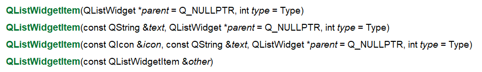

# QT

## 概念

```
跨平台C++图形用户界面应用程序开发框架
```

### 特征

```
1.面向对象
	QT具有模块设计和控件或元素的可重用性特点,一个空间不需要知道它的内容和用途,通过signal和slot与外界通信,交流,并且QT所有控件都可以继承
	
2.控件间的相互通信
	QT提供signal和slot,这是一种安全可靠的方法,它允许回调,并支持对象之间在彼此不知道对方信息的情况下进行合作,这使QT非常合适于真正的空间编程
	
3.友好的联机互助
	QT包括大量的联机参考文档,有超文本HTML方式,UNIX帮助页,map手册和补充的指南

4.用户自定义
	对其他的工具包在应用时都存在一个普遍的问题,就是经常没有真正适合需求的控件,生成的自定义控件对于用户来说,也是一个黑匣子.比如在Motif手册中就讨论了用户自定义的控件的问题,而在QT中,能够创建控件,具有绝对的优越性,生成自定义控件很简单,且容易修改控件
	
5.方便性
	由于QT是一种跨平台的GUI工具包,所以它对编程者隐藏了在处理不同窗口系统时的潜在问题,为了将基于QT程序更加方便,QT包含了一系列类,该类能够使程序员避免了在文件处理,处理时间等方面存在依赖操作系统方面的细节问题
```

## 信号与槽

连接信号与槽：谁发出信号，发出什么信号，谁处理信号，怎么处理信号

​	1、通过宏	2、通过地址	3、lambda表达式 

```
##通过宏
connect(ui->_tool_name,SIGNAL(returnPressed()),this,SLOT(_slotfunc_name));//returnPressed()为例
##通过地址
connect(ui->_tool_name,&QPushButton::clicked,this,&Widget::_slotfunc_name);//以QPushButton为例
##lambda表达式
connect(ui->_tool_name,&QPushButton::clicked,[this]()
		{
			actions...
		});
```

关于QT槽函数触发两次的问题：
如果使用官方的写法（如：on_btn_clicked()），可以不用写connect函数,会默认触发槽函数；
如果此时再次使用connect连接，就会导致on_btn_clicked()被执行两次，可以通过以下方式避免：
a. 修改槽函数命名,如btn_cLicked;
b. 强制指定:connect(ui->colorDialog_pushButton, SIGNAL(clicked(bool)), this, SLOT(on_colorDialog_pushButton_clicked()), Qt::UniqueConnection);


事件和QObject

## 基本对话框

## 主窗口

## 模型/视图结构

### ListView和ListWidget

### 概念

QListWidget继承于QListView，而QListView基于model，需要自己建模（如建立QStringListMdel、QSqlTableModel等），保存数据，降低了数据冗余，提高了程序效率但是需要对数据建模有一定的了解，QListWidget则已经建立了一个数据存储模型ListWidgetItem，直接调用addItem即可添加Item。

QListWidget 是 Qt 提供的控件类，专门用来创建列表。QListWidget 类的继承关系如下：

```
QListWidget -> QListView -> QAbstractItemView -> QAbstractScrollArea -> QFrame -> QWidget
```

### 常用API

```
void addItem(const QString &label) //添加一项标签
void addItem(QListWidgetItem *item) //添加一项item

void insertItem(int row, QListWidgetItem *item) //在row行后添加一项item
QListWidgetItem * item(int row) //在row行的项

QListWidgetItem *takeItem(int row) //删除第row行的项，注意qt不会给你释放内存，需要手动释放，只会从界面上删除该项
void clear() //清空界面

void setAlternatingRowColors(bool) //设置是否开启交替颜色显示
```

以下信号都会常用signals:

```
void currentItemChanged(QListWidgetItem *current, QListWidgetItem *previous) //当前项改变发出信号

void currentRowChanged(int currentRow) //当前行改变发出信号

void currentTextChanged(const QString ¤tText) //当前项改变发出信号

void itemClicked(QListWidgetItem *item) //点击项时发出信号

void itemDoubleClicked(QListWidgetItem *item) //双击发出信号

void itemEntered(QListWidgetItem *item) //鼠标进入某项发出信号

void itemPressed(QListWidgetItem *item) //鼠标按住某项发出信号

void itemSelectionChanged() //改变选择项时发出信号
```

#### addItem&insertItem

**QListWidget::addItem(const QString &label)**	将QString作为Item添加到ListWidget尾

**QListWidget::insertItem(int row,QlistWidgetItem *item)** 在对应row行添加QListWidgetItem

**QListWidget::addItem(QListWidgetItem *Item)**	将QListWidgetItem作为Item添加到LisWidget尾

​	一个QListWidgetItem只能添加到QListWidget一次，否则会返回一个未定义的行为

**QListWidget::insertItem(int row,const QString &label)**	在对应row行添加QString

**QListWidget::insertItems(int row,const QStringList &labels)**	将一个StringList添加到对应row行，实质为批量添加item




### 自定义item的添加

#### Widget作为自定义item

**1、widget的设计**

​	由于使用widget自定义item，故而需额外自定义widget类，该widget需要能够实现自身控件的设计和生成与使用，由于`Qt Creator` 中控件的生成代码存在于`*.ui`文件生成的ui_*.h，其中每次对于`*.ui`的操作都会生成新的`.h`文件覆盖旧文件，故而每个widget的内容动态更新函数需定义为对应widget的成员函数，且为了实现对自定义widget的更新，需要和主widget一样在设计师界面设计好控件的大小和对应位置

**2、自定义widget中的控件在主widget中的位置**

​	由于是自定义widget作为item添加到主widget中的ListWidget，故而对于控件位置的更改只能通过自定义widget对象更改，主widget对象对于ListWidget中item的调整只是整个自定义widget在ListWidget中的位置调整

**3、添加自定义item的API**

​	QLIstWidget中有一个`setItemWidget( QListWidgetItem *item, QWidget *widget)` 函数接口 ，通常用来设置显示我们自定义的QWidget， 然后将item与我们自定义的QWidget 相关联

```
1、QListWidgetItem 一般不指定对应的QListWidget：当传递过来的参数parent，如果其model是sorted，那么它在insert时将会调用< 操作运算符导致不确定的操作，建议不指定父窗口，而是通过insertitem即可。

2、应该先添加item，再去将item与QWidget绑定

3、如果要删除对应item 时，removeItemWidget,只是将 old widget deleted 但是item并没有deleted 所以item还存在

4、QListWidgetItem* takeItem(int row); 此时返回的item，并没有被删除，只是从listwidget中remove掉了， 还需要自己手动delete，不然此时item不受qt管控，会导致未知问题

5、当添加item足够多时, 可能会超过原有widget高度， 此时添加item可能会导致添加item 并不能全部显示， 此时需要设置listWidget->scrollToItem(topItem, QAbstractItemView::EnsureVisible), 确保添加item能够全部显示出来
```

### 列表框的信号和槽

| 信号函数                                                     | 功 能                                                        |
| ------------------------------------------------------------ | ------------------------------------------------------------ |
| itemClicked(QListWidgetItem *item)                           | 用户点击某个列表项时会触发此信号函数，item 参数指的就是被用户点击的列表项。 |
| itemDoubleClicked(QListWidgetItem *item)                     | 用户双击某个列表项时会触发此信号函数，item 参数指的就是被用户双击的列表项。 |
| itemPressed(QListWidgetItem *item)                           | 鼠标按下某个列表项时会触发此信号函数，item 参数指的就是被鼠标按下的列表项， |
| itemSelectionChanged()                                       | 当选择的列表项发生变化时会触发此信号函数。                   |
| currentItemChanged(QListWidgetItem *current, QListWidgetItem *previous) | 当前列表项发生变化时会触发此信号函数，current 参数指的是新选择的列表项；previous 参数指的是先前选择的列表项。 |
| 槽函数                                                       | 功 能                                                        |
| clear()                                                      | 删除列表中的所有列表项。                                     |
| scrollToItem(const QListWidgetItem *item, QAbstractItemView::ScrollHint hint = EnsureVisible) | 用 hint 参数指定的滑动方式，让用户看到指定的 item 列表项。   |
| selectAll()                                                  | 选择所有的列表项。                                           |
| scrollToBottom() scrollToTop()                               | 分别将列表滑动到底部和顶部。                                 |

## 常用控件

### Buttons

#### PushButton

