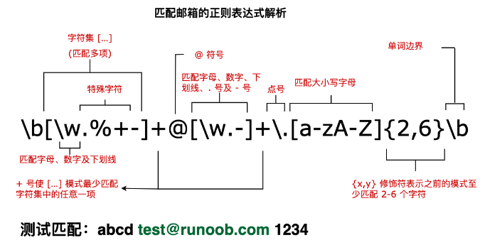
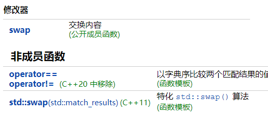

# 正则表达式

## 概念

**什么是正则表达式**	正则表达式就是一套表示规则的式子，专门用来处理各种复杂的操作

**正则程序库regex**

​	`std::regex`是C++用来表示正则表达式的库，`所需头文件<regex>`，是`class std::basic_regex<>`针对char类型的一个特化，还有一个针对wchar_t类型的特化为`std::wregex`

## 语法

**字符匹配**

- 普通字符：普通字符按照字面意义进行匹配，例如匹配字母 "a" 将匹配到文本中的 "a" 字符。
- 元字符：元字符具有特殊的含义，例如 `\d` 匹配任意数字字符，`\w` 匹配任意字母数字字符，`.` 匹配任意字符（除了换行符）等。

**量词**

- `*`：匹配前面的模式零次或多次。
- `+`：匹配前面的模式一次或多次。
- `?`：匹配前面的模式零次或一次。
- `{n}`：匹配前面的模式恰好 n 次。
- `{n,}`：匹配前面的模式至少 n 次。
- `{n,m}`：匹配前面的模式至少 n 次且不超过 m 次。

**字符类**

- `[ ]`：匹配括号内的任意一个字符。例如，`[abc]` 匹配字符 "a"、"b" 或 "c"。
- `[^ ]`：匹配除了括号内的字符以外的任意一个字符。例如，`[^abc]` 匹配除了字符 "a"、"b" 或 "c" 以外的任意字符。

**边界匹配**

- `^`：匹配字符串的开头。
- `$`：匹配字符串的结尾。
- `\b`：匹配单词边界。
- `\B`：匹配非单词边界。

**分组和捕获**

- `( )`：用于分组和捕获子表达式。
- `(?: )`：用于分组但不捕获子表达式。

**特殊字符**

- `\`：转义字符，用于匹配特殊字符本身。
- `.`：匹配任意字符（除了换行符）。
- `|`：用于指定多个模式的选择。

### 非打印字符

非打印字符也可以是正则表达式的组成部分。下表列出了表示非打印字符的转义序列：

| 字符 | 描述                                                         |
| :--- | :----------------------------------------------------------- |
| \cx  | 匹配由x指明的控制字符。例如， \cM 匹配一个 Control-M 或回车符。x 的值必须为 A-Z 或 a-z 之一。否则，将 c 视为一个原义的 'c' 字符。 |
| \f   | 匹配一个换页符。等价于 \x0c 和 \cL。                         |
| \n   | 匹配一个换行符。等价于 \x0a 和 \cJ。                         |
| \r   | 匹配一个回车符。等价于 \x0d 和 \cM。                         |
| \s   | 匹配任何空白字符，包括空格、制表符、换页符等等。等价于 [ \f\n\r\t\v]。注意 Unicode 正则表达式会匹配全角空格符。 |
| \S   | 匹配任何非空白字符。等价于 [^ \f\n\r\t\v]。                  |
| \t   | 匹配一个制表符。等价于 \x09 和 \cI。                         |
| \v   | 匹配一个垂直制表符。等价于 \x0b 和 \cK。                     |

### 特殊字符

所谓特殊字符，就是一些有特殊含义的字符，如上面说的 **runoo\*b** 中的 *****，简单的说就是表示任何字符串的意思。如果要查找字符串中的 ***** 符号，则需要对 ***** 进行转义，即在其前加一个 **\**，**runo\*ob** 匹配字符串 **runo\*ob**。

许多元字符要求在试图匹配它们时特别对待。若要匹配这些特殊字符，必须首先使字符"转义"，即，将反斜杠字符**\** 放在它们前面。下表列出了正则表达式中的特殊字符：

| 特别字符 | 描述                                                         |
| :------- | :----------------------------------------------------------- |
| $        | 匹配输入字符串的结尾位置。如果设置了 RegExp 对象的 Multiline 属性，则 $ 也匹配 '\n' 或 '\r'。要匹配 $ 字符本身，请使用 \$。 |
| ( )      | 标记一个子表达式的开始和结束位置。子表达式可以获取供以后使用。要匹配这些字符，请使用 \( 和 \)。 |
| *        | 匹配前面的子表达式零次或多次。要匹配 * 字符，请使用 \*。     |
| +        | 匹配前面的子表达式一次或多次。要匹配 + 字符，请使用 \+。     |
| .        | 匹配除换行符 \n 之外的任何单字符。要匹配 . ，请使用 \. 。    |
| [        | 标记一个中括号表达式的开始。要匹配 [，请使用 \[。            |
| ?        | 匹配前面的子表达式零次或一次，或指明一个非贪婪限定符。要匹配 ? 字符，请使用 \?。 |
| \        | 将下一个字符标记为或特殊字符、或原义字符、或向后引用、或八进制转义符。例如， 'n' 匹配字符 'n'。'\n' 匹配换行符。序列 '\\' 匹配 "\"，而 '\(' 则匹配 "("。 |
| ^        | 匹配输入字符串的开始位置，除非在方括号表达式中使用，当该符号在方括号表达式中使用时，表示不接受该方括号表达式中的字符集合。要匹配 ^ 字符本身，请使用 \^。 |
| {        | 标记限定符表达式的开始。要匹配 {，请使用 \{。                |
| \|       | 指明两项之间的一个选择。要匹配 \|，请使用 \|。               |

### 限定符

限定符用来指定正则表达式的一个给定组件必须要出现多少次才能满足匹配。有 ***** 或 **+** 或 **?** 或 **{n}** 或 **{n,}** 或 **{n,m}** 共6种。

正则表达式的限定符有：

| 字符  | 描述                                                         |
| :---- | :----------------------------------------------------------- |
| *     | 匹配前面的子表达式零次或多次。例如，**zo\*** 能匹配 **"z"** 以及 **"zoo"**。***** 等价于 **{0,}**。 |
| +     | 匹配前面的子表达式一次或多次。例如，**zo+** 能匹配 **"zo"** 以及 "**zoo"**，但不能匹配 **"z"**。**+** 等价于 **{1,}**。 |
| ?     | 匹配前面的子表达式零次或一次。例如，**do(es)?** 可以匹配 **"do"** 、 **"does"**、 **"doxy"** 中的 **"do"** 和 **"does"**。**?** 等价于 **{0,1}**。 |
| {n}   | n 是一个非负整数。匹配确定的 **n** 次。例如，**o{2}** 不能匹配 **"Bob"** 中的 **o**，但是能匹配 **"food"** 中的两个 **o**。 |
| {n,}  | n 是一个非负整数。至少匹配n 次。例如，**o{2,}** 不能匹配 **"Bob"** 中的 **o**，但能匹配 **"foooood"** 中的所有 **o**。**o{1,}** 等价于 **o+**。**o{0,}** 则等价于 **o\***。 |
| {n,m} | m 和 n 均为非负整数，其中 n <= m。最少匹配 n 次且最多匹配 m 次。例如，**o{1,3}** 将匹配 **"fooooood"** 中的前三个 **o**。**o{0,1}** 等价于 **o?**。请注意在逗号和两个数之间不能有空格。 |

**\*和 + 限定符都是贪婪的，因为它们会尽可能多的匹配文字，只有在它们的后面加上一个 ? 就可以实现非贪婪或最小匹配 **

### 定位符

定位符使您能够将正则表达式固定到行首或行尾。它们还使您能够创建这样的正则表达式，这些正则表达式出现在一个单词内、在一个单词的开头或者一个单词的结尾。

定位符用来描述字符串或单词的边界，**^** 和 **$** 分别指字符串的开始与结束，**\b** 描述单词的前或后边界，**\B** 表示非单词边界。

正则表达式的定位符有：

| 字符 | 描述                                                         |
| :--- | :----------------------------------------------------------- |
| ^    | 匹配输入字符串开始的位置。如果设置了 RegExp 对象的 Multiline 属性，^ 还会与 \n 或 \r 之后的位置匹配。 |
| $    | 匹配输入字符串结尾的位置。如果设置了 RegExp 对象的 Multiline 属性，$ 还会与 \n 或 \r 之前的位置匹配。 |
| \b   | 匹配一个单词边界，即字与空格间的位置。                       |
| \B   | 非单词边界匹配。                                             |

**注意**：不能将限定符与定位符一起使用。由于在紧靠换行或者单词边界的前面或后面不能有一个以上位置，因此不允许诸如 **^\*** 之类的表达式。

**\b** 字符的位置是非常重要的。如果它位于要匹配的字符串的开始，它在单词的开始处查找匹配项。如果它位于字符串的结尾，它在单词的结尾处查找匹配项。

```
例如，下面的表达式匹配单词 Chapter 中的字符串 ter，因为它出现在单词边界的前面：
	/ter\b/
下面的表达式匹配 Chapter 中的字符串 apt，但不匹配 aptitude 中的字符串 apt：
	/\Bapt/
字符串 apt 出现在单词 Chapter 中的非单词边界处，但出现在单词 aptitude 中的单词边界处。对于 \B 非单词边界运算符，不可以匹配单词的开头或结尾，如果是下面的表达式，就不匹配 Chapter 中的 Cha：
	\BCha
```


### 选择

用圆括号 **()** 将所有选择项括起来，相邻的选择项之间用 **|** 分隔。

**()** 表示捕获分组，**()** 会把每个分组里的匹配的值保存起来， 多个匹配值可以通过数字 n 来查看(**n** 是一个数字，表示第 n 个捕获组的内容)

但用圆括号会有一个副作用，使相关的匹配会被缓存，此时可用 **?:** 放在第一个选项前来消除这种副作用。

其中 **?:** 是非捕获元之一，还有两个非捕获元是 **?=** 和 **?!**，这两个还有更多的含义，前者为正向预查，在任何开始匹配圆括号内的正则表达式模式的位置来匹配搜索字符串，后者为负向预查，在任何开始不匹配该正则表达式模式的位置来匹配搜索字符串。

### 反向引用

对一个正则表达式模式或部分模式两边添加圆括号将导致相关匹配存储到一个临时缓冲区中，所捕获的每个子匹配都按照在正则表达式模式中从左到右出现的顺序存储。缓冲区编号从 1 开始，最多可存储 99 个捕获的子表达式。每个缓冲区都可以使用 **\n** 访问，其中 n 为一个标识特定缓冲区的一位或两位十进制数。

可以使用非捕获元字符 **?:**、**?=** 或 **?!** 来重写捕获，忽略对相关匹配的保存。

反向引用的最简单的、最有用的应用之一，是提供查找文本中两个相同的相邻单词的匹配项的能力

### 修饰符

标记也称为修饰符，正则表达式的标记用于指定额外的匹配策略。

标记不写在正则表达式里，标记位于表达式之外，格式如下：

```
/pattern/flags
```

下表列出了正则表达式常用的修饰符：

| 修饰符 | 含义                                   | 描述                                                         |
| :----- | :------------------------------------- | :----------------------------------------------------------- |
| i      | ignore - 不区分大小写                  | 将匹配设置为不区分大小写，搜索时不区分大小写: A 和 a 没有区别。 |
| g      | global - 全局匹配                      | 查找所有的匹配项。                                           |
| m      | multi line - 多行匹配                  | 使边界字符 **^** 和 **$** 匹配每一行的开头和结尾，记住是多行，而不是整个字符串的开头和结尾。 |
| s      | 特殊字符圆点 **.** 中包含换行符 **\n** | 默认情况下的圆点 **.** 是匹配除换行符 **\n** 之外的任何字符，加上 **s** 修饰符之后, **.** 中包含换行符 \n。 |



### 优先级

正则表达式从左到右进行计算，并遵循优先级顺序，这与算术表达式非常类似。

相同优先级的从左到右进行运算，不同优先级的运算先高后低。下表从最高到最低说明了各种正则表达式运算符的优先级顺序：

| 运算符                      | 描述                                                         |
| :-------------------------- | :----------------------------------------------------------- |
| \                           | 转义符                                                       |
| (), (?:), (?=), []          | 圆括号和方括号                                               |
| *, +, ?, {n}, {n,}, {n,m}   | 限定符                                                       |
| ^, $, \任何元字符、任何字符 | 定位点和序列（即：位置和顺序）                               |
| \|                          | 替换，"或"操作 字符具有高于替换运算符的优先级，使得"m\|food"匹配"m"或"food"。若要匹配"mood"或"food"，请使用括号创建子表达式，从而产生"(m\|f)ood"。 |

### 匹配规则

| 字符簇       | 描述                                |
| :----------- | :---------------------------------- |
| [[:alpha:]]  | 任何字母                            |
| [[:digit:]]  | 任何数字                            |
| [[:alnum:]]  | 任何字母和数字                      |
| [[:space:]]  | 任何空白字符                        |
| [[:upper:]]  | 任何大写字母                        |
| [[:lower:]]  | 任何小写字母                        |
| [[:punct:]]  | 任何标点符号                        |
| [[:xdigit:]] | 任何16进制的数字，相当于[0-9a-fA-F] |


## C++ regex

### 组件介绍

在头文件`<regex>`中包含了多个我们使用正则表达式时需要用到的组件，即 `#include<regex>`

regex库组件详细介绍如下

| regex                | 表示有一个正则表达式类，比如：regex pattern("(.{3})(.{2})_(\d{4})!") |
| -------------------- | ------------------------------------------------------------ |
| regex_match          | 全文匹配，要求整个字符串符合正则表达式的匹配规则。用来判断一个字符串和一个正则表达式是否模式匹配，返回一个 bool 值，true 为匹配，false 为不匹配。匹配的含义是目标字符串必须完全和正则表达式相匹配，不能有多余的字符，如果需要部分匹配则应使用regex_search |
| regex_search         | 搜索匹配，根据正则表达式来搜索字符串中是否存在符合规则的子字符串。 能和正则表达式相匹配就返回true |
| regex_replace        | 替换匹配，即可以将符合匹配规则的子字符串替换为其他字符串。要求输入一个正则表达式，以及一个用于替换匹配子字符串的格式化字符串。这个格式化字符串可以通过转义序列引用匹配子字符串中的部分内容 |
| sregex_iterator      | 迭代器适配器，调用regex_search来遍历一个string中所有匹配的子串 |
| smatch/match_results | 容器类，保存在string中搜索的结果。如果匹配成功，这些函数将成功匹配的相关信息保存在给定的smatch对象中。比如：smatch results；将匹配结果存放在results中，另一种存储方法声明：match_resultsstring::const_iterator result |

### 主类

#### basic_regex

##### 类定义

```
template <
    class CharT,
    class Traits = std::regex_traits<CharT>
> class basic_regex;
类模板 basic_regex 提供保有正则表达式的通用框架。
提供对于常见类型的几个特化：
定义于头文件 <regex>
类型		定义
regex	basic_regex<char>
wregex	basic_regex<wchar_t>
```

##### 成员函数

​	**构造和析构**	构造和析构regex对象

​	**operator=**

```
basic_regex& operator=( const basic_regex& other );(1)
basic_regex& operator=( basic_regex&& other ) noexcept;(2)
basic_regex& operator=( const CharT* ptr );(3)
basic_regex& operator=( std::initializer_list<CharT> il );(4)
template< class ST, class SA >
basic_regex& operator=( const std::basic_string<CharT,ST,SA>& p );(5)	
    1) 复制赋值运算符。赋值 other 的内容。等价于 assign(other); 。
    2) 移动赋值运算符。用移动语义赋值 other 的内容。操作后 other 在合法但未指定的状态。等价于 assign(other); 。
    3) 赋值 ptr 所指向的空终止字符串。等价于 assign(ptr); 。
    4) 赋值 initializer_list il 中含有的字符。等价于 assign(il); 。
    5) 赋值 string p 的内容。等价于 assign(p); 。    
other	-	另一 regex 对象
ptr	-	指向空终止字符串的指针
il	-	含要赋值的字符的 initializer_list
p	-	含要赋值的字符的 string
```

​	**assign**

```
basic_regex& assign( const basic_regex& other );(1)	
basic_regex& assign( basic_regex&& that ) noexcept;(2)	
basic_regex& assign( const CharT* s,
                     flag_type f = std::regex_constants::ECMAScript );(3)	
basic_regex& assign( const charT* ptr, size_t count,
                     flag_type f = std::regex_constants::ECMAScript );(4)	
template< class ST, class SA >
basic_regex& assign( const std::basic_string<CharT,ST,SA>& str,
                     flag_type f = std::regex_constants::ECMAScript );(5)	
template< class InputIt >
basic_regex& assign( InputIt first, InputIt last,
                     flag_type f = std::regex_constants::ECMAScript );(6)	
basic_regex& assign( std::initializer_list<CharT> ilist,
                     flag_type f = std::regex_constants::ECMAScript );(7)	
    1) 赋值 other 的内容。调用后 flags() 和 mark_count() 等于 other.flags() 和 other.mark_count() 的值。
    2) 用移动语义赋值 other 的内容。 flags() 和 mark_count() 等于 other.flags() 和 other.mark_count() 在赋值前的值。调用后， other 在合法但未指定的状态。
    3-7) 赋值字符序列给正则表达式。设置语法标志为 f 。调用后 mark_count() 产生的子表达式中的有标记子表达式数。
    3) 赋值 s 所指向的空终止字符串。
    4) 赋值 s 所指向的 count 个字符序列。
    5) 赋值 string str 。
    6) 赋值范围 [first, last) 中的字符。
    7) 赋值 initializer_list ilist 中的字符。
other	-	要赋值的另一正则表达式
s	-	指向要赋值的字符序列的指针
str	-	要赋值的 string
first, last	-	要赋值的字符范围
ilist	-	含要赋值的字符的 initializer_list
```

​	**mark_count**	返回正则表达式内有标记的子表达式数。

​	**flags**	返回构造函数或最后一次到 assign() 调用中设置的正则表达式语法标志。

​	**getloc**	返回与正则表达式关联的当前本地环境

​					等效地调用 traits_i.getloc() ，其中 `traits_i` 是 `Traits` 类型的默认初始化实例，存储于正则表达式对象中

​	**imube**	以 `loc` 替换当前本地环境。调用后，正则表达式不匹配任何字符序列。

​					等效地调用 traits_i.imbue(loc) ，其中 `traits_i` 是存储于正则表达式对象内的默认初始化的`Traits` 类型实例

​	**swap**	`void swap( basic_regex& other ) noexcept;`	交换二个正则表达式的内容

##### 特化

```
template< class CharT, class Traits >
void swap( basic_regex<CharT,Traits> &lhs, basic_regex<CharT,Traits> &rhs ) noexcept;
(C++11 起)
```

为 std::basic_regex 特化 std::swap 算法。交换 lhs 与 rhs 的状态。等效地调用 lhs.swap(rhs) 

#### sub_match

```
template<class BidirIt>
class sub_match;
正则表达式引擎用类模板 sub_match ，表示有标记子表达式所匹配的字符序列。 匹配是目标范围中匹配正则表达式的 [begin, end) 对，不过拥有附加的观察器函数以增进代码清晰度。
只有默认构造函数是可公开访问的。在处理 regex 算法之一期间， sub_match 的实例作为 std::match_results 容器的一部分正常构造并移居。
成员函数返回定义的默认值，除非 matched 成员为 true 。
sub_match 继承自 std::pair<BidirIt, BidirIt> ，尽管它不能当做 std::pair 对象，因为成员函数，如交换与赋值，不会按期待工作。
```

#### match_results

##### 类定义

```
template<
    class BidirIt,
    class Alloc = std::allocator<std::sub_match<BidirIt>>
> class match_results;
```

类模板 `std::match_results` 保有表示正则表达式匹配结果的字符序列汇集。

这是特殊的具分配器容器。它只能默认创建、从`std::regex_iterator` 获得，或通过 `std::regex_search` 或 `std::regex_match` 修改。 `std::match_results` 保有 `std::sub_match` ，它们每个都是一对指向匹配的原初字符序列中的迭代器，故若原初字符序列被销毁，或指向它的迭代器因另外的原因非法化，则检验 `std::match_results` 是未定义行为。

`match_result` 中所含的首个 `sub_match` （下标 0 ）始终表示 `regex` 所做的目标序列内的完整匹配，而后继的 `sub_match` 表示按顺序对应分隔正则表达式中子表达式的左括号的子表达式匹配

`std::match_results` 满足知分配器容器 (AllocatorAwareContainer) 与序列容器 (SequenceContainer) 的要求，除了仅支持复制赋值、移动赋值和对常容器定义的操作，还有比较函数的语义异于对容器要求的语义。

##### 成员函数

​	**构造和析构**	构造和析构match_results对象

​	**operator=**	

```
match_results& operator=( const match_results& other );(1)	(C++11 起)
match_results& operator=( match_results&& other ) noexcept;(2)	(C++11 起)
赋值内容。
    1) 复制赋值运算符。赋值 other 的内容。
    2) 移动赋值运算符。用移动语义赋值 other 的内容。操作后 other 在合法但未指定的状态
```

​	**get_allocator**	返回与对象关联的分配器

​	**bool ready() const;**	若 match_results 就绪则为 true ，否则为 false

​	**bool empty() const**	size() == 0 （若 `*this` 表示成功匹配则为 false ，否则为 true ）

​	**size_type size() const noexcept;**	返回子匹配数，即 std::distance(begin(), end()) 。若 *this 不表示成功匹配的结果则返回 0

​	**size_type max_size() const noexcept;**	返回 match_results 类型因系统或库实现限制而能保有最大子匹配数，即对于最大子匹配数的 std::distance(begin(), end())

​	**difference_type length( size_type n = 0 ) const;**	

```
返回指定子匹配的长度。
    若 n == 0 ，则返回整个匹配的表达式的长度。
    若 n > 0 && n < size() ，则返回第 n 个子匹配的长度。
    若 n >= size() ，则返回未匹配的长度。
调用等价于 (*this)[n].length() 。
```

​	**difference_type position( size_type n = 0 ) const;**

```
返回指定的子匹配的首字符位置。
    若 n == 0 ，则返回整个匹配表达式的首字符位置。
    若 n > 0 && n < size() ，则返回第 n 个子匹配的首字符位置。
    若 n >= size() ，则返回不匹配的首字符位置。
```

​	**const_reference operator const;**

```
若 n > 0 且 n < size() ，则返回到 std::sub_match 的引用，它表示第 n 个捕获的有标记子表达式所匹配的目标序列部分。
若 n == 0 ，则返回到 std::sub_match 的引用，它表示返回整个匹配的正则表达式所匹配的目标序列部分。
若 n >= size() ，则返回到 std::sub_match 的引用，它表示不配的子表达式（目标序列的空子范围）。
除非 ready() == true ，否则行为未定义。
```

​	**const_reference prefix() const;**	获得到 std::sub_match 对象的引用，该对象表示目标序列起始到正则表达式的整个匹配起始之间的目标序列。除非 ready() == true ，否则行为未定义。

​	**const_reference suffix() const;**	获得到 std::sub_match 对象的引用，该对象表示正则表达式的整个匹配结尾，和目标序列结尾之间的目标序列。除非 ready() == true ，否则行为未定义。

##### 迭代器

```
iterator begin() noexcept;
const_iterator begin() const noexcept;
const_iterator cbegin() const noexcept;
	返回指向子匹配列表开始的迭代器。若匹配成功，则迭代器将指向整个匹配的表达式。
	
iterator end() noexcept;
const_iterator end() const noexcept;
const_iterator cend() const noexcept;
	返回指向子匹配列表结尾的迭代器。
```

##### 格式

```
template< class OutputIt >
OutputIt format( OutputIt out,
                 const char_type* fmt_first, const char_type* fmt_last,
                 std::regex_constants::match_flag_type flags =
                     std::regex_constants::format_default ) const;(1)	(C++11 起)
                     
template< class OutputIt, class ST, class SA >
OutputIt format( OutputIt out,
                 const basic_string<char_type,ST,SA>& fmt,
                 std::regex_constants::match_flag_type flags =
                     std::regex_constants::format_default ) const;(2)	(C++11 起)
                     
template< class ST, class SA >
std::basic_string<char_type,ST,SA>
    format( const std::basic_string<char_type,ST,SA>& fmt,
            std::regex_constants::match_flag_type flags =
                std::regex_constants::format_default ) const;(3)	(C++11 起)
                
string_type format( const char_type* fmt_s,
                    std::regex_constants::match_flag_type flags =
                        std::regex_constants::format_default ) const;(4)	(C++11 起)
                        
format 输出格式字符串，它将字符串中的任何格式指定符或转义序列替换为来自 *this 的数据。

    1) 格式字符序列以范围 [fmt_first, fmt_last) 定义。复制结果字符序列到 out 的副本。
    2) 格式字符序列以 fmt 中的字符定义。复制结果字符序列到 out 的副本。
    3-4) 格式字符序列分别以 fmt 和 fmt_s 中的字符定义。复制结果字符序列到新构造的 std::basic_string ，并返回它。
    flags 位掩码确定辨识哪些格式指定符和转义序列。
    若 ready() != true 则 format 的行为未定义。
    
参数
    fmt_begin, fmt_end	-	指向定义格式字符序列的字符范围的指针
    fmt	-	定义格式字符序列的 std::basic_string
    fmt_s	-	指向定义格式字符序列的空终止字符串的指针
    out	-	要复制结果字符串到的迭代器
    flags	-	指定辨识哪些格式指定符和转义序列的 std::regex_constants::match_flag_type 位掩码
类型要求
    -OutputIt 必须满足遗留输出迭代器 (LegacyOutputIterator) 的要求。
    
返回值
    1-2) out
    3-4) 含结果字符序列的新构造字符串。
```



### 算法

#### regex_match

```
template< class BidirIt,
          class Alloc, class CharT, class Traits >
bool regex_match( BidirIt first, BidirIt last,
                  std::match_results<BidirIt,Alloc>& m,
                  const std::basic_regex<CharT,Traits>& e,
                  std::regex_constants::match_flag_type flags =
                      std::regex_constants::match_default );(1)	(C++11 起)
                      
template< class BidirIt,
          class CharT, class Traits >
bool regex_match( BidirIt first, BidirIt last,
                  const std::basic_regex<CharT,Traits>& e,
                  std::regex_constants::match_flag_type flags =
                      std::regex_constants::match_default );(2)	(C++11 起)

template< class CharT, class Alloc, class Traits >
bool regex_match( const CharT* str,
                  std::match_results<const CharT*,Alloc>& m,
                  const std::basic_regex<CharT,Traits>& e,
                  std::regex_constants::match_flag_type flags =
                      std::regex_constants::match_default );(3)	(C++11 起)

template< class STraits, class SAlloc,
          class Alloc, class CharT, class Traits >
bool regex_match( const std::basic_string<CharT,STraits,SAlloc>& s,
                  std::match_results<
                      typename std::basic_string<CharT,STraits,SAlloc>::const_iterator,
                      Alloc
                  >& m,
                  const std::basic_regex<CharT,Traits>& e,
                  std::regex_constants::match_flag_type flags =
                      std::regex_constants::match_default );(4)	(C++11 起)

template< class CharT, class Traits >
bool regex_match( const CharT* str,
                  const std::basic_regex<CharT,Traits>& e,
                  std::regex_constants::match_flag_type flags =
                      std::regex_constants::match_default );(5)	(C++11 起)

template< class STraits, class SAlloc,
          class CharT, class Traits >
bool regex_match( const std::basic_string<CharT, STraits, SAlloc>& s,
                  const std::basic_regex<CharT,Traits>& e,
                  std::regex_constants::match_flag_type flags =
                      std::regex_constants::match_default );(6)	(C++11 起)

template< class STraits, class SAlloc,
          class Alloc, class CharT, class Traits >
bool regex_match( const std::basic_string<CharT,STraits,SAlloc>&&,
                  std::match_results<
                      typename std::basic_string<CharT,STraits,SAlloc>::const_iterator,
                      Alloc
                  >&,
                  const std::basic_regex<CharT,Traits>&,
                  std::regex_constants::match_flag_type flags =
                      std::regex_constants::match_default ) = delete;(7)	(C++14 起)
                      
确定正则表达式 el 是否匹配整个目标字符序列，它可能以 std::string 、 C 字符串或迭代器对表示。
    1) 确定正则表达式 e 和整个目标字符序列 [first,last) 间是否有匹配，不计 flags 的效果。确定是否有匹配时，只考虑匹配整个字符序列的潜在匹配。匹配结果返回于 m 。
    2) 表现同上面的 (1) ，省去匹配结果。
    3) 返回 std::regex_match(str, str + std::char_traits<charT>::length(str), m, e, flags) 。
    4) 返回 std::regex_match(s.begin(), s.end(), m, e, flags) 。
    5) 返回 std::regex_match(str, str + std::char_traits<charT>::length(str), e, flags) 。
    6) 返回 std::regex_match(s.begin(), s.end(), e, flags) 。
    7) 禁止重载 4 接受临时 string ，否则此函数会以立即变为非法的 string 迭代器填充 match_results m 。
注意 regex_match 将只成功地匹配正则表达式到整个字符序列，而 std::regex_search 将成功地匹配子序列。 

参数
    first, last	-	应用 regex 到的目标字符范围，以迭代器给定
    m	-	匹配结果
    str	-	目标字符串，以空终止 C 风格字符串给出
    s	-	目标字符串，以 std::basic_string 给出
    e	-	正则表达式
    flags	-	用于确定将如何进行匹配的标志
类型要求
	-BidirIt 必须满足遗留双向迭代器 (LegacyBidirectionalIterator) 的要求。
```

##### 返回值

```
返回值
若匹配存在则返回 true ，否则返回 false 。任一情况下，以下列方式更新对象 m ：
    若匹配不存在：
        m.ready() == true
        m.empty() == true
        m.size() == 0
    若匹配存在：
        m.ready()	true
        m.empty()	false
        m.size()	有标记子表达式数加 1 ，即 1+e.mark_count()
        m.prefix().first	first
        m.prefix().second	first
        m.prefix().matched	false （匹配前缀为空）
        m.suffix().first	last
        m.suffix().second	last
        m.suffix().matched	false （匹配前缀为空）
        m[0].first	first
        m[0].second	last
        m[0].matched	true （匹配整个序列）
        m[n].first	匹配有标记子表达式 n 的序列起始，或若该子表达式不参与匹配则为 last
        m[n].second	匹配有标记子表达式 n 的序列结尾，或若该子表达式不参与匹配则为 last
        m[n].matched	若表达式 n 参与匹配则为 true ，否则为 false
```

#### regex_search

```
template< class BidirIt,
          class Alloc, class CharT, class Traits >
bool regex_search( BidirIt first, BidirIt last,
                   std::match_results<BidirIt,Alloc>& m,
                   const std::basic_regex<CharT,Traits>& e,
                   std::regex_constants::match_flag_type flags =
                       std::regex_constants::match_default );(1)	(C++11 起)

template< class CharT, class Alloc, class Traits >
bool regex_search( const CharT* str,
                   std::match_results<const CharT*,Alloc>& m,
                   const std::basic_regex<CharT,Traits>& e,
                   std::regex_constants::match_flag_type flags =
                       std::regex_constants::match_default );(2)	(C++11 起)

template< class STraits, class SAlloc,
          class Alloc, class CharT, class Traits >
bool regex_search( const std::basic_string<CharT,STraits,SAlloc>& s,
                   std::match_results<
                       typename std::basic_string<CharT,STraits,SAlloc>::const_iterator,
                       Alloc
                   >& m,
                   const std::basic_regex<CharT, Traits>& e,
                   std::regex_constants::match_flag_type flags =
                       std::regex_constants::match_default );(3)	(C++11 起)

template< class BidirIt,
          class CharT, class Traits >
bool regex_search( BidirIt first, BidirIt last,
                   const std::basic_regex<CharT,Traits>& e,
                   std::regex_constants::match_flag_type flags =
                       std::regex_constants::match_default );(4)	(C++11 起)

template< class CharT, class Traits >
bool regex_search( const CharT* str,
                   const std::basic_regex<CharT,Traits>& e,
                   std::regex_constants::match_flag_type flags =
                       std::regex_constants::match_default );(5)	(C++11 起)

template< class STraits, class SAlloc,
          class CharT, class Traits >
bool regex_search( const std::basic_string<CharT,STraits,SAlloc>& s,
                   const std::basic_regex<CharT,Traits>& e,
                   std::regex_constants::match_flag_type flags =
                       std::regex_constants::match_default );(6)	(C++11 起)

template< class STraits, class SAlloc,
          class Alloc, class CharT, class Traits >
bool regex_search( const std::basic_string<CharT,STraits,SAlloc>&&,
                   std::match_results<
                       typename std::basic_string<CharT,STraits,SAlloc>::const_iterator,
                       Alloc
                   >&,
                   const std::basic_regex<CharT, Traits>&,
                   std::regex_constants::match_flag_type flags =
                       std::regex_constants::match_default ) = delete;(7)	(C++14 起)
                       
确定正则表达式 e 和目标字符序列中的某个子序列间是否有匹配。
    1) 分析泛型范围 [first,last) 。返回匹配结果于 m 。
    2) 分析 str 所指向的空终止字符串。返回匹配结果于 m 。
    3) 分析 string s 。返回匹配结果于 m 。
    4-6) 等价于 (1-3) ，只是省略匹配结果。
    7) 禁止重载 3 接受临时字符串，否则此函数将以立即变为非法的 string 迭代器填充 match_results m 。
    regex_search 将成功地匹配给定序列的任何子序列，相对地 std::regex_match 仅若正则表达式匹配整个序列才返回 true 。
参数
    first, last	-	标识目标字符序列的范围
    str	-	指向空终止字符序列的指针
    s	-	标识目标字符序列的指针
    e	-	应当应用到目标字符序列的 std::regex
    m	-	匹配结果
    flags	-	掌管搜索行为的 std::regex_constants::match_flag_type
类型要求
    -BidirIt 必须满足遗留双向迭代器 (LegacyBidirectionalIterator) 的要求。
    -Alloc 必须满足分配器 (Allocator) 的要求。
```

##### 返回值

```
若匹配存在则返回 true ，否则返回 false 。任一情况下，更新对象 m 如下：
    若匹配不存在：
        m.ready() == true
        m.empty() == true
        m.size() == 0
    若匹配存在：
        m.ready()	true
        m.empty()	false
        m.size()	有标记子表达式的数量加 1 ，即 1+e.mark_count()
        m.prefix().first	first
        m.prefix().second	m[0].first
        m.prefix().matched	m.prefix().first != m.prefix().second
        m.suffix().first	m[0].second
        m.suffix().second	last
        m.suffix().matched	m.suffix().first != m.suffix().second
        m[0].first	匹配序列的起始
        m[0].second	匹配数列的结尾
        m[0].matched	true
        m[n].first	匹配有标记子表达式 n 的序列的起始，或若子表达式不参与匹配则为 last
        m[n].second	匹配有标记子表达式 n 的序列的结尾，或若子表达式不参与匹配则为 last
        m[n].matched	若子表达式 n 参与匹配则为 true ，否则为 false
```

#### regex_replace

```
template< class OutputIt, class BidirIt,
          class Traits, class CharT,
          class STraits, class SAlloc >
OutputIt regex_replace( OutputIt out, BidirIt first, BidirIt last,
                        const std::basic_regex<CharT,Traits>& re,
                        const std::basic_string<CharT,STraits,SAlloc>& fmt,
                        std::regex_constants::match_flag_type flags =
                            std::regex_constants::match_default );(1)	(C++11 起)

template< class OutputIt, class BidirIt,
          class Traits, class CharT >
OutputIt regex_replace( OutputIt out, BidirIt first, BidirIt last,
                        const std::basic_regex<CharT,Traits>& re,
                        const CharT* fmt,
                        std::regex_constants::match_flag_type flags =
                            std::regex_constants::match_default );(2)	(C++11 起)

template< class Traits, class CharT,
          class STraits, class SAlloc,
          class FTraits, class FAlloc >
std::basic_string<CharT,STraits,SAlloc>
    regex_replace( const std::basic_string<CharT,STraits,SAlloc>& s,
                   const std::basic_regex<CharT,Traits>& re,
                   const std::basic_string<CharT,FTraits,FAlloc>& fmt,
                   std::regex_constants::match_flag_type flags =
                       std::regex_constants::match_default );(3)	(C++11 起)

template< class Traits, class CharT,
          class STraits, class SAlloc >
std::basic_string<CharT,STraits,SAlloc>
    regex_replace( const std::basic_string<CharT,STraits,SAlloc>& s,
                   const std::basic_regex<CharT,Traits>& re,
                   const CharT* fmt,
                   std::regex_constants::match_flag_type flags =
                       std::regex_constants::match_default );(4)	(C++11 起)

template< class Traits, class CharT,
          class STraits, class SAlloc >
std::basic_string<CharT>
    regex_replace( const CharT* s,
                   const std::basic_regex<CharT,Traits>& re,
                   const std::basic_string<CharT,STraits,SAlloc>& fmt,
                   std::regex_constants::match_flag_type flags =
                       std::regex_constants::match_default );(5)	(C++11 起)

template< class Traits, class CharT >
std::basic_string<CharT>
    regex_replace( const CharT* s,
                   const std::basic_regex<CharT,Traits>& re,
                   const CharT* fmt,
                   std::regex_constants::match_flag_type flags =
                       std::regex_constants::match_default );(6)	(C++11 起)
                       
regex_replace 用正则表达式进行字符序列的替换：
    1) 复制 [first,last) 中的字符到 out ，以 re 所格式化的字符替换任何匹配 fmt 的序列。换言之：
        如同以 std::regex_iterator<BidirIt, CharT, traits> i(first, last, re, flags) 构造 std::regex_iterator 对象 i ，并用它在序列 [first,last) 内前进通过每个 re 的匹配。
        对于每个匹配 m ，如同用 out = std::copy(m.prefix().first, m.prefix().second, out) 复制非匹配子序列（ m.prefix() ）到 out ，然后如同通过调用 out = m.format(out, fmt, flags) ，以格式化替换字符串替换匹配的子序列。
        找不到更多匹配时，如同用 out = std::copy(last_m.suffix().first, last_m.suffix().second, out) 复制剩余的非匹配字符到 out ，其中 last_m 是找到的最后匹配的副本。
        若无匹配，则原态地复制整个序列到 out ，以 out = std::copy(first, last, out) 。
        若 flags 含有 std::regex_constants::format_no_copy ，则不复制非匹配的子序列到 out 。
        若 flags 含有 std::regex_constants::format_first_only ，则只替换首个匹配。
    2) 同 1) ，但如同以调用 out = m.format(out, fmt, fmt + char_traits<charT>::length(fmt), flags) 进行格式化替换。
    3-4) 构造 std::basic_string<CharT, ST, SA> 类型空字符串 result ，并调用 std::regex_replace(std::back_inserter(result), s.begin(), s.end(), re, fmt, flags) 。
    5-6) 构造 std::basic_string<CharT> 类型空字符串 result 并调用 std::regex_replace(std::back_inserter(result), s, s + std::char_traits<CharT>::length(s), re, fmt, flags) 。

参数
    first, last	-	以一对迭代器表示的输入字符序列
    s	-	以 std::basic_string 或字符数组表示的输入字符序列
    re	-	将与输入序列匹配的 std::basic_regex
    flags	-	std::regex_constants::match_flag_type 类型的匹配标志
    fmt	-	正则表达式替换格式字符串，准确语法依赖于 flags 的值
    out	-	存储替换结果的输出迭代器
类型要求
    -OutputIt 必须满足遗留输出迭代器 (LegacyOutputIterator) 的要求。
    -BidirIt 必须满足遗留双向迭代器 (LegacyBidirectionalIterator) 的要求。
```

##### 返回值

```
1-2) 返回输出迭代器 out 在所有插入后的副本。
3-6) 返回含有输出的字符串 result 。
```

