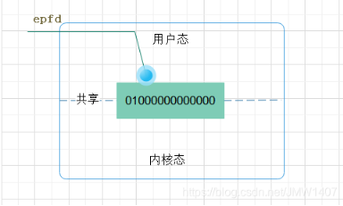

# I/O复用

## 基础知识

**句柄**	数值上，是一个32位无符号整型值（32位系统下）；逻辑上，相当于指针的指针；形象理解上，是Windows中各个对象的一个唯一的、固定不变的ID；作用上，Windows使用句柄来标识诸如窗口、位图、画笔等对象，并通过句柄找到这些对象

​	个人理解：句柄就是指向对象地址指针的指针，对象地址一直在变，其指针的值也一直在变，但指向其指针地址的指针一直不变，这个指针就是句柄

**句柄性质**

​	1.所谓“唯一”、“不变”是指在程序的一次运行中。如果本次运行完，关闭程序，再次启动程序运行，那么这次运行中，同一对象的句柄的值和上次运行时比较，一般是不一样的。

​	其实这理解起来也很自然，所谓“一把归一把，这把是这把，那把是那把，两者不相干”（“把”是形象的说法，就像打牌一样，这里指程序的一次运行）。

​	2.句柄是对象生成时系统指定的，属性是只读的，程序员不能修改句柄。

​	3.不同的系统中，句柄的大小（字节数）是不同的，可以使用sizeof()来计算句柄的大小。

​	4.通过句柄，程序员只能调用系统提供的服务（即API调用），不能像使用指针那样，做其它的事。

**什么是多路复用**

​	多路: 指的是多个socket网络连接;

​	复用: 指的是复用一个线程、使用一个线程来检查多个文件描述符（Socket）的就绪状态

​	多路复用主要有三种技术：select，poll，epoll。epoll是最新的, 也是目前最好的多路复用技术；

**什么是IO**	对文件的所有操作都是对外设的输入和输出简称IO

**什么是文件**	

​	狭义：1、文件在磁盘里	2、磁盘是永久性存储介质，因此文件在磁盘上的存储是永久性的	3、磁盘是外设（既是输出设备也是输入设备）	

​	广义：Linux下一切皆文件（键盘、显示器、网卡等都是抽象化的过程）

**文件操作的归类**

​	1、对于0KB的操作本质是进程对文件的操作

​	2、文件是文件属性（元数据）和文件内容的集合（文件 = 属性（元数据） + 内容）

​	3、所有的文件操作本质是文件内容操作和文件属性操作

​	**系统角度**

​		1、对文件的操作本质是进程对文件的操作

​		2、磁盘的管理者是操作系统

​		3、文件的读写本质不是通过C/C++的库函数来操作（这些库函数只是为用户提供方便），而是通过文件相关的系统调用接口来实现

**文件描述符**	一个非负整数值，一个句柄

**OS怎么样知道网络数据对应于哪个socket**

​	因为一个socket对应着一个`端口号`，而网络数据包中包含了ip和端口的信息，内核可以通过端口号找到对应的socket。当然，为了提高处理速度，操作系统会维护端口号到socket的索引结构，以快速读取。

### 五种IO模型

**阻塞IO**


​	进程/线程在从调用recvfrom开始到它返回的整段时间内是被阻塞的，recvfrom成功返回后，应用进程/线程开始处理数据报。主要特点是进程阻塞挂起不消耗CPU资源，能及时响应每个操作；实现难度低，适用并发量小的网络应用开发，不适用并发量大的应用，因为一个请求IO会阻塞进程，所以每请求分配一个处理进程（线程）去响应，系统开销大。

**非阻塞IO**


​	进程发起IO系统调用后，如果内核缓冲区没有数据，需要到IO设备中读取，进程返回一个错误而不会被阻塞；进程发起IO系统调用后，如果内核缓冲区有数据，内核就会把数据返回进程。

​	进程轮询（重复）调用，消耗CPU的资源；

​	实现难度低、开发应用相对阻塞IO模式较难；

​	适用并发量较小、且不需要及时响应的网络应用开发

**信号驱动IO**


​	当进程发起一个IO操作，会向内核注册一个信号处理函数，然后进程返回不阻塞；当内核数据就绪时会发送一个信号给进程，进程便在信号处理函数中调用IO读取数据。

特点：回调机制，实现、开发应用难度大；

**异步IO**


​	当进程发起一个IO操作，进程返回（不阻塞），但也不能返回果结；内核把整个IO处理完后，会通知进程结果。如果IO操作成功则进程直接获取到数据。

特点：
    不阻塞，数据一步到位；Proactor模式；
    需要操作系统的底层支持，LINUX 2.5 版本内核首现，2.6 版本产品的内核标准特性；
    实现、开发应用难度大；
    非常适合高性能高并发应用；

**IO多路复用**


​	大多数文件系统的默认IO操作都是缓存IO。在Linux的缓存IO机制中，操作系统会将IO的数据缓存在文件系统的页缓存（page cache）。也就是说，数据会先被拷贝到操作系统内核的缓冲区中，然后才会从操作系统内核的缓存区拷贝到应用程序的地址空间中。这种做法的缺点就是，需要在应用程序地址空间和内核进行多次拷贝，这些拷贝动作所带来的CPU以及内存开销是非常大的。

​	I/O多路复用就是通过一种机制，一个进程可以监视多个描述符，一旦某个描述符就绪（一般是读就绪或者写就绪），能够通知程序进行相应的读写操作。但select，poll，epoll本质上都是同步I/O，因为他们都需要在读写事件就绪后自己负责进行读写，也就是说这个读写过程是阻塞的，而异步I/O则无需自己负责进行读写，异步I/O的实现会负责把数据从内核拷贝到用户空间

​	至于为什么不能直接让磁盘控制器把数据送到应用程序的地址空间中呢？最简单的一个原因就是应用程序不能直接操作底层硬件。

**支持IO多路复用的系统调用**	select、pselect、poll、epoll

**多进程/线程与IO多路复用**	I/O多路复用技术的最大优势是系统开销小，系统不必创建进程/线程，也不必维护这些进程/线程，从而大大减小了系统的开销

**总结**

IO分两阶段：

​	1)数据准备阶段

​	2)内核空间复制回用户进程缓冲区阶段。


## select

### 概念

**头文件和函数声明**	

```
<sys/select.h>
<sys/time.h>
int select(int maxfd, 
			fd_set *readfds, 
			fd_set *writefds,
            fd_set *exceptfds, 
            struct timeval *timeout);           
```

**参数说明**

```
maxfds：是一个整数值，是指集合中所有文件描述符的范围，即所有文件描述符的最大值加1，不能错。在linux系统中，select的默认最大值为1024。设置这个值的目的是为了不用每次都去轮询这1024个fd，假设我们只需要几个套接字，我们就可以用最大的那个套接字的值加上1作为这个参数的值，当我们在等待是否有套接字准备就绪时，只需要监测maxfd+1个套接字就可以了，这样可以减少轮询时间以及系统的开销。

readfds：首先需要明白，fd_set是什么数据类型，有一点像int，又有点像struct，其实，fd_set声明的是一个集合，也就是说，readfs是一个容器，里面可以容纳多个文件描述符，把需要监视的描述符放入这个集合中，当有文件描述符可读时，select就会返回一个大于0的值，表示有文件可读；
writefds和readfs类似，表示有一个可写的文件描述符集合，当有文件可写时，select就会返回一个大于0的值，表示有文件可写；
fd_set* exceptfds同上面两个参数的意图，用来监视文件错误异常文件。

timeout：这个参数一出来就可以知道，可以选择阻塞，可以选择非阻塞，还可以选择定时返回。
	当将timeout置为NULL时，表明此时select是阻塞的；
	当将tineout设置为timeout->tv_sec = 0，timeout->tv_usec = 0时，表明这个函数为非阻塞；
	当将timeout设置为非0的时间，表明select有超时时间，当这个时间走完，select函数就会返回。
	从这个角度看，个人觉得可以用select来做超时处理，因为你如果使用recv函数的话，你还需要去设置recv的模式，麻烦的很。

struct timeval{      
	long tv_sec;   /*秒 */	//延时多少秒
	long tv_usec;  /*微秒 */   //延时多少微秒
}
void FD_ZERO(fd_set *set);//将fdset里面的所有位设置成0
void FD_SET(int fd, fd_set *set);//设置fd到fdset中
void FD_CLR(int fd, fd_set *set);//从fdset中删除fd
int  FD_ISSET(int fd, fd_set *set);//判断fd在不在fdset中

对fd_set的理解：fd_set可以理解为一个二进制位图集合，那么集合就会有一个数量，在<sys/select.h>总定义了一个常量FD_SETSIZE，默认为1024，也就是说在这个集合内默认最多有1024个文件描述符，但是通常你用不了这么多，你通常只是关心maxfds个描述符。
也就是说你现在有maxfds个文件描述符在这个集合里，那么我怎么知道集合里的哪个文件描述符有消息来了呢？你可以将fd_set中的集合看成是二进制bit位，一位代表着一个文件描述符。0代表文件描述符处于睡眠状态，没有数据到来；1代表文件描述符处于准备状态，可以被应用层处理

```

### 步骤

```
1、设置文件描述符
2、设置监听范围
3、设置监听超时
4、调用select
5、查看监听结果
6、处理目标事件
7、调用select....
```

### 解析

```
select函数可以分下面几步进行理解

在你开始监测这些描述符时，你先将这些文件描述符全部置为0，当你需要监测的描述符置为1
使用select函数监听置为1的文件描述符是否有数据到来
	当状态为1的文件描述符有数据到来时，此时你的状态仍然为1，但是其他状态为1的文件描述如果没有数据到来，那么此时会将这些文件描述符置为0
	当select函数返回后，可能有一个或者多个文件描述符为1
那么你怎么知道是哪个文件描述符准备好了呢？
	其实select并不会告诉你说，我哪个文件描述符准备好了，他只会告诉你他的那些bit为位哪些是0，哪些是1。也就是说你需要自己用逻辑去判断你要的那个文件描是否准备好了
	
理解了上面几步的话，下面这些宏就比较好理解了。
FD_ZERO：将指定集合里面所有的描述符全部置为0，在对文件描述符集合进行设置前，必须对其进行初始化，如果不清空，由于在系统分配内存空间后，通常并不作清空处理，所以结果是不可知的
FD_SET：用于在文件描述符集合中增加一个新的文件描述符，将相应的位置置为1
FD_CLR：用来清除集合里面的某个文件描述符
FD_ISSET：用来检测指定的某个描述符是否有数据到来。

假如在我们的程序中有5个客户端已经连接上了服务器，这个时候突然有一条数据过来了。select返回了，但是此时你并不知道是哪个客户发过来的消息，因为你每个客户发过来的消息都是一样重要的。所以你没法去只针对一个套接字使用FD_ISSET，你需要做的是用一个循环去检测（FD_ISSET）到底是哪一个客户发过来的消息，因为如果此时你监测一个套接字的话，其他客户的信息你会丢失。这个也是select的一个缺点，你需要去检测所有的套接字，看看这个套接字到底是谁来的数据。


select模型的缺点
	[1] 每次调用select，都需要把被监控的fds集合从用户态空间拷贝到内核态空间，高并发场景下这样的拷贝会使得消耗的资源是很大的。
	[2] 能监听端口的数量有限，单个进程所能打开的最大连接数由FD_SETSIZE宏定义，监听上限就等于fds_bits位数组中所有元素的二进制位总数，其大小是32个整数的大小（在32位的机器上，大小就是3232，同理64位机器上为3264），当然我们可以对宏FD_SETSIZE进行修改，然后重新编译内核，但是性能可能会受到影响，一般该数和系统内存关系很大，具体数目可以cat /proc/sys/fs/file-max察看。32位机默认1024个，64位默认2048。
	[3] 被监控的fds集合中，只要有一个有数据可读，整个socket集合就会被遍历一次调用sk的poll函数收集可读事件：由于当初的需求是朴素，仅仅关心是否有数据可读这样一个事件，当事件通知来的时候，由于数据的到来是异步的，我们不知道事件来的时候，有多少个被监控的socket有数据可读了，于是，只能挨个遍历每个socket来收集可读事件了。
	如果只对系统提供的事件集合FD_SET做遍历，当监听集合很多但是只有个别几个有事件发生时，遍历哪个文件描述符有事件的过程会消耗很多无用资源。因此select相比于poll，epoll效率就低
	当select上监听的fd数量较少，内核通知用户现在有就绪事件发生，应用程序判断当前是哪个fd就绪所消耗的时间复杂度就会大大减小。
	故而select适用于连接较少的情况
```

### 示例

```
#include <stdio.h>
#include <stdlib.h>
#include <unistd.h>
#include <string.h>
#include <arpa/inet.h>
#include <ctype.h>

#define SERV_PORT 6666

int main(int argc, char *argv[])
{
    int listenfd, connfd;
    char buf[BUFSIZ], str[INET_ADDRSTRLEN];

    struct sockaddr_in clie_addr, serv_addr;//创建套接字
    socklen_t clie_addr_len;

    listenfd = socket(AF_INET, SOCK_STREAM, 0);//s
    int opt = 1;
    setsockopt(listenfd, SOL_SOCKET, SO_REUSEADDR, &opt, sizeof(opt)); //SO_REUSEADDR允许重用本地地址端口

    bzero(&serv_addr, sizeof(serv_addr));

    serv_addr.sin_family = AF_INET;
    serv_addr.sin_addr.s_addr = htonl(INADDR_ANY);
    serv_addr.sin_port = htons(SERV_PORT);

    bind(listenfd, (struct sockaddr *)&serv_addr, sizeof(serv_addr));
    listen(listenfd, 128);

    fd_set rset, allset;
    int ret, maxfd = 0;
    maxfd = listenfd;
    FD_ZERO(&allset); //集合全部设为0
    FD_SET(listenfd, &allset);

    while (1)
    {
        rset = allset;
        ret = select(maxfd + 1, &rset, NULL, NULL, NULL); //返回有事件发生的个数
        if (FD_ISSET(listenfd, &rset))
        {
            clie_addr_len = sizeof(clie_addr);
            connfd = accept(listenfd, (struct sockaddr *)&clie_addr, &clie_addr_len);
            printf("received from %s at PORT %d\n", inet_ntop(AF_INET, &clie_addr.sin_addr, str, sizeof(str)), ntohs(clie_addr.sin_port));

            FD_SET(connfd, &allset); //将一个集合中的事件“加入”
            if (maxfd < connfd)
                maxfd = connfd;
            if (ret == 1)
                continue; //说明select只返回一个，并且只是listenfd，无需后续执行
        }
        int n = 0;//read读到的字节数
        for (int i = listenfd + 1; i < maxfd + 1; ++i)
        {
            if (FD_ISSET(i, &rset)) //判断文件描述符是否在集合中
            {
                n = read(i, buf, sizeof(buf));
                if (n == 0)
                {
                    close(i);
                    FD_CLR(i, &allset); //将一个集合中的事件“拿走”
                }
                else if (n == -1)
                {
                }
                else
                    for (int j = 0; j < n; ++j)
                        buf[j] = toupper(buf[j]);
                write(i, buf, n);
                write(STDOUT_FILENO, buf, n);
            }
        }
    }

    close(listenfd);
    return 0;
}

```

## poll

### 概念

**什么是poll**	

```
poll的实现和select非常相似，只是描述fd集合的方式不同。针对select遗留的fd限制和性能问题，poll只是使用pollfd结构而不是select的fd_set结构，这就解决了select的fds集合大小1024限制问题。但poll和select同样存在一个性能缺点就是包含大量文件描述符的数组被整体复制于用户态和内核的地址空间之间，而不论这些文件描述符是否就绪，它的开销随着文件描述符数量的增加而线性增大。
```

**头文件和函数声明**

```
#include <poll.h>
int poll(struct pollfd *fds, nfds_t nfds, int timeout);

nfds 为监听事件集合fds的大小

timeout 为poll的超时时间，单位毫秒。timeout 为-1时，poll永远阻塞，直到有事件发生。timeout为0时，poll立即返回。
```

**结构体**

```
struct pollfd {
    int fd;           /*文件描述符*/
    short events;     /*监控的事件*/
    short revents;    /*监控事件中满足条件返回的事件*/
};
fd 为文件描述符，events 告诉poll 监听fd 上哪些事件，它是一系列事件按位或。revents 由内核修改，来通知应用程序fd 上实际上发生了哪些事件

```

### 解析

```
poll改变了fds集合的描述方式，使用了pollfd结构而不是select的fd_set结构，使得poll支持的fds集合限制远大于select的1024。poll虽然解决了fds集合大小1024的限制问题，从实现来看。很明显它并没优化大量描述符数组被整体复制于用户态和内核态的地址空间之间，以及个别描述符就绪触发整体描述符集合的遍历的低效问题。poll随着监控的socket集合的增加性能线性下降，使得poll也并不适合用于大并发场景。
```

#### poll实现原理

```
###应用层调用poll函数时内核状态

（1）把用户空间的pollfd复制到内核空间，用户空间的pollfd包含有设置的需要监听的fd和events
// poll 使用的结构体  
struct pollfd {  
    int fd;        // 描述符  
    short events;  // 关注的事件掩码  
    short revents; // 返回的事件掩码  
};  
// long sys_poll(struct pollfd *ufds, unsigned int nfds, long timeout_msecs)  
SYSCALL_DEFINE3(poll, struct pollfd __user *, ufds, unsigned int, nfds,  
                long, timeout_msecs)  
{  
    struct timespec end_time, *to = NULL;  
    int ret;  
    if (timeout_msecs >= 0) {  
        to = &end_time;  
        // 将相对超时时间msec 转化为绝对时间  
        poll_select_set_timeout(to, timeout_msecs / MSEC_PER_SEC,  
                                NSEC_PER_MSEC * (timeout_msecs % MSEC_PER_SEC));  
    } 
     // do sys poll  
    ret = do_sys_poll(ufds, nfds, to);  
    // do_sys_poll 被信号中断, 重新调用, 对使用者来说 poll 是不会被信号中断的.  
    if (ret == -EINTR) {  
        struct restart_block *restart_block;  
        restart_block = &current_thread_info()->restart_block;  
        restart_block->fn = do_restart_poll; // 设置重启的函数  
        restart_block->poll.ufds = ufds;  
        restart_block->poll.nfds = nfds;  
        if (timeout_msecs >= 0) {  
            restart_block->poll.tv_sec = end_time.tv_sec;  
            restart_block->poll.tv_nsec = end_time.tv_nsec;  
            restart_block->poll.has_timeout = 1;  
        } else {  
            restart_block->poll.has_timeout = 0;  
        }  
        // ERESTART_RESTARTBLOCK 不会返回给用户进程,  
        // 而是会被系统捕获, 然后调用 do_restart_poll,  
        ret = -ERESTART_RESTARTBLOCK;  
    }  
    return ret;  
} 

int do_sys_poll(struct pollfd __user *ufds, unsigned int nfds,  
                struct timespec *end_time)  
{  
    struct poll_wqueues table;  
    int err = -EFAULT, fdcount, len, size;  
    /* 首先使用栈上的空间，节约内存，加速访问 */  
    long stack_pps[POLL_STACK_ALLOC/sizeof(long)];  
    struct poll_list *const head = (struct poll_list *)stack_pps;  
    struct poll_list *walk = head;  
    unsigned long todo = nfds;  
    if (nfds > rlimit(RLIMIT_NOFILE)) {  
        // 文件描述符数量超过当前进程限制  
        return -EINVAL;  
    }  
    // 复制用户空间数据到内核  
    len = min_t(unsigned int, nfds, N_STACK_PPS);  
    for (;;) {  
        walk->next = NULL;  
        walk->len = len;  
        if (!len) {  
            break;  
        } 
...................................................（1）
 // 复制到当前的 entries  
        if (copy_from_user(walk->entries, ufds + nfds-todo,  
                           sizeof(struct pollfd) * walk->len)) {  
            goto out_fds;  
        }  
        todo -= walk->len;  
        if (!todo) {  
            break;  
        }  
        // 栈上空间不足，在堆上申请剩余部分  
        len = min(todo, POLLFD_PER_PAGE);  
        size = sizeof(struct poll_list) + sizeof(struct pollfd) * len;  
        walk = walk->next = kmalloc(size, GFP_KERNEL);  
        if (!walk) {  
            err = -ENOMEM;  
            goto out_fds;  
        }  
    } 
// 初始化 poll_wqueues 结构, 设置函数指针_qproc  为__pollwait  
..................................................................（2）
    poll_initwait(&table);  
    // poll  
.....................................................................（3）
    fdcount = do_poll(nfds, head, &table, end_time);  
    // 从文件wait queue 中移除对应的节点, 释放entry.  
    poll_freewait(&table);  
    // 复制结果到用户空间  
    for (walk = head; walk; walk = walk->next) {  
        struct pollfd *fds = walk->entries;  
        int j;  
        for (j = 0; j < len; j++, ufds++)  
.......................................................................（4）
            if (__put_user(fds[j].revents, &ufds->revents)) {  
                goto out_fds;  
            }  
    }  
    err = fdcount;  
out_fds:  
    // 释放申请的内存  
    walk = head->next;  
    while (walk) {  
        struct poll_list *pos = walk;  
        walk = walk->next;  
        kfree(pos);  
    }  
    return err;  
}   

（2）初始化 poll的等待队列
void poll_initwait(struct poll_wqueues *pwq)
{
	//__pollwait函数在调用监控文件的poll函数的时候会被回掉到，用来向驱动函数的等待队列头插入该等待队列。
	init_poll_funcptr(&pwq->pt, __pollwait);
	pwq->polling_task = current;
	pwq->triggered = 0;
	pwq->error = 0;
	pwq->table = NULL;
	pwq->inline_index = 0;
}

（3）do_poll的详细实现，遍历每个文件描述符实现的poll函数，检查是否该文件有数据可读，如果有数据可读，就返回，否则就把自己插入到驱动的等待队列头中睡眠，直到有数据来杯唤醒

（4）把各个文件描述符poll调用得到的返回事件复制到用户空间，用户空间据此返回值可以来判断文件的状态。
```

#### do_poll详细实现

```
（1）调用文件描述符提供的poll方法，可以看到，如果返回的mask不为0，则表示有数据变化，该mask 值作为do_pollfd的返回值不为0，则count++

 // 真正的处理函数  
static int do_poll(unsigned int nfds,  struct poll_list *list,  
                   struct poll_wqueues *wait, struct timespec *end_time)  
{  
    poll_table* pt = &wait->pt;  
    ktime_t expire, *to = NULL;  
    int timed_out = 0, count = 0;  
    unsigned long slack = 0;  
    if (end_time && !end_time->tv_sec && !end_time->tv_nsec) {  
        // 已经超时,直接遍历所有文件描述符, 然后返回  
        pt = NULL;  
        timed_out = 1;  
    }  
    if (end_time && !timed_out) {  
        // 估计进程等待时间，纳秒  
        slack = select_estimate_accuracy(end_time);  
    } 
    // 遍历文件，为每个文件的等待队列添加唤醒函数(pollwake)  
    for (;;) {  
        struct poll_list *walk;  
        for (walk = list; walk != NULL; walk = walk->next) {  
            struct pollfd * pfd, * pfd_end;  
            pfd = walk->entries;  
            pfd_end = pfd + walk->len;  
            for (; pfd != pfd_end; pfd++) {  
                // do_pollfd 会向文件对应的wait queue 中添加节点  
                // 和回调函数(如果 pt 不为空)  
                // 并检查当前文件状态并设置返回的掩码  
-----------------------------------------------------------------（1）
                if (do_pollfd(pfd, pt)) {  
                    // 该文件已经准备好了.  
                    // 不需要向后面文件的wait queue 中添加唤醒函数了.  
                    count++;  
                    pt = NULL;  
                }  
            }  
        }  
    // 下次循环的时候不需要向文件的wait queue 中添加节点,  
        // 因为前面的循环已经把该添加的都添加了  
        pt = NULL;  
  
        // 第一次遍历没有发现ready的文件  
        if (!count) {  
            count = wait->error;  
            // 有信号产生  
            if (signal_pending(current)) {  
                count = -EINTR;  
            }  
        }  
  -----------------------------------------------------------------------（2）
        // 有ready的文件或已经超时  
        if (count || timed_out) {  
            break;  
        }  
        // 转换为内核时间  
        if (end_time && !to) {  
            expire = timespec_to_ktime(*end_time);  
            to = &expire;  
        }  
     // 等待事件就绪, 如果有事件发生或超时，就再循  
        // 环一遍，取得事件状态掩码并计数,  
        // 注意此次循环中, 文件 wait queue 中的节点依然存在  
---------------------------------------------------------------------------（3）
        if (!poll_schedule_timeout(wait, TASK_INTERRUPTIBLE, to, slack)) {  
            timed_out = 1;  
        }  
    }  
    return count;  
}  

static inline unsigned int do_pollfd(struct pollfd *pollfd, poll_table *pwait)
{
	unsigned int mask;
	int fd;
	mask = 0;
	fd = pollfd->fd;
	if (fd >= 0) {
		struct fd f = fdget(fd);
		mask = POLLNVAL;
		if (f.file) {
			mask = DEFAULT_POLLMASK;
			if (f.file->f_op && f.file->f_op->poll) {
				pwait->_key = pollfd->events|POLLERR|POLLHUP;
				mask = f.file->f_op->poll(f.file, pwait);
			}
			/* Mask out unneeded events. */
			mask &= pollfd->events | POLLERR | POLLHUP;
			fdput(f);
		}
	}
	pollfd->revents = mask;
 
	return mask;
}

（2）如果count不为0，或者超时，则poll不会睡眠，直接返回

（3）如果 超时，或者没有数据变化，则睡眠，由于外围函数是个for的死循环，所以醒来以后又会遍历所有的描述符事件，来获取数据以及决定是否跳出poll方法

从上面的实现可以看出，如果应用层要实现poll这样的机制，是需要驱动层来提供自己的poll函数的。
```

### 示例

```
###驱动的poll实现

#include <linux/module.h>
#include <linux/types.h>
#include <linux/fs.h>
#include <linux/errno.h>
#include <linux/mm.h>
#include <linux/sched.h>
#include <linux/init.h>
#include <linux/cdev.h>
#include <asm/io.h>
#include <asm/system.h>
#include <asm/uaccess.h>
#include <linux/poll.h>
#include "memdev.h"
 
static mem_major = MEMDEV_MAJOR;
bool have_data = false; /*表明设备有足够数据可供读*/
 
module_param(mem_major, int, S_IRUGO);
 
struct mem_dev *mem_devp; /*设备结构体指针*/
 
struct cdev cdev; 
 
/*文件打开函数*/
int mem_open(struct inode *inode, struct file *filp)
{
    struct mem_dev *dev;
    
    /*获取次设备号*/
    int num = MINOR(inode->i_rdev);
 
    if (num >= MEMDEV_NR_DEVS) 
            return -ENODEV;
    dev = &mem_devp[num];
    
    /*将设备描述结构指针赋值给文件私有数据指针*/
    filp->private_data = dev;
    
    return 0; 
}
 
/*文件释放函数*/
int mem_release(struct inode *inode, struct file *filp)
{
  return 0;
}
 
/*读函数*/
static ssize_t mem_read(struct file *filp, char __user *buf, size_t size, loff_t *ppos)
{
  unsigned long p =  *ppos;
  unsigned int count = size;
  int ret = 0;
  struct mem_dev *dev = filp->private_data; /*获得设备结构体指针*/
 
  /*判断读位置是否有效*/
  if (p >= MEMDEV_SIZE)
    return 0;
  if (count > MEMDEV_SIZE - p)
    count = MEMDEV_SIZE - p;
    
  while (!have_data) /* 没有数据可读，考虑为什么不用if，而用while */
  {
        if (filp->f_flags & O_NONBLOCK)
            return -EAGAIN;
    
    wait_event_interruptible(dev->inq,have_data);
  }
 
  /*读数据到用户空间*/
  if (copy_to_user(buf, (void*)(dev->data + p), count))
  {
    ret =  - EFAULT;
  }
  else
  {
    *ppos += count;
    ret = count;
   
    printk(KERN_INFO "read %d bytes(s) from %d\n", count, p);
  }
  
  have_data = false; /* 表明不再有数据可读 */
  /* 唤醒写进程 */
  return ret;
}
 
/*写函数*/
static ssize_t mem_write(struct file *filp, const char __user *buf, size_t size, loff_t *ppos)
{
  unsigned long p =  *ppos;
  unsigned int count = size;
  int ret = 0;
  struct mem_dev *dev = filp->private_data; /*获得设备结构体指针*/
  
  /*分析和获取有效的写长度*/
  if (p >= MEMDEV_SIZE)
    return 0;
  if (count > MEMDEV_SIZE - p)
    count = MEMDEV_SIZE - p;
 
  /*从用户空间写入数据*/
  if (copy_from_user(dev->data + p, buf, count))
    ret =  - EFAULT;
  else
  {
    *ppos += count;
    ret = count;
    
    printk(KERN_INFO "written %d bytes(s) from %d\n", count, p);
  }
  
  have_data = true; /* 有新的数据可读 */
    
    /* 唤醒读进程 */
    wake_up(&(dev->inq));
 
  return ret;
}
 
/* seek文件定位函数 */
static loff_t mem_llseek(struct file *filp, loff_t offset, int whence)
{ 
    loff_t newpos;
 
    switch(whence) {
      case 0: /* SEEK_SET */
        newpos = offset;
        break;
 
      case 1: /* SEEK_CUR */
        newpos = filp->f_pos + offset;
        break;
 
      case 2: /* SEEK_END */
        newpos = MEMDEV_SIZE -1 + offset;
        break;
 
      default: /* can't happen */
        return -EINVAL;
    }
    if ((newpos<0) || (newpos>MEMDEV_SIZE))
        return -EINVAL;
        
    filp->f_pos = newpos;
    return newpos;
 
}
unsigned int mem_poll(struct file *filp, poll_table *wait)
{
    struct mem_dev  *dev = filp->private_data; 
    unsigned int mask = 0;
    
   /*将等待队列添加到poll_table */
    poll_wait(filp, &dev->inq,  wait);
 
    
    if (have_data)         mask |= POLLIN | POLLRDNORM;  /* readable */
 
    return mask;
}
 
 
/*文件操作结构体*/
static const struct file_operations mem_fops =
{
  .owner = THIS_MODULE,
  .llseek = mem_llseek,
  .read = mem_read,
  .write = mem_write,
  .open = mem_open,
  .release = mem_release,
  .poll = mem_poll,
};
 
/*设备驱动模块加载函数*/
static int memdev_init(void)
{
  int result;
  int i;
 
  dev_t devno = MKDEV(mem_major, 0);
 
  /* 静态申请设备号*/
  if (mem_major)
    result = register_chrdev_region(devno, 2, "memdev");
  else  /* 动态分配设备号 */
  {
    result = alloc_chrdev_region(&devno, 0, 2, "memdev");
    mem_major = MAJOR(devno);
  }  
  
  if (result < 0)
    return result;
 
  /*初始化cdev结构*/
  cdev_init(&cdev, &mem_fops);
  cdev.owner = THIS_MODULE;
  cdev.ops = &mem_fops;
  
  /* 注册字符设备 */
  cdev_add(&cdev, MKDEV(mem_major, 0), MEMDEV_NR_DEVS);
   
  /* 为设备描述结构分配内存*/
  mem_devp = kmalloc(MEMDEV_NR_DEVS * sizeof(struct mem_dev), GFP_KERNEL);
  if (!mem_devp)    /*申请失败*/
  {
    result =  - ENOMEM;
    goto fail_malloc;
  }
  memset(mem_devp, 0, sizeof(struct mem_dev));
  
  /*为设备分配内存*/
  for (i=0; i < MEMDEV_NR_DEVS; i++) 
  {
        mem_devp[i].size = MEMDEV_SIZE;
        mem_devp[i].data = kmalloc(MEMDEV_SIZE, GFP_KERNEL);
        memset(mem_devp[i].data, 0, MEMDEV_SIZE);
  
      /*初始化等待队列*/
     init_waitqueue_head(&(mem_devp[i].inq));
     //init_waitqueue_head(&(mem_devp[i].outq));
  }
   
  return 0;
 
  fail_malloc: 
  unregister_chrdev_region(devno, 1);
  
  return result;
}
 
/*模块卸载函数*/
static void memdev_exit(void)
{
  cdev_del(&cdev);   /*注销设备*/
  kfree(mem_devp);     /*释放设备结构体内存*/
  unregister_chrdev_region(MKDEV(mem_major, 0), 2); /*释放设备号*/
}
 
MODULE_AUTHOR("David Xie");
MODULE_LICENSE("GPL");
 
module_init(memdev_init);
module_exit(memdev_exit);

其中poll_wait是调用poll_table初始化时赋值的__pollwait函数，该函数为__pollwait，把当前进程插入到该驱动提供的等待队列头中，最后数据到达时，一般会由该驱动来唤醒等待队列头中的进程

static inline void poll_wait(struct file * filp, wait_queue_head_t * wait_address, poll_table *p)
{
	if (p && p->_qproc && wait_address)
		p->_qproc(filp, wait_address, p);
}
```


## epoll

### 概念

**相关系统调用**

```
epoll_create 负责创建一个池子，一个监控和管理句柄 fd 的池子；
epoll_ctl 负责管理这个池子里的 fd 增、删、改；
epoll_wait 就是负责打盹的，让出 CPU 调度，但是只要有“事”，立马会从这里唤醒
```

**头文件和结构体**

```
#include <sys/epoll.h>

typedef union epoll_data
{
    void* ptr;              //指定与fd相关的用户数据
    int fd;                 //指定事件所从属的目标文件描述符
    uint32_t u32;
    uint64_t u64;
} epoll_data_t;

struct epoll_event {
      __uint32_t events;  /* Epoll 事件 */
      epoll_data_t data;  /* 用户数据 */
};

struct eventpoll
{
    spin_lock_t lock;            //对本数据结构的访问
    struct mutex mtx;            //防止使用时被删除
    wait_queue_head_t wq;        //sys_epoll_wait() 使用的等待队列
    wait_queue_head_t poll_wait; //file->poll()使用的等待队列
    struct list_head rdllist;    //事件满足条件的链表
    struct rb_root rbr;          //用于管理所有fd的红黑树
    struct epitem *ovflist;      //将事件到达的fd进行链接起来发送至用户空间
}


struct epitem
{
    struct rb_node rbn;            //用于主结构管理的红黑树
    struct list_head rdllink;       //事件就绪队列
    struct epitem *next;           //用于主结构体中的链表
    struct epoll_filefd ffd;         //每个fd生成的一个结构
    int nwait;
    struct list_head pwqlist;     //poll等待队列
    struct eventpoll *ep;          //该项属于哪个主结构体
    struct list_head fllink;         //链接fd对应的file链表
    struct epoll_event event; //注册的感兴趣的事件,也就是用户空间的epoll_event
 }
```

**函数说明**

```
###epoll_create
int epoll_create(int size);
	功能：该函数生成一个 epoll 专用的文件描述符。
	参数size: 用来告诉内核这个监听的数目一共有多大，参数 size 并不是限制了 epoll 所能监听的描述符最大个数，只是对内核初始分配内部数据结构的一个建议。自从 linux 2.6.8 之后，size 参数是被忽略的，也就是说可以填只有大于 0 的任意值。
	返回值：如果成功，返回poll 专用的文件描述符，否者失败，返回-1。

源码实现
SYSCALL_DEFINE1(epoll_create1, int, flags)
{
    struct eventpoll *ep = NULL;

    //创建一个 eventpoll 对象
    error = ep_alloc(&ep);
}

//struct eventpoll 的定义
// file：fs/eventpoll.c
struct eventpoll
{
    spin_lock_t lock;            //对本数据结构的访问
    struct mutex mtx;            //防止使用时被删除
    wait_queue_head_t wq;        //sys_epoll_wait() 使用的等待队列
    wait_queue_head_t poll_wait; //file->poll()使用的等待队列
    struct list_head rdllist;    //事件满足条件的链表
    struct rb_root rbr;          //用于管理所有fd的红黑树
    struct epitem *ovflist;      //将事件到达的fd进行链接起来发送至用户空间
}

static int ep_alloc(struct eventpoll **pep)
{
    struct eventpoll *ep;

    //申请 epollevent 内存
    ep = kzalloc(sizeof(*ep), GFP_KERNEL);

    //初始化等待队列头
    init_waitqueue_head(&ep->wq);

    //初始化就绪列表
    INIT_LIST_HEAD(&ep->rdllist);

    //初始化红黑树指针
    ep->rbr = RB_ROOT;

    ......
}
其中eventpoll 这个结构体中的几个成员的含义如下：
	wq： 等待队列链表。软中断数据就绪的时候会通过 wq 来找到阻塞在 epoll 对象上的用户进程。
	rbr： 红黑树。为了支持对海量连接的高效查找、插入和删除，eventpoll 内部使用的就是红黑树。通过红黑树来管理用户主进程accept添加进来的所有 socket 连接。
	rdllist： 就绪的描述符链表。当有连接就绪的时候，内核会把就绪的连接放到 rdllist 链表里。这样应用进程只需要判断链表就能找出就绪进程，而不用去遍历红黑树的所有节点了。
	
	
###epoll_ctl
int epoll_ctl(int epfd, int op, int fd, struct epoll_event *event);
	功能：epoll 的事件注册函数，它不同于 select() 是在监听事件时告诉内核要监听什么类型的事件，而是在这里先注册要监听的事件类型。
	
	参数epfd: epoll 专用的文件描述符，epoll_create()的返回值
	参数op: 表示动作，用三个宏来表示：
        EPOLL_CTL_ADD：注册新的 fd 到 epfd 中；
        EPOLL_CTL_MOD：修改已经注册的fd的监听事件；
        EPOLL_CTL_DEL：从 epfd 中删除一个 fd；
    参数fd: 需要监听的文件描述符
    参数event: 告诉内核要监听什么事件，struct epoll_event 结构如:
        events可以是以下几个宏的集合：
        EPOLLIN ：表示对应的文件描述符可以读（包括对端 SOCKET 正常关闭）；
        EPOLLOUT：表示对应的文件描述符可以写；
        EPOLLPRI：表示对应的文件描述符有紧急的数据可读（这里应该表示有带外数据到来）；
        EPOLLERR：表示对应的文件描述符发生错误；
        EPOLLHUP：表示对应的文件描述符被挂断；
        EPOLLET ：将 EPOLL 设为边缘触发(Edge Trigger)模式，这是相对于水平触发(Level Trigger)来说的。
        EPOLLONESHOT：只监听一次事件，当监听完这次事件之后，如果还需要继续监听这个 socket 的话，需要再次把这个 socket 加入到 EPOLL 队列里
        
	返回值：0表示成功，-1表示失败。
	
	
###epoll_wait
int epoll_wait(int epfd, struct epoll_event * events, int maxevents, int timeout); 
	功能：等待事件的产生，收集在 epoll 监控的事件中已经发送的事件，类似于 select() 调用。
	参数epfd: epoll 专用的文件描述符，epoll_create()的返回值
	参数events: 分配好的 epoll_event 结构体数组，epoll 将会把发生的事件赋值到events 数组中（events 不可以是空指针，内核只负责把数据复制到这个 events 数组中，不会去帮助我们在用户态中分配内存）。
	参数maxevents: maxevents 告之内核这个 events 有多少个 。
	参数timeout: 超时时间，单位为毫秒，为 -1 时，函数为阻塞。
	
    返回值：
    	如果成功，表示返回需要处理的事件数目
    	如果返回0，表示已超时
    	如果返回-1，表示失败
```

### 解析

**epoll高效的原因**

​	1、新建epoll描述符 == epoll_create()
​	epoll把用户关心的文件描述符上的事件放在内核里的一个事件表中，从而无须像select和poll那样每次调用都要重复传入文件描述符集或事件集。
epoll需要使用一个额外的文件描述符，来唯一标识内核中的这个事件表。 这个文件描述符使用如下epoll_create函数来创建

​	2、添加或者删除所有待监控的连接 == epoll_ctl()
​	epoll_ctl函数添加进来的事件都会被放在红黑树的某个节点内，所以，重复添加是没有用的，红黑树本身插入和删除性能比较好，时间复杂度O(logN)

​	3、返回的活跃连接 == epoll_wait（ epoll描述符 ）
​	epoll_wait只需要检查rdlist双向链表中是否有存在注册的事件

**epoll核心**	3个API（3个相关系统调用），核心数据结构是一个红黑树和一个链表


#### 相关知识

**什么是事件**

​	1、可读事件

​		当文件描述符关联的内核读缓冲区可读，则触发可读事件（可读：内核缓冲区非空，有数据可以读取）

​	2、可写事件

​		当文件描述符关联的内核写缓冲区可写，则触发可写事件（可写：内核缓冲区不满，有空闲空间可写入）

**通知机制**	当事件发生时主动通知，通知机制反之就是轮询机制

**socket和文件描述符之间的关系**

套接字也是文件。具体数据传输流程如下：

​	1、当server端监听到有连接时，应用程序会请求内核创建Socket；
​    2、Socket创建好后会返回一个文件描述符给应用程序；
​    3、当有数据包过来网卡时，内核会通过数据包的源端口，源ip，目的端口等在内核维护的一个ipcb双向链表中找到对应的Socket，并将数据包赋值到该Socket的缓冲区；
​    4、应用程序请求读取Socket中的数据时，内核就会将数据拷贝到应用程序的内存空间，从而完成读取Socket数据

注意：
	操作系统针对不同的传输方式（TCP，UDP）会在内核中各自维护一个Socket双向链表，当数据包到达网卡时，会根据数据包的源端口，源ip，目的端口从对应的链表中找到其对应的Socket，并会将数据拷贝到Socket的缓冲区，等待应用程序读取

**服务器文件传输过程**


服务器接收客户的请求，红色箭头方向相反

**内核接收网络数据全过程**

​	1、计算机收到了对端传送的数据（步骤①）；

​	2、数据经由网卡传送到内存（步骤②）；

​	3、然后网卡通过中断信号通知cpu有数据到达，cpu执行中断程序（步骤③）。此处的中断程序主要有两项功能；

​		1）先将网络数据写入到对应socket的接收缓冲区里面（步骤④）；
​		2）再唤醒进程A（步骤⑤），重新将进程A放入工作队列中。

​		

注：
	蓝色区域里面的等待队列：就是用户空间进程调用recv函数（读取数据）请求读取内核缓冲区内的数据，由于缓冲区数据没有准备好，所以处于等待状态（又称为阻塞状态）

**如何同时监听多个socket**

​	epoll是一种I/O事件通知机制，是linux 内核实现IO多路复用的一个实现，在一个操作里同时监听多个输入输出源，在其中一个或多个输入输出源可用的时候返回，然后对其的进行读写操作。

#### epoll_create

**文件描述符的创建**

**函数原型**

```
#include<sys/epoll.h>
int epoll_create(int size);
该函数返回的文件描述符将用作其他所有epoll系统调用的第一个参数，以指定要访问的内核事件表

参数说明：
	size参数现在并不起作用，只是给内核一个提示，告诉内核应该如何为内部数据结构划分初始大小。

返回值	返回文件描述符epollfd
		这个文件描述符也会占用一个fd值，在linux下如果查看/proc/进程id/fd/，能够看到这个fd，所以在使用完epoll后，必须调用close()关闭，否则可能导致fd被耗尽
```

**epoll_create的作用**

​	1、epoll需要使用一个额外的文件描述符，来唯一标识内核中的这个事件表。 这个文件描述符使用如下epoll_create函数来创建；

​	2、epoll把用户关心的文件描述符上的事件放在内核里的一个事件表中，从而无须像select和poll那样每次调用都要重复传入文件描述符集或事件集。

​	3、调用epoll_create时，内核除了帮我们在epoll文件系统里建了个file结点（epoll_create创建的文件描述符），在内核cache里建了个 红黑树用于存储以后epoll_ctl传来的socket外，还会再建立一个list链表，用于存储准备就绪的事件.（概括就是：调用epoll_create方法时，内核会跟着创建一个eventpoll对象）


​	4、eventpoll对象也是文件系统中的一员，和socket一样，它也会有等待队列。

​	5、创建一个代表该epoll的eventpoll对象是必须的，因为内核要维护“就绪列表”等数据，“就绪列表”可以作为eventpoll的成员。

**struct eventpoll**

```
epoll在实现上采用红黑树去存储所有套接字：
    1、当添加或者删除一个套接字时（epoll_ctl），都在红黑树上去处理
    2、红黑树本身插入和删除性能比较好，时间复杂度O(logN)。
    3、通过epoll_ctl函数添加进来的事件都会被放在红黑树的某个节点内，所以，重复添加是没有用的。
    
注意
	在执行epoll_ctl的add操作时，不仅将文件描述符放到红黑树上，而且也注册了回调函数，内核在检测到某文件描述符可读/可写时会调用回调函数，该回调函数将文件描述符放在就绪链表中。
###
eventpoll中包含了两个主要的成员变量，分别是rbr和rdlist，前者指向红黑树的根节点，后者指向双链表的头结点。即一个eventpoll对象对应二个epitem的容器。对epitem的检索，将发生在这两个容器上（红黑树和双链表）

struct eventpoll
{
    spin_lock_t lock;            //对本数据结构的访问
    struct mutex mtx;            //防止使用时被删除
    wait_queue_head_t wq;        //sys_epoll_wait() 使用的等待队列
    wait_queue_head_t poll_wait; //file->poll()使用的等待队列
    struct list_head rdllist;    //事件满足条件的链表
    struct rb_root rbr;          //用于管理所有fd的红黑树
    struct epitem *ovflist;      //将事件到达的fd进行链接起来发送至用户空间
}

###
epitem是中包含了两个主要的成员变量，分别是rbn和rdlink，前者是红黑树的节点，而后者是双链表的节点，也就是说一个epitem对象即可作为红黑树中的一个节点又可作为双链表中的一个节点。并且每个epitem中存放着一个event，对event的查询也就转换成了对epitem的查询
###
struct epitem
{
    struct rb_node rbn;            //用于主结构管理的红黑树
    struct list_head rdllink;       //事件就绪队列
    struct epitem *next;           //用于主结构体中的链表
    struct epoll_filefd ffd;         //每个fd生成的一个结构
    int nwait;
    struct list_head pwqlist;     //poll等待队列
    struct eventpoll *ep;          //该项属于哪个主结构体
    struct list_head fllink;         //链接fd对应的file链表
    struct epoll_event event; //注册的感兴趣的事件,也就是用户空间的epoll_event
 }
```


#### epoll_ctl

**epoll_ctl的作用**

​	创建epoll对象后，可以用epoll_ctl添加或删除所要监听的socket。以添加socket为例，如下图，如果通过epoll_ctl添加sock1、sock2和sock3的监视，内核会将eventpoll添加到这三个socket的等待队列中。


**注意**	当socket收到数据后，中断程序会操作eventpoll对象，而不是直接操作进程。

**函数原型**

```
###操作epoll的内核事件表

#include <sys/epoll.h>
int epoll_ctl(int epfd, int op, int fd, struct epoll_event *event);
返回值：
	成功返回0，不成功返回-1并设置errno。

参数说明：
    1、epfd ：epoll_create()的返回值；
    2、op : 指定操作类型。操作类型有如下3种：
        EPOLL_CTL_ADD：注册新的fd到epfd中；
        EPOLL_CTL_MOD：修改已经注册的fd的监听事件；
        EPOLL_CTL_DEL：从epfd中删除一个fd；
    3、fd：是需要监听的fd
    4、event：告诉内核需要监听什么事，指定事件，它是epoll_event结构指针类型。
    	epoll_event的定义如下：
            struct epoll_event {
              __uint32_t events;  /* Epoll 事件 */
              epoll_data_t data;  /* 用户数据 */
            };        
```


#### epoll_wait

**epoll_wait的作用**

​	当socket收到数据后，中断程序会给eventpoll的“就绪列表”添加socket引用。如下图展示的是sock2和sock3收到数据后，中断程序让rdlist引用这两个socket，而不是像select轮询所有的sock。


​	eventpoll对象相当于是socket和进程之间的中介，socket的数据接收并不直接影响进程，而是通过改变eventpoll的就绪列表来改变进程状态。

​	当程序执行到epoll_wait时，如果rdlist已经引用了socket，那么epoll_wait直接返回，如果rdlist为空，阻塞进程，如下：

​		1、在某时刻进程A运行到了epoll_wait语句。如下图所示，内核会将进程A放入eventpoll的等待队列中，阻塞进程。


​		2、当socket接收到数据，中断程序一方面修改rdlist，另一方面唤醒eventpoll等待队列中的进程，进程A再次进入运行状态（如下图）。也因为rdlist的存在，进程A可以知道哪些socket发生了变化。


**工作流程**

​	1、epoll_wait调用ep_poll，当rdlist为空（无就绪fd）时挂起当前进程，直到rdlist不空时进程才被唤醒。
​	2、文件fd状态改变（buffer由不可读变为可读或由不可写变为可写），导致相应fd上的回调函数ep_poll_callback()被调用。
​	3、ep_poll_callback将相应fd对应epitem加入rdlist，导致rdlist不空，进程被唤醒，epoll_wait得以继续执行。
​	4、ep_events_transfer函数将rdlist中的epitem拷贝到txlist中，并将rdlist清空。
​	5、ep_send_events函数（很关键），它扫描txlist中的每个epitem，调用其关联fd对用的poll方法。此时对poll的调用仅仅是取得fd上较新的events（防止之前events被更新），之后将取得的events和相应的fd发送到用户空间（封装在struct epoll_event，从epoll_wait返回）。


**函数原型**

```
###它在一段超时时间内等待一组文件描述符上的事件，阻塞等待注册的事件发生，返回事件的数目

#include <sys/epoll.h>
int epoll_wait(int epfd, struct epoll_event * events, int maxevents, int timeout);

返回值：
	成功时返回就绪的文件描述符个数，失败时返回-1并设置errno。

参数说明：
    1、epfd ：epoll_create()的返回值；
    2、events: 用来记录被触发的events（结构参考epoll_ctl），其大小受制于maxevents
    3、maxevents: 设定最多监听多少个事件，必须大于0，一般设定为65535
    4、timeout：在函数调用中阻塞时间上限，单位是ms
        timeout = -1：表示调用将一直阻塞，直到有文件描述符进入ready状态或者捕获到信号才返回；
        timeout = 0：用于非阻塞检测是否有描述符处于ready状态，不管结果怎么样，调用都立即返回；
        timeout > 0：表示调用将最多持续timeout时间，如果期间有检测对象变为ready状态或者捕获到信号则返回，否则直到超时。
```

**timeout参数设计技巧问题**

```
1、设置为-1，程序阻塞在此，后续任务没法执行。

2、设置为0，程序能继续跑，但即使没事件时，程序也在空转，十分占用cpu时间片，我测试时每个进程都是60+%的cpu占用时间。

综上，我们给出比较好的设置方法：将其设置为1，但还没完，因为即使这样设置，处理其它任务时，在每次循环都会在这浪费1ms的阻塞时间，多次循环后性能损失就比较明显了。
    为了避免该现象，我们通常向epoll再添加一个fd，我们有其它任务要执行时直接向该fd随便写入一个字节，将epoll唤醒从而跳过阻塞时间。没任务时epoll超过阻塞时间1ms也会自动挂起，不会占用cpu，两全其美。
    int eventfd(unsigned int initval, int flags)，linux中是一个较新的进程通信方式，可以通过它写入字节。
```

#### LT/ET

**LT水平触发**

Level Triggered (LT) 水平触发

​	socket接收缓冲区不为空 ，说明有数据可读， 读事件一直触发

​	socket发送缓冲区不满 ，说明可以继续写入数据 ，写事件一直触发

​	符合思维习惯，epoll_wait返回的事件就是socket的状态

**LT的处理过程**

```
1、accept一个连接，添加到epoll中监听EPOLLIN事件 .（注意这里没有关注EPOLLOUT事件）
2、当EPOLLIN事件到达时，read fd中的数据并处理 .
3、当需要写出数据时，把数据write到fd中；如果数据较大，无法一次性写出，那么在epoll中监听EPOLLOUT事件 .
4、当EPOLLOUT事件到达时，继续把数据write到fd中；如果数据写出完毕，那么在epoll中关闭EPOLLOUT事件

//LT模式的工作流程
void lt( epoll_event* events, int number, int epollfd, int listenfd )
{
    char buf[ BUFFER_SIZE ];
    for ( int i = 0; i < number; i++ )
    {
        int sockfd = events[i].data.fd;
        if ( sockfd == listenfd )
        {
            struct sockaddr_in client_address;
            socklen_t client_addrlength = sizeof( client_address );
            int connfd = accept( listenfd, ( struct sockaddr* )&client_address, &client_addrlength );
            addfd( epollfd, connfd, false );
        }
        else if ( events[i].events & EPOLLIN )
        {
            //只要socket读缓存中还有未读出的数据，这段代码就被触发
            printf( "event trigger once\n" );
            memset( buf, '\0', BUFFER_SIZE );
            int ret = recv( sockfd, buf, BUFFER_SIZE-1, 0 );
            if( ret <= 0 )
            {
                close( sockfd );
                continue;
            }
            printf( "get %d bytes of content: %s\n", ret, buf );
        }
        else
        {
            printf( "something else happened \n" );
        }
    }
}
```

**ET边沿触发**

Edge Triggered (ET)  边沿触发

​	socket的接收缓冲区状态变化时触发读事件，即空的接收缓冲区刚接收到数据时触发读事件（从无到有）

​	socket的发送缓冲区状态变化时触发写事件，即满的缓冲区刚空出空间时触发读事件（从有到无）

​	仅在状态变化时触发事件

**ET的处理过程**

```
1、accept一个一个连接，添加到epoll中监听EPOLLIN|EPOLLOUT事件（）
2、当EPOLLIN事件到达时，read fd中的数据并处理，read需要一直读，直到返回EAGAIN为止
3、当需要写出数据时，把数据write到fd中，直到数据全部写完，或者write返回EAGAIN
4、当EPOLLOUT事件到达时，继续把数据write到fd中，直到数据全部写完，或者write返回EAGAIN

//ET模式的工作流程
void et( epoll_event* events, int number, int epollfd, int listenfd )
{
    char buf[ BUFFER_SIZE ];
    for ( int i = 0; i < number; i++ )
    {
        int sockfd = events[i].data.fd;
        if ( sockfd == listenfd )
        {
            struct sockaddr_in client_address;
            socklen_t client_addrlength = sizeof( client_address );
            int connfd = accept( listenfd, ( struct sockaddr* )&client_address, &client_addrlength );
            addfd( epollfd, connfd, true );
        }
        else if ( events[i].events & EPOLLIN )
        {
            //这段代码不会被重复触发，所以我们循环读取数据，以确保把socket读缓存中的所有数据读出
            printf( "event trigger once\n" );
            while( 1 )
            {
                memset( buf, '\0', BUFFER_SIZE );
                int ret = recv( sockfd, buf, BUFFER_SIZE-1, 0 );
                if( ret < 0 )
                {
                    //对于非阻塞IO，下面条件成立表示数据已经全部读取完毕。
                    //此后，epoll就能再次触发sockfd上的EPOLLIN事件，已驱动下一次读操作
                    if( ( errno == EAGAIN ) || ( errno == EWOULDBLOCK ) )
                    {
                        printf( "read later\n" );
                        break;
                    }
                    close( sockfd );
                    break;
                }
                else if( ret == 0 )
                {
                    close( sockfd );
                }
                else
                {
                    printf( "get %d bytes of content: %s\n", ret, buf );
                }
            }
        }
        else
        {
            printf( "something else happened \n" );
        }
    }
}
```

**使用ET模式设计epoll**

​	从ET的处理过程中可以看到，ET的要求是需要一直读写，直到返回EAGAIN，否则就会遗漏事件。而LT的处理过程中，直到返回EAGAIN不是硬性要求，但通常的处理过程都会读写直到返回EAGAIN，但LT比ET多了一个开关EPOLLOUT事件的步骤

​	1、在接收到一个I/O事件通知后，立即处理该事件。程序在某个时刻应该在相应的文件描述符上尽可能多地执行I/O。
​	2、在ET模式下，在使用epoll_ctl注册文件描述符的事件时，应该把描述符设置为非阻塞的（非常重要）。
因为程序采用循环（ET里面采用while循环，看清楚呦，LE是if判断）来对文件描述符执行尽可能多的I/O，而文件描述符又被设置为可阻塞的，那么最终当没有更多的I/O可执行时，I/O系统调用就会阻塞。基于这个原因，每个被检查的文件描述符通常应该置为非阻塞模式，在得到I/O事件通知后重复执行I/O操作，直到相应的系统调用(比如read(),write())以错误码EAGAIN或EWOULDBLOCK的形式失败。

### 示例

```
#include <sys/socket.h>
#include <netinet/in.h>
#include <arpa/inet.h>
#include <stdio.h>
#include <unistd.h>
#include <errno.h>
#include <fcntl.h>
#include <stdlib.h>
#include <cassert>
#include <sys/epoll.h>
#include <sys/types.h>
#include <sys/stat.h>
#include <string.h>
#include<iostream>
const int MAX_EVENT_NUMBER = 10000; //最大事件数
// 设置句柄非阻塞
int setnonblocking(int fd)
{
    int old_option = fcntl(fd, F_GETFL);
    int new_option = old_option | O_NONBLOCK;
    fcntl(fd, F_SETFL, new_option);
    return old_option;
}

int main(){

    // 创建套接字
    int nRet=0;
    int m_listenfd = socket(PF_INET, SOCK_STREAM, 0);
    if(m_listenfd<0)
    {
        printf("fail to socket!");
        return -1;
    }
    // 
    struct sockaddr_in address;
    bzero(&address, sizeof(address));
    address.sin_family = AF_INET;
    address.sin_addr.s_addr = htonl(INADDR_ANY);
    address.sin_port = htons(6666);

    int flag = 1;
    // 设置ip可重用
    setsockopt(m_listenfd, SOL_SOCKET, SO_REUSEADDR, &flag, sizeof(flag));
    // 绑定端口号
    int ret = bind(m_listenfd, (struct sockaddr *)&address, sizeof(address));
    if(ret<0)
    {
        printf("fail to bind!,errno :%d",errno);
        return ret;
    }

    // 监听连接fd
    ret = listen(m_listenfd, 200);
    if(ret<0)
    {
        printf("fail to listen!,errno :%d",errno);
        return ret;
    }

    // 初始化红黑树和事件链表结构rdlist结构
    epoll_event events[MAX_EVENT_NUMBER];
    // 创建epoll实例
    int m_epollfd = epoll_create(5);
    if(m_epollfd==-1)
    {
        printf("fail to epoll create!");
        return m_epollfd;
    }


    // 创建节点结构体将监听连接句柄
    epoll_event event;
    event.data.fd = m_listenfd;
    //设置该句柄为边缘触发（数据没处理完后续不会再触发事件，水平触发是不管数据有没有触发都返回事件），
    event.events = EPOLLIN | EPOLLET | EPOLLRDHUP;
    // 添加监听连接句柄作为初始节点进入红黑树结构中，该节点后续处理连接的句柄
    epoll_ctl(m_epollfd, EPOLL_CTL_ADD, m_listenfd, &event);

    //进入服务器循环
    while(1)
    {
        int number = epoll_wait(m_epollfd, events, MAX_EVENT_NUMBER, -1);
        if (number < 0 && errno != EINTR)
        {
            printf( "epoll failure");
            break;
        }
        for (int i = 0; i < number; i++)
        {
            int sockfd = events[i].data.fd;
            // 属于处理新到的客户连接
            if (sockfd == m_listenfd)
            {
                struct sockaddr_in client_address;
                socklen_t client_addrlength = sizeof(client_address);
                int connfd = accept(m_listenfd, (struct sockaddr *)&client_address, &client_addrlength);
                if (connfd < 0)
                {
                    printf("errno is:%d accept error", errno);
                    return false;
                }
                epoll_event event;
                event.data.fd = connfd;
                //设置该句柄为边缘触发（数据没处理完后续不会再触发事件，水平触发是不管数据有没有触发都返回事件），
                event.events = EPOLLIN | EPOLLRDHUP;
                // 添加监听连接句柄作为初始节点进入红黑树结构中，该节点后续处理连接的句柄
                epoll_ctl(m_epollfd, EPOLL_CTL_ADD, connfd, &event);
                setnonblocking(connfd);
            }
            else if (events[i].events & (EPOLLRDHUP | EPOLLHUP | EPOLLERR))
            {
                //服务器端关闭连接，
                epoll_ctl(m_epollfd, EPOLL_CTL_DEL, sockfd, 0);
                close(sockfd);
            }
            //处理客户连接上接收到的数据
            else if (events[i].events & EPOLLIN)
            {
                char buf[1024]={0};
                read(sockfd,buf,1024);
                printf("from client :%s");

                // 将事件设置为写事件返回数据给客户端
                events[i].data.fd = sockfd;
                events[i].events = EPOLLOUT | EPOLLET | EPOLLONESHOT | EPOLLRDHUP;
                epoll_ctl(m_epollfd, EPOLL_CTL_MOD, sockfd, &events[i]);
            }
            else if (events[i].events & EPOLLOUT)
            {
                std::string response = "server response \n";
                write(sockfd,response.c_str(),response.length());

                // 将事件设置为读事件，继续监听客户端
                events[i].data.fd = sockfd;
                events[i].events = EPOLLIN | EPOLLRDHUP;
                epoll_ctl(m_epollfd, EPOLL_CTL_MOD, sockfd, &events[i]);
            }
            //else if 可以加管道，unix套接字等等数据
        }
    }


}
```

## select、poll和epoll

**IO复用的思路**

​	由一个线程监控多个网络请求（我们后面将称为fd文件描述符，linux系统把所有网络请求以一个fd来标识），这样就可以只需要一个或几个线程就可以完成数据状态询问的操作，当有数据准备就绪之后再分配对应的线程去读取数据，这么做就可以节省出大量的线程资源出来，这个就是IO复用模型的思路

​	因此，复用IO的基本思路就是通过select或poll、epoll 来监控多fd ，来达到不必为每个fd创建一个对应的监控线程，从而减少线程资源创建的目的

### 为什么选择epoll

**select和poll的缺陷**

​	1、高并发的核心解决方案是1个线程处理所有连接的“等待消息准备好”，这一点上epoll和select是无争议的。但select预估错误了一件事，当数十万并发连接存在时，可能每一毫秒只有数百个活跃的连接，同时其余数十万连接在这一毫秒是非活跃的。select的使用方法是这样的：返回的活跃连接 == select（全部待监控的连接）

​	2、在你认为需要找出有报文到达的活跃连接时，就应该调用select。所以，调用select在高并发（连接请求多，活跃的连接也多）时是会被频繁调用的。这样，这个频繁调用的方法就很有必要看看它是否有效率，因为，它的轻微效率损失都会被“频繁”二字所放大

​	3、内核中实现 select是用轮询方法，即每次检测都会遍历所有FD_SET中的句柄，显然，select函数执行时间与FD_SET中的句柄个数有一个比例关系，即 select要检测的句柄数越多就会越费时。全部待监控连接是数以十万计的，返回的只是数百个活跃连接，这本身就是无效率的表现。被放大后就会发现，处理并发上万个连接时，select就完全力不从心了。

​	4、在Linux内核中，select所用到的FD_SET是有限的，即内核中有个参数__FD_SETSIZE定义了每个FD_SET的句柄个数。这样就限制了select能够并发处理是事件的数目`#define __FD_SETSIZE         1024`

​	5、每次调用select，都需要把fd集合从用户态拷贝到内核态，这个开销在fd很多时会很大

​	6、select与poll在内部机制方面并没有太大的差异。相比于select机制，poll只是取消了最大监控文件描述符数限制，并没有从根本上解决select存在的问题

**epoll的关键**

​	1、新建epoll描述符 == epoll_create()

​		epoll把用户关心的文件描述符上的事件放在内核里的一个事件表中，从而无须像select和poll那样每次调用都要重复传入文件描述符集或事件集。
​		epoll需要使用一个额外的文件描述符，来唯一标识内核中的这个事件表。 这个文件描述符使用如下epoll_create函数来创建

​	2、添加或者删除所有待监控的连接 == epoll_ctl()

​		epoll_ctl函数添加进来的事件都会被放在`红黑树`的某个节点内，所以，重复添加是没有用的，红黑树本身插入和删除性能比较好，时间复杂度O(logN)

​	3、返回的活跃连接 == epoll_wait（ epoll描述符 ）

​		epoll_wait只需要检查rdlist双向链表中是否有存在注册的事件

### mmp

**背景**

当存在客户－服务程序中复制文件时候，其数据流如下，要经历四次数据复制，开销很大。具体如下：

​	进程调用read或是write后会陷入内核，因为这两个函数都是系统调用，进入系统调用后，内核开始读写文件，

​		1、假设内核在读取文件，内核首先把文件读入自己的内核空间，
​		2、读完之后进程在内核回归用户态，内核把读入内核内存的数据再copy进入进程的用户态内存空间。
​		3、实际上我们同一份文件内容相当于读了两次，先读入内核空间，再从内核空间读入用户空间。


如果采用共享内存的方式，那么将大大优化IO操作，数据流变成了如下，数据只复制两次：一次从输入文件到共享内存区，另一次从共享内存区到输出文件。

​		1、Linux提供了内存映射函数mmap, 它把文件内容映射到一段内存上(准确说是虚拟内存上), 通过对这段内存的读取和修改,实现对文件的读取和修改；
​		2、普通文件映射到进程地址空间后，进程可以向访问内存的方式对文件进行访问，不需要其他系统调用(read,write)去操作。


**什么是共享内存**

​	1、共享内存，顾名思义就是允许两个不相关的进程访问同一个逻辑内存
​	2、不同进程之间共享的内存通常为同一段物理内存。进程可以将同一段物理内存连接到他们自己的地址空间中，所有的进程都可以访问共享内存中的地址。
​	3、如果某个进程向共享内存写入数据，所做的改动将立即影响到可以访问同一段共享内存的任何其他进程。
​	4、这是最快的进程间通信方式，但是不提供同步功能（需要我们信号量实现）。


**mmp定义**

mmap是一种内存映射文件的方法，

​	1、即将一个文件或者其它对象映射到进程的地址空间，实现文件磁盘地址和进程虚拟地址空间中一段虚拟地址的一 一对映关系。

​	2、实现这样的映射关系后，进程就可以采用指针的方式读写操作这一段内存，而系统会自动回写脏页面到对应的文件磁盘上，即完成了对文件的操作而不必再调用read,write等系统调用函数


```
由上图可以看出，进程的虚拟地址空间，由多个虚拟内存区域构成。虚拟内存区域是进程的虚拟地址空间中的一个同质区间，即具有同样特性的连续地址范围。上图中所示的text数据段（代码段）、初始数据段、BSS数据段、堆、栈和内存映射，都是一个独立的虚拟内存区域。而为内存映射服务的地址空间处在堆栈之间的空余部分。
```

linux内核使用vm_area_struct结构来表示一个独立的虚拟内存区域，由于每个不同质的虚拟内存区域功能和内部机制都不同，因此一个进程使用多个vm_area_struct结构来分别表示不同类型的虚拟内存区域。各个vm_area_struct结构使用链表或者树形结构链接，方便进程快速访问。

mmap函数就是要创建一个新的vm_area_struct结构，并将其与文件的物理磁盘地址相连。


### 怎么把FD消息通知给用户空间

**select**

```
int select(int nfds, fd_set *readfds, fd_set *writefds,
                  fd_set *exceptfds, struct timeval *timeout);
    第一个参数：nfds最大的文件描述符
    第二个参数:&rset为读文件描述符集合
        &rset 是一个 bitmap 用来表示哪一个文件描述符被启用了或者说被监听了。
        假设我们有3个请求，3个请求对应的文件描述符为：1,5,9，那bitmap为010001000100000...为"1"就代表第几个文件描述符被占用。
    剩下三个参数分别为写文件描述符集合、异常信息、超时时间。

注意：
    从内核态到用户态的切换是有一个开销，无论多少个文件修改，1个文件修改，3个文件修改都要切换拷贝。
    不能知道是哪一个文件被修改，select 无法通知是哪一个或者哪几个文件描述符被修改，需要整个重新遍历一遍，这个复杂度是O(n)的
```


**epoll**

```
epoll是通过内核与用户空间mmap同一块内存实现的
mmap将用户空间的一块地址和内核空间的一块地址同时映射到相同的一块物理内存地址
    不管是用户空间还是内核空间都是虚拟地址，最终要通过地址映射映射到物理地址），使得这块物理内存对内核和对用户均可见
    减少用户态和内核态之间的数据交换的复制开销。内核可以直接看到epoll监听的句柄，效率高。
```



### 双向链表

**添加及返回事件**

​	1、当把事件添加进来的时候时候会完成关键的一步，那就是该事件都会与相应的设备（网卡）驱动程序建立回调关系；
​	2、当相应的事件发生后，就会调用这个回调函数，该回调函数在内核中被称为：ep_poll_callback,这个回调函数其实就所把这个事件添加到rdllist这个双向链表中。
​	3、那么当我们调用epoll_wait时，epoll_wait只需要检查rdlist双向链表中是否有存在注册的事件（红黑树），效率非常可观。这里也需要将发生了的事件复制到用户态内存中即可。

### 三者对比

1、 用户态将文件描述符传入内核的方式
	select：创建3个文件描述符集并拷贝到内核中，分别监听读、写、异常动作。这里受到单个进程可以打开的fd数量限制，默认是1024。
	poll：将传入的struct pollfd结构体数组拷贝到内核中进行监听。
	epoll：执行epoll_create会在内核的高速cache区中建立一颗红黑树以及就绪链表(该链表存储已经就绪的文件描述符)。接着用户执行的epoll_ctl函数添加文件描述符会在红黑树上增加相应的结点。

2、内核态检测文件描述符读写状态的方式
	select：采用轮询方式，遍历所有fd，最后返回一个描述符读写操作是否就绪的mask掩码，根据这个掩码给fd_set赋值。
	poll：同样采用轮询方式，查询每个fd的状态，如果就绪则在等待队列中加入一项并继续遍历。
	epoll：采用回调机制。在执行epoll_ctl的add操作时，不仅将文件描述符放到红黑树上，而且也注册了回调函数，内核在检测到某文件描述符可读/可写时会调用回调函数，该回调函数将文件描述符放在就绪链表中。

3、找到就绪的文件描述符并传递给用户态的方式
	select：将之前传入的fd_set拷贝传出到用户态并返回就绪的文件描述符总数。用户态并不知道是哪些文件描述符处于就绪态，需要遍历来判断。
	poll：将之前传入的fd数组拷贝传出用户态并返回就绪的文件描述符总数。用户态并不知道是哪些文件描述符处于就绪态，需要遍历来判断。
	epoll：epoll_wait只用观察就绪链表中有无数据即可，最后将链表的数据返回给数组并返回就绪的数量。内核将就绪的文件描述符放在传入的数组中，所以只用遍历依次处理即可。
这里返回的文件描述符是通过mmap让内核和用户空间共享同一块内存实现传递的，减少了不必要的拷贝。

4、重复监听的处理方式
	select：将新的监听文件描述符集合拷贝传入内核中，继续以上步骤。
	poll：将新的struct pollfd结构体数组拷贝传入内核中，继续以上步骤。
	epoll：无需重新构建红黑树，直接沿用已存在的即可。


