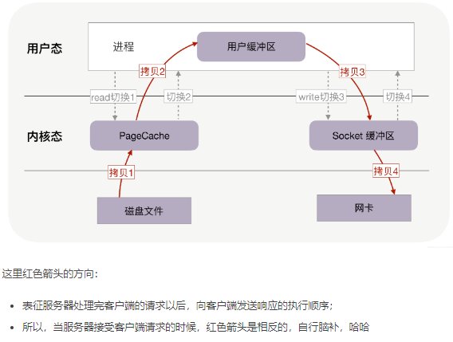
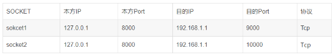
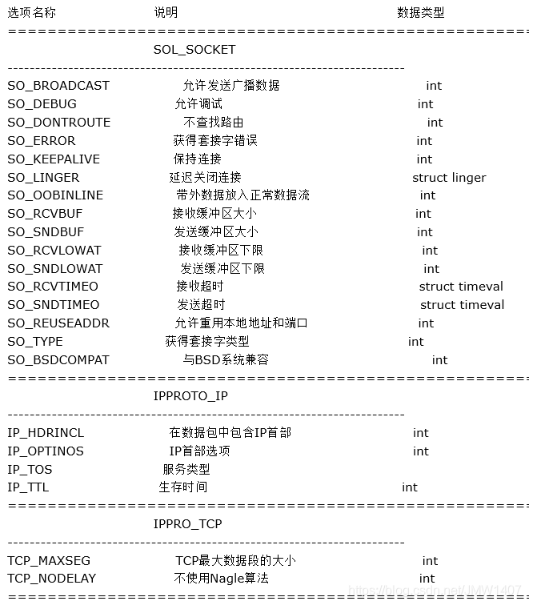
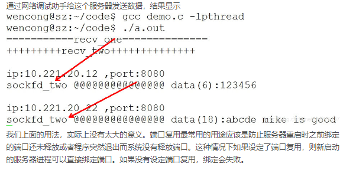

# 网络编程

## 网络通信过程

### 概念

```
数据经过封装后才能经链路传输

TCP/IP四层模型网络通信(传输前由顶至低逐层封装,传输后由底至顶逐层解封装)
应用层:用户数据
传输层(段):TCP首部+用户数据
网络层(数据报):IP首部+TCP首部+用户数据
网络接口层(链路层)(帧):以太网首部+IP首部+TCP首部+用户数据+以太网尾部

以太网帧格式:目的地址(6)+源地址(6)+类型(2)+数据(46~1500)+校验位CRC(4)(字节)
```

### 以太网帧协议

```
ARP协议:根据IP地址获取MAC地址(请求和应答同格式)
	以太网目的地址(6)+以太网源地址(6)+帧类型(2)+硬件类型(2)+协议类型(2)+硬件地址长度(1)+协议地址长度(1)+发送端以太网地址(6)+发送端IP地址(4)+目的以太网地址(6)+目的IP地址(4)
	
以太网帧协议:根据MAC地址完成数据报传输
```

### IP协议

```
位于网络层，负责将数据包递给对方
任何一个参与到网络上的设备都会用到IP协议，为系统分配对应的IP地址，IP地址是表明网络中每个设备的标签
IP地址需要转换为网卡的物理地址（MAC）才能真正完成数据通信

ipv4,ipv6,不同版本IP数据报首部版本位数和首部长度不一样,4+4或6+6

TTL:生存时间(time to live)(次数):到达目的地最多跳数,为0时路由器就会丢弃,是数据包在路由节点的跳转上限,经过一个就-1
源IP:32位,4字节(点分十进制,string类型,如192.168.1.108为一个点分十进制表示的字符串)
目的IP:32位,4字节
```

### TCP/UDP数据报格式

```
将大的数据分割成报文段
TCP：可靠的面向连接的
UDP：不可靠无连接的

TCP&UDP:源端口和目的端口号都为16位

TCP:序号32位    确认序号32位    标志位6位    窗口大小16位
```


## 网络应用程序设计模式

### C/S

```
client/server	客户端/服务器
优:可以缓存大量数据,可自定义协议,速度快,应用权限大
缺:安全性
```

### B/S

```
browser/server	浏览器/服务器
优:安全性,可跨平台,开发工作量小
缺:不能缓存大量数据,需严格遵守http
```


## 网络套接字

```
socket,通信过程中套接字一定成对出现,每个套接字由发送和接收两个缓冲区组成

在TCP/IP协议中,IP地址+TCP/UDP端口号唯一标识网络通信中的一个进程,IP地址+端口号就对应一个socket,欲建立连接的两个进程各有一个socket来标识,这两个socket pair就唯一标识一个连接
```


## 网络字节序

```
小端法:高位存高地址,低位存低地址
大端法:高位存低地址,低位存高地址

TCP/IP协议规定网络数据流采用大端法存储,但是计算机存储一般采用小端法


为使网路程序具有可移植性,使同样的C代码在大端和小端计算机上编译后都能正常运行,可调用<arpa/inet.h>做网络字节序和主机字节序的转换
eg.
	#include<arpa/inet.h>
	uint32_t htonl(uint32_t hostlong);
	uint16_t htons(uint16_t hostshort);
	uint32_t ntonl(uint32_t netlong);
	uint16_t ntons(uint16_t netlong);
	//h表示host,n表示network,转换数据存储表示类型
	
	htonl:本地-->网络(IP)
	htons:本地-->网络(port(端口))
	ntol:网络-->本地(IP)
    ntos:网络-->本地(port)
    
eg.
    #include<arpa/inet.h>
    
    int inet_pton(int af,const char *src,char* dst);//本地字节序(string)-->网络字节序(二进制)
    
    inet_ntop(int af,const char *src,char* dst,dst_size);
    const char *inet_ntop(int af,const void *src,char *dst,socklen_t size);//网络字节序-->本地字节序(string)
    //dst和dst_size可以缺省,此时会创建一个临时变量存储src的值,在函数结束后回收
    
    支持IPv4和IPv6的IP地址转换函数
    //af:使用的协议类型(AF_INET--IPv4;AF_INET6--IPv6;AF_UNIX--本地套接字)
    //src:需转换的点分十进制式的IP地址
    //dst:需传出的转换后的网络字节序的IP地址所存放的缓冲区
    //dst_size:缓冲区大小
    
    返回值
    inet_pton	1--成功	0--src给了无效的网络地址(异常)    	-1--失败
    inet_ntop	dst--成功    null--失败		
    
    
```


## Socket

### 概念

```
socket 的原意是“插座”,在计算机通信领域,socket 被翻译为“套接字”,它是计算机之间进行通信的一种约定或一种方式.

通过 socket 这种约定,一台计算机可以接收其他计算机的数据,也可以向其他计算机发送数据
socket 的典型应用就是 Web 服务器和浏览器:浏览器获取用户输入的 URL,向服务器发起请求,服务器分析接收到的 URL,将对应的网页内容返回给浏览器,浏览器再经过解析和渲染,就将文字、图片、视频等元素呈现给用户

例如我们每天浏览网页、QQ 聊天、收发 email 等等。
```

### socket和文件描述符

套接字也是文件。具体数据传输流程如下：

​	1、当server端监听到有连接时，应用程序会请求内核创建Socket；

​	2、Socket创建好后会返回一个文件描述符给应用程序；

​	3、当有数据包过来网卡时，内核会通过数据包的源端口，源ip，目的端口等在内核维护的一个ipcb双向链表中找到对应的Socket，并将数据包赋值到该Socket的缓冲区；

​	4、应用程序请求读取Socket中的数据时，内核就会将数据拷贝到应用程序的内存空间，从而完成读取Socket数据



注意：
	操作系统针对不同的传输方式（TCP，UDP）会在内核中各自维护一个Socket双向链表，当数据包到达网卡时，会根据数据包的源端口，源ip，目的端口从对应的链表中找到其对应的Socket，并会将数据拷贝到Socket的缓冲区，等待应用程序读取。


### sockaddr地址结构

```C++
struct sockaddr {
    unsigned short sa_family;  /* 地址族, AF_xxx */
    char sa_data[14];  /* 14字节的协议地址*/
};

struct sockaddr_in {
    unsigned short sin_family; /*地址类型*/
    unsigned short int sin_port; /* 端口号 */
    struct in_addr sin_addr; /* Internet地址 */
    unsigned char sin_zero[8]; /* 与struct sockaddr一样的长度 */
};
	
struct in_addr {
    unsigned long s_addr;	//32位IP地址
};

```

### Socket模型建立流程


#### 函数解析

##### socket()

```
作用:创建套接字
注:每个进程开启一个soeket连接,都会占用一个文件描述符,socket的文件描述符只有一个

头文件:<sys/socket.h>
函数原型:int socket(int domain,int type,int protocol);
参数解析
	domain:指定所选用IP地址协议,如AF_INET(IPV4)、AF_INET6(IPV6)、AF_UNIX\AF_LOCAL(本地)
	type:指定创建套接字选用数据传输协议,如SOCK_STREAM(流式协议,有保障的面向连接)、SOCK_DGRAM(报式协议,无保障的面向消息的)
	protocol:所选用协议的代表协议,默认为0(流式为TCP,报式UDP)
返回值:成功返回新套接字对应文件描述符,失败返回-1/error

扩充:协议簇
	AF_UNIX（本机通信）
	AF_INET（TCP/IP – IPv4）
	AF_INET6（TCP/IP – IPv6）
	其中 “type”参数指的是套接字类型，常用的类型有：
	SOCK_STREAM（TCP流,流式协议）
	SOCK_DGRAM（UDP数据报,报式协议）
	SOCK_RAW（原始套接字）
	//AF_地址族和PF_协议族常量的值是相同的（例如，AF_INET和PF_INET），因此可以使用任何一个常量
```

##### bind()

```
作用:给socket绑定IP和端口号

函数原型:int bind(int sockfd,const struct sockaddr *addr,socklen_t addrlen);
参数原型
	sockfd:socket返回值
		struct sockaddr_in addr;
		addr.sin_family = AF_INET;
		addr.sin_port = htons(8888);//端口号,由本地字节序转为网络字节序
		addr.sin_addr.s_addr = htonl(INADDR_ANY);//IP地址,本地字节序转为网络字节序,INADDR_ANY表示由系统选择网卡
	addr:(struct sockaddr*)&addr//强制转换数据类型,绑定地址结构
	addrlen:sizeof(addr) //地址结构大小
返回值:成功返回0,失败返回-1,原因存于errno

socklen_t – 无符号不透明整数类型,长度至少为32位
```

##### listen()

```
作用:设置同时与服务器连接的上限数.(同时进行3次握手的客户端数量)

函数原型:int listen(int sockfd,int backlog);
参数解析
	sockfd:socket返回值
	backlog:上限数值
返回值:成功返回0,失败返回-1,原因存于errno
```

##### accept()

```
作用:阻塞等待客户端连接,直到有客户端连接,成功返回一个与客户端成功连接的socket文件描述符
	//文件描述符:Linux 系统中,把一切都看做是文件,当进程打开现有文件或创建新文件时,内核向进程返回一个文件描述符,文件描述符就是内核为了高效管理已被打开的文件所创建的索引,用来指向被打开的文件,所有执行I/O操作的系统调用都会通过文件描述符

头文件:<sys/socket.h>
函数原型:int accept(int sockfd,struct sockaddr *addr,socklen_t *addrlen);
参数解析
	sockfd:socket函数返回值
	addr:传出参数,保存成功与服务器建立连接的客户端的地址结构(IP+port)
	addrlen:传入(addr的大小),传出(客户端addr的实际大小)
		赋值方式
			socklen_t clit_addr_len = sizeof(addr);
			&clit_addr_len 
返回值:成功返回一个能与服务器进行数据通信的socket对应的文件描述符,失败返回-1,原因存在errno
```

##### connect()

```
作用:用现有socket与服务器建立连接

函数原型:int connect(int sockfd,const struct sockaddr *addr,socklen_t addrlen);
参数解析
	sockfd:socket函数返回值
	addr:传入参数,服务器的地址结构(IP+port)
	addrlen:服务器地址结构大小长度
返回值:成功返回0,失败返回-1,存在errno
若不适用bind绑定客户端地质结构,采用隐式绑定,故而IP和Port都是系统自动传递
```

#### TCP通信流程分析

```
serve:
	socket() 创建socket -> bind() 绑定地址端口号 -> listen() 设置监听上限 -> accept() 阻塞监听客户端连接 -> read(fd) 读socket获取客户端数据 -> 小写转大写 toupper() -> write(fd)写应答 -> close()
	
client:
	socket() 创建socket -> connect() 与服务器建立连接 -> write() 写数据到socket -> read() 读转换后的数据 -> 显示读取结果 -> clse()
```

### Serve的实现

```C
/*
Serve流程
	socket()->bind()->listen()->accept()->read()->write()->close()
*/


#include<stdio.h>
#include<stdlib.h>
#include<string.h>
#include<errno.h>	//errno宏头文件
#include<unistd.h>	//read等函数头文件
#include<pthread.h>
#include<ctype.h>
#include<sys/socket.h>	//socket函数头文件
#include<arpa/inet.h>	//ip地址转换函数头文件

#define SERVE_PORT 9527

void sys_err(const char* str){
    prror(str);
    exit(1);
}

int main(int arg,char*argv[]){
    int lfd = 0,cfd = 0;
    char* buf[BUFSIZ],clit_ip[1024];	//#define BUFSIZ 4096,system default
    
    struct sockaddr_in serv_addr,clit_addr;
    socklen_t serv_addr_len,clit_addr_len;
    
    serv_addr.sin_family = AF_INET; //设置IP地址类型
    serv_addr.sin_port = htons(SERVE_PORT);	//设置服务端端口号
    serv_addr.sin_addr.s_addr = htonl(INADDR_ANY);
    serv_addr_len = sizeof(serv_addr);
    
    clit_addr_len = sizeof(clit_addr);
    
    lfd = socket(AF_INET,SOCK_STREAM,0);   //创建套接字,成功返回新套接字对应文件描述符,失败返回-1
    if(lfd == -1){
        sys_err("socket error"); //创建socket错误
    }
    
    bind(lfd,(struct sockaddr*)&serv_addr,serv_addr_len); //绑定socket相关信息
    
    listen(fd,1000);  //监听
    
    cfd = accept(lfd,(struct sockaddr*)&clit_addr,&clit_addr_len); //阻塞等待连接
    if(cfd == -1){
        sys_err("accept error"); //尝试连接失败
    }
    
    printf("client ip:%s port:%d",
          	inet_ntop(AF_INET,&clit_addr.sin_addr.s_addr,clit_addr_len)),
    		ntos(clit_addr.sin_port));//打印客户端IP和端口号
    
    while(1){
        ret = read(cfd,buf,sizeof(buf));//ret接收客户端发送的文件大小,存在buf缓冲区
        write(STDOUT,buf,ret);//服务端打印输出接收到的文件描述符
        if(*buf == '0') {
            printf("serve close!!!\n");
            close(lfd);
            close(cfd);
            return 0;}//终止条件
        for(i = 0;i<ret;i++){
			buf[i] = toupper(buf[i]);//大写接收信息
        }
        write(cfd,buf,ret);//写回接收信息，即确认消息
    }
}
```

### Client实现

```C
/*
	Client流程
		socket()->connect()->write()->read()->close()
*/

#include<stdio.h>
#include<stdlib.h>
#include<string.h>
#include<pthread.h>
#include<errno.h>

#incldue<sys/socket.h>
#include<arpa/inet.h>

void sys_err(char *str){
	perror(str);
    exit(1);
}

int main(int arg,char* argv){
    int cfd,ret;
    
    struct sockaddr_in serv; //创建socket对象
    socklen_t serv_ip_len;
    
    serv.sin_family = AF_INET;
    serv.sin_port = htons(9527); //服务端端口号
    inet_pton(AF_INET,"127.0.0.1",(struct sockaddr_in *)& serv.sin_addr.s_addr);	//将文本形式的服务端ip转为数值形式存入serv.sin_addr.s_addr
    
    cfd = sorcket(AF_INET,SOCK_STREAM,0);	//创建socket套接字，成功新套接字对应文件描述符，否则-1
    if(cld == -1)
    {
        sys_err("socket error");
    }
    
    ret = connect(cfd,(struct sockaddr*)&serv,sizeof(serv));	//建立连接连接,成功返回0
    if(ret != 0)
    {
        sys_err("connect error");
    }
    
    int count = 5;
    while(count--){
        write(cfd,"hello\n",6);	//写入cfd并发送给服务端
        ret = read(cfd,buf,sizeof(buf));	//读出服务端返回信息
        write(STDOUT_FILENO,buf,sizeof(buf));	//输出在屏幕
        sleep(1);
    }
    
    close(cfd);
    
}
```

## 端口复用

### 概念

**系统如何区分socket**

socket = 《A进程的IP地址：端口号，B进程的IP地址：端口号》


也就是说，只要五元素不完全一致，操作系统就能区分socket。

**端口复用与socket**	端口复用允许在一个应用程序可以把n个套接字绑在一个端口而不出错

**作用**	防止服务器重启时之前绑定的端口还未释放或者程序突然退出而系统没有释放端口

```
	这种情况下如果设定了端口复用，则新启动的服务器进程可以直接绑定端口。如果没有设定端口复用，绑定会失败，提示ADDR已经在使用中。

　　是否可以使用这个技术实现服务优雅的部署？对于线上应用发布，我们希望发布不对客户造成任何影响，那么当应用部署时，我们需要先停止上一个版本的应用，启动新版本的应用，这时候，我们无法得知，上一个版本的应用是否还处于处理用户流量的过程中，如果直接kill -9 pid的方式，很可能造成用户某些信息的处理错误，如果涉及一笔资金，那就影响比较大了。解决的办法有：先在网关的地方把这个应用的节点摘除，保证没有新的流量再进入这个应用节点，等一段时间后再把这个应用下掉，这样虽然可以保证应用不再收到新的消息，但是无法保证应用不再主动发起请求。

　　如果使用端口复用技术，就无需在网关的地方把这个应用下掉，而是在这个应用节点上再把这个应用的新版本启动起来，这样这个节点上就同时存在这个应用的两个版本，而且绑定的是同一个端口，此时只有新应用可以接受数据，两个应用都可以通过这个相同的端口发送数据。
```

**定义**

​	1、中间程序即是一个服务端程序(监听连接)，也是一个客户端程序(发送给端口程序).操作系统内核支持通过配置socket参数的方式来实现多个进程绑定同一个端口。

​	2、要复用端口,必须使中间程序的监听SOCKET用setsockopt()函数设置

​	3、复用端口的原理是用在服务器安装一个中间程序,在客户端发送数据给端口前劫获这个数据,判断这个是不是HACKER发来的数据,如果是把它发给后门程序,如果不是则转发给端口程序,返回信息再发给客户端

### setsockopt

**头文件**

```
#include <sys/types.h>
#include <sys/socket.h>
```

**功能**	用于任意类型、任意状态套接口的设置选项值

​	选项可能存在于多层协议中，它们总会出现在最上面的套接字层。

​	当操作套接字选项时，选项位于的层和选项的名称必须给出。

​	为了操作套接字层的选项，应该将层的值指定为SOL_SOCKET。

​	为了操作其它层的选项，控制选项的合适协议号必须给出。

**函数声明**

```
int setsockopt(int sockFd, int level, int optname, const void *optval, socklen_t optlen);
```

**参数说明**

```
sockfd：将要被设置或者获取选项的套接字。
level：选项定义的层次；支持SOL_SOCKET、IPPROTO_TCP、IPPROTO_IP和IPPROTO_IPV6。一般设成SOL_SOCKET以存取socket层。
    SOL_SOCKET:通用套接字选项.
    IPPROTO_IP:IP选项.IPv4套接口
    IPPROTO_TCP:TCP选项.
    IPPROTO_IPV6: IPv6套接口
optname： 欲设置的选项
optval： 对于setsockopt()，指针，指向存放选项待设置的新值的缓冲区。获得或者是设置套接字选项.根据选项名称的数据类型进行转换。
optlen：optval缓冲区长度。
```



**SO_REUSEADDR参数说明**

```
optname选项之一：允许套接口和一个已在使用中的地址捆绑。

SO_REUSEADDR提供如下四个功能：
    1、允许启动一个监听服务器并捆绑其众所周知端口，即使以前建立的将此端口用做他们的本地端口的连接仍存在。这通常是重启监听服务器时出现，若不设置此选项，则bind时将出错。
    2、允许在同一端口上启动同一服务器的多个实例，只要每个实例捆绑一个不同的本地IP地址即可。对于TCP，我们根本不可能启动捆绑相同IP地址和相同端口号的多个服务器。
    3、允许单个进程捆绑同一端口到多个套接口上，只要每个捆绑指定不同的本地IP地址即可。这一般不用于TCP服务器。
    4、允许完全重复的捆绑：当一个IP地址和端口绑定到某个套接口上时，还允许此IP地址和端口捆绑到另一个套接口上。一般来说，这个特性仅在支持多播的系统上才有，而且只对UDP套接口而言（TCP不支持多播）。

SO_REUSEPORT有如下语义：
	1、此选项允许完全重复捆绑，但仅在想捆绑相同IP地址和端口的套接口都指定了此套接口选项才行。
	2、如果被捆绑的IP地址是一个多播地址，则SO_REUSEADDR和SO_REUSEPORT等效。
	
编写 TCP/SOCK_STREAM 服务程序时，SO_REUSEADDR到底什么意思？
	这个套接字选项通知内核，如果端口忙，但TCP状态位于 TIME_WAIT ，可以重用端口。如果端口忙，而TCP状态位于其他状态，重用端口时依旧得到一个错误信息，指明"地址已经使用中"。如果你的服务程序停止后想立即重启，而新套接字依旧使用同一端口，此时SO_REUSEADDR 选项非常有用。必须意识到，此时任何非期望数据到达，都可能导致服务程序反应混乱，不过这只是一种可能，事实上很不可能。
```

**返回值说明**

```
成功执行时，返回0。失败返回-1，errno被设为以下的某个值
    EBADF：sockfd不是有效的文件描述词
    EFAULT：optval指向的内存并非有效的进程空间
    EINVAL：在调用setsockopt()时，optlen无效
    ENOPROTOOPT：指定的协议层不能识别选项
    ENOTSOCK：socket描述的不是套接字
```

### 示例

**没有设置端口复用**

```
//https://blog.csdn.net/tennysonsky/article/details/44062173
#include <stdio.h>
#include <stdlib.h>
#include <string.h>
#include <unistd.h>
#include <sys/socket.h>
#include <netinet/in.h>
#include <arpa/inet.h>

int main(int argc, char *argv[])
{
	int sockfd_one;
	int err_log;
	sockfd_one = socket(AF_INET, SOCK_DGRAM, 0); //创建UDP套接字one
	if(sockfd_one < 0)
	{
	perror("sockfd_one");
	exit(-1);
	}
	// 设置本地网络信息
	struct sockaddr_in my_addr;
	bzero(&my_addr, sizeof(my_addr));
	my_addr.sin_family = AF_INET;
	my_addr.sin_port = htons(8000);		// 端口为8000
	my_addr.sin_addr.s_addr = htonl(INADDR_ANY);
 
	// 绑定，端口为8000
	err_log = bind(sockfd_one, (struct sockaddr*)&my_addr, sizeof(my_addr));
	if(err_log != 0)
	{
		perror("bind sockfd_one");
		close(sockfd_one);		
		exit(-1);
	}

	int sockfd_two;
	sockfd_two = socket(AF_INET, SOCK_DGRAM, 0);  //创建UDP套接字two
	if(sockfd_two < 0)
	{
		perror("sockfd_two");
		exit(-1);
	}

	// 新套接字sockfd_two，继续绑定8000端口，绑定失败
	// 因为8000端口已被占用，默认情况下，端口没有释放，无法绑定
	err_log = bind(sockfd_two, (struct sockaddr*)&my_addr, sizeof(my_addr));
	if(err_log != 0)
	{
		perror("bind sockfd_two");
		close(sockfd_two);		
		exit(-1);
	}

	close(sockfd_one);
	close(sockfd_two);
	return 0;

}
```

**设置端口复用**

```
##置socket的SO_REUSEADDR选项，即可实现端口复用
#include <stdio.h>
#include <stdlib.h>
#include <string.h>
#include <unistd.h>
#include <sys/socket.h>
#include <netinet/in.h>
#include <arpa/inet.h>

 

int main(int argc, char *argv[])
{
	int sockfd_one;
	int err_log;
	sockfd_one = socket(AF_INET, SOCK_DGRAM, 0); //创建UDP套接字one
	if(sockfd_one < 0)
	{
	perror("sockfd_one");
	exit(-1);
	}

	// 设置本地网络信息
	struct sockaddr_in my_addr;
	bzero(&my_addr, sizeof(my_addr));
	my_addr.sin_family = AF_INET;
	my_addr.sin_port = htons(8000);		// 端口为8000
	my_addr.sin_addr.s_addr = htonl(INADDR_ANY);

	// 在sockfd_one绑定bind之前，设置其端口复用

	int opt = 1;
	setsockopt( sockfd_one, SOL_SOCKET,SO_REUSEADDR, 
					(const void *)&opt, sizeof(opt) );

	// 绑定，端口为8000
	err_log = bind(sockfd_one, (struct sockaddr*)&my_addr, sizeof(my_addr));
	if(err_log != 0)
	{
		perror("bind sockfd_one");
		close(sockfd_one);		
		exit(-1);
	}
	int sockfd_two;
	sockfd_two = socket(AF_INET, SOCK_DGRAM, 0);  //创建UDP套接字two
	if(sockfd_two < 0)
	{
		perror("sockfd_two");
		exit(-1);
	}
	// 在sockfd_two绑定bind之前，设置其端口复用
	opt = 1;
	setsockopt( sockfd_two, SOL_SOCKET,SO_REUSEADDR, 

					(const void *)&opt, sizeof(opt) );

	// 新套接字sockfd_two，继续绑定8000端口，成功
	err_log = bind(sockfd_two, (struct sockaddr*)&my_addr, sizeof(my_addr));
	if(err_log != 0)
	{
		perror("bind sockfd_two");
		close(sockfd_two);		
		exit(-1);
	}
	close(sockfd_one);
	close(sockfd_two);
	return 0;
}

端口复用允许在一个应用程序可以把 n 个套接字绑在一个端口上而不出错。同时，这 n 个套接字发送信息都正常，没有问题。但是，这些套接字并不是所有都能读取信息，只有最后一个套接字会正常接收数据。
```

**使用**

```
##在之前的代码上，添加两个线程，分别负责接收sockfd_one，sockfd_two的信息

#include <stdio.h>
#include <stdlib.h>
#include <string.h>
#include <unistd.h>
#include <sys/socket.h>
#include <netinet/in.h>
#include <arpa/inet.h>
#include <pthread.h>

// 线程1的回调函数
void *recv_one(void *arg)
{
	printf("===========recv_one==============\n");
	int sockfd = (int )arg;
	while(1){
		int recv_len;
		char recv_buf[512] = "";
		struct sockaddr_in client_addr;
		char cli_ip[INET_ADDRSTRLEN] = "";//INET_ADDRSTRLEN=16
		socklen_t cliaddr_len = sizeof(client_addr);
		recv_len = recvfrom(sockfd, recv_buf, sizeof(recv_buf), 0, (struct sockaddr*)&client_addr, &cliaddr_len);
		inet_ntop(AF_INET, &client_addr.sin_addr, cli_ip, INET_ADDRSTRLEN);
		printf("\nip:%s ,port:%d\n",cli_ip, ntohs(client_addr.sin_port));
		printf("sockfd_one =========== data(%d):%s\n",recv_len,recv_buf);

	}
	return NULL;
}

// 线程2的回调函数
void *recv_two(void *arg)
{
	printf("+++++++++recv_two++++++++++++++\n");
	int sockfd = (int )arg;
	while(1){
		int recv_len;
		char recv_buf[512] = "";
		struct sockaddr_in client_addr;
		char cli_ip[INET_ADDRSTRLEN] = "";//INET_ADDRSTRLEN=16
		socklen_t cliaddr_len = sizeof(client_addr);
		recv_len = recvfrom(sockfd, recv_buf, sizeof(recv_buf), 0, (struct sockaddr*)&client_addr, &cliaddr_len);
		inet_ntop(AF_INET, &client_addr.sin_addr, cli_ip, INET_ADDRSTRLEN);
		printf("\nip:%s ,port:%d\n",cli_ip, ntohs(client_addr.sin_port));
		printf("sockfd_two @@@@@@@@@@@@@@@ data(%d):%s\n",recv_len,recv_buf);
	}
	return NULL;

}

int main(int argc, char *argv[])
{
	int err_log;

	/sockfd_one
	int sockfd_one;
	sockfd_one = socket(AF_INET, SOCK_DGRAM, 0); //创建UDP套接字one
	if(sockfd_one < 0)
	{
	perror("sockfd_one");
	exit(-1);
	}

 	// 设置本地网络信息
	struct sockaddr_in my_addr;
	bzero(&my_addr, sizeof(my_addr));
	my_addr.sin_family = AF_INET;
	my_addr.sin_port = htons(8000);		// 端口为8000
	my_addr.sin_addr.s_addr = htonl(INADDR_ANY);

	// 在sockfd_one绑定bind之前，设置其端口复用
	int opt = 1;
	setsockopt( sockfd_one, SOL_SOCKET,SO_REUSEADDR, 

					(const void *)&opt, sizeof(opt) );
	// 绑定，端口为8000
	err_log = bind(sockfd_one, (struct sockaddr*)&my_addr, sizeof(my_addr));
	if(err_log != 0)
	{
		perror("bind sockfd_one");
		close(sockfd_one);		
		exit(-1);
	}
	//接收信息线程1
	pthread_t tid_one;
	pthread_create(&tid_one, NULL, recv_one, (void *)sockfd_one);
	/sockfd_two

	int sockfd_two;
	sockfd_two = socket(AF_INET, SOCK_DGRAM, 0);  //创建UDP套接字two
	if(sockfd_two < 0)
	{
		perror("sockfd_two");
		exit(-1);
	}

	// 在sockfd_two绑定bind之前，设置其端口复用
	opt = 1;
	setsockopt( sockfd_two, SOL_SOCKET,SO_REUSEADDR, 
					(const void *)&opt, sizeof(opt) );
	// 新套接字sockfd_two，继续绑定8000端口，成功
	err_log = bind(sockfd_two, (struct sockaddr*)&my_addr, sizeof(my_addr));
	if(err_log != 0)
	{
		perror("bind sockfd_two");
		close(sockfd_two);		
		exit(-1);
	}
	//接收信息线程2
	pthread_t tid_two;
	pthread_create(&tid_two, NULL, recv_two, (void *)sockfd_two);

	
	while(1){	// 让程序阻塞在这，不结束
		NULL;
	}

	close(sockfd_one);
	close(sockfd_two);
	return 0;
}
```

**结果**




## 并发服务器

