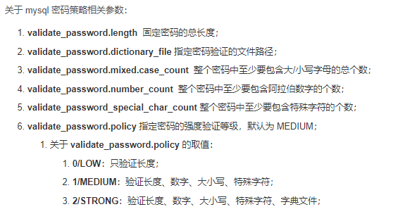

# MySql

**mysql命令中不区分大小写**

**本篇为linux环境下**

## 管理

**启动**

```
1、查看是否启动	ps -ef | grep mysqld
2、启动	service mysql start
```


## 用户

### 管理用户

**用户验证**	`mysql -u [用户名] -p [密码]/回车后亦可输入，可省略`

**添加用户**	`CREATE USER '用户名'@'主机名' IDENTIFIED BY '密码';`

**删除用户**	`DROP USER '用户名'@'主机名';`

**用户重命名**	`RENAME USER '旧用户名'@'主机名' TO '新用户名'@'主机名';`

**查看所有用户信息**	`SELECT [*/指定字段] FROM mysql.user; `


**用户权限作用**

```
1、用户管理可以控制用户能访问哪些数据库和哪些数据表
2、用户管理可以控制用户对哪些表执行查询、创建、删除等操作
3、用户管理可以控制用户登录的ip或域名
4、用户管理可以控制用户自己的权限或者分配自己的权限给其他用户
```

**查看指定用户权限** `SHOW GRANTS FOR [用户名]@[主机名];`  

**查看当前用户权限** `SHOW GRANTS;`


**查看用户全局权限** `SELECT * FROM mysql.user WHERE user='用户名'\G`

**授予用户权限** `GRANT  [具体权限/all privileges] ON [数据库.数据表] TO [用户名]@[IP/localhost/域名/%]  IDENTIFIED BY [密码] [WITH GRANT OPTION]`

**删除用户权限** `REVOKE [具体权限/all privileges] ON [数据库.数据表] FROM [用户名]@[IP/localhost/域名/%];`

```
注意：(一般授权或者回收权限后，需要 flush privileges;)
  all privileges 代表所有权限
  ON 表示可以在哪个库里的哪种表执行，*号代表所有库或所有表
  TO 表示授权给哪个用户
  IDENTIFIED BY 表示指定用户登录密码
  WITH GRANT OPTION 表示用户可以将自己的权限分配给其他用户
```


### 密码管理

**查看初始密码**	`cat /var/log/mysqld.log | grep password`

**密码修改**

```
 (1)  ALTER USER [用户名]@[主机名] IDENTIFIED BY '新密码';
 (2)  SET PASSWORD FOR [用户名]@[主机名] = PASSWORD([新密码]);
 (3)  GRANT USAGE ON *.* TO [用户名]@[主机名] IDENTIFIED BY [新密码];
 (4)  UPDATE  user SET password=password([新密码]) where user='root' and host='localhost';  
      （注意：user表中的密码字段需要查表之后才知道是具体字段名称）
```

**查看当前密码策略** `SHOW VARIABLES LIKE 'VALIDATE_PASSWORD%';`



**修改密码策略**	`SET GLOBAL VALIDATE_PASSWORD.NAME = SET;`

## MYSQL


# C++API

## 相关数据类型

```
MYSQL
该结构代表1个数据库连接的句柄。几乎所有的MySQL函数均使用它。不应尝试拷贝MYSQL结构。不保证这类拷贝结果会有用。

MYSQL_RES
该结构代表返回行的查询结果（SELECT, SHOW, DESCRIBE, EXPLAIN）。在本节的剩余部分，将查询返回的信息称为“结果集”。

MYSQL_ROW
对应一个内存，这是1行数据的“类型安全”表示。它目前是按照计数字节字符串的数组实施的。（如果字段值可能包含二进制数据，不能将其当作由Null终结的字符串对待，这是因为这类值可能会包含Null字节）。行是通过调用mysql_fetch_row()获得的。

MYSQL_FIELD
该结构包含关于字段的信息，如字段名、类型和大小。这里详细介绍了其成员。通过重复调用mysql_fetch_field()，可为每个字段获得MYSQL_FIELD结构。字段值不是该结构的组成部份，它们包含在MYSQL_ROW结构中。
```

## 连接及初始化

### mysql_init

**函数声明**

`MYSQL *mysql_init(MYSQL *mysql)`

**作用**

​	分配或初始化与mysql_real_connect()相适应的MYSQL对象。如果mysql是NULL指针，该函数将分配、初始化、并返回新对象。否则，将初始化对象，并返回对象的地址。如果mysql_init()分配了新的对象，当调用mysql_close()来关闭连接时。将释放该对象。

**返回值**

​	初始化的MYSQL*句柄。如果无足够内存以分配新的对象，返回NULL。在内存不足的情况下，返回NULL。

### mysql_set_character_set

**函数声明**

`int mysql_set_character_set(MYSQL *mysql, char *csname)`

**作用**

​	该函数用于为当前连接设置默认的字符集。字符串csname指定了1个有效的字符集名称。连接校对成为字符集的默认校对。该函数的工作方式与SET NAMES语句类似，但它还能设置mysql->charset的值，从而影响了由mysql_real_escape_string()设置的字符集。

​	即设置MySQL对象的编码格式

**返回值**

​	0表示成功，非0值表示出现错误。

## 查询

### mysql_real_connect

**函数声明**

`MYSQL *mysql_real_connect(MYSQL *mysql, const char *host, const char *user, const char *passwd, const char *db, unsigned int port, const char *unix_socket, unsigned long client_flag)`

**作用**

​	mysql_real_connect()尝试与运行在主机上的MySQL数据库引擎建立连接。在你能够执行需要有效MySQL连接句柄结构的任何其他API函数之前，mysql_real_connect()必须成功完成。

**返回值**

​	如果连接成功，返回MYSQL*连接句柄。如果连接失败，返回NULL。对于成功的连接，返回值与第1个参数的值相同。

### mysql_store_result

**函数声明**

`MYSQL_RES *mysql_store_result(MYSQL *mysql)`

**作用**

​	对于成功检索了数据的每个查询（SELECT、SHOW、DESCRIBE、EXPLAIN、CHECK TABLE等），必须调用mysql_store_result()或mysql_use_result() 。

​	对于其他查询，不需要调用mysql_store_result()或mysql_use_result()，但是如果在任何情况下均调用了mysql_store_result()，它也不会导致任何伤害或性能降低。通过检查mysql_store_result()是否返回0，可检测查询是否没有结果集（以后会更多）。

​	如果希望了解查询是否应返回结果集，可使用mysql_field_count()进行检查。

​	mysql_store_result()将查询的全部结果读取到客户端，分配1个MYSQL_RES结构，并将结果置于该结构中。

**返回值**

​	如果查询未返回结果集，mysql_store_result()将返回Null指针（例如，如果查询是INSERT语句）。

​	如果读取结果集失败，mysql_store_result()还会返回Null指针。通过检查mysql_error()是否返回非空字符串，mysql_errno()是否返回非0值，或mysql_field_count()是否返回0，可以检查是否出现了错误。

​	如果未返回行，将返回空的结果集。（空结果集设置不同于作为返回值的空指针）。

​	一旦调用了mysql_store_result()并获得了不是Null指针的结果，可调用mysql_num_rows()来找出结果集中的行数。

​	可以调用mysql_fetch_row()来获取结果集中的行，或调用mysql_row_seek()和mysql_row_tell()来获取或设置结果集中的当前行位置。

​	一旦完成了对结果集的操作，必须调用mysql_free_result()。

## 处理结果集

### mysql_fetch_field


### mysql_fetch_row


### mysql_fetch_count


## 错误检测

### mysql_errno()

**函数声明**

`unsigned int mysql_errno(MYSQL *mysql)`

**作用**

​	对于由mysql指定的连接，mysql_errno()返回最近调用的API函数的错误代码，该函数调用可能成功也可能失败。“0”返回值表示未出现错误。在MySQL errmsg.h头文件中，列出了客户端错误消息编号。

​	注意，如果成功，某些函数，如mysql_fetch_row()等，不会设置mysql_errno()。

​	经验规则是，如果成功，所有向服务器请求信息的函数均会复位mysql_errno()。

**返回值**

​	如果失败，返回上次mysql_*xxx*()调用的错误代码。“0”表示未出现错误。

### mysql_error()

**函数声明**

`const char *mysql_error(MYSQL *mysql)`

**作用**

​	对于由mysql指定的连接，对于失败的最近调用的API函数，mysql_error()返回包含错误消息的、由Null终结的字符串。如果该函数未失败，mysql_error()的返回值可能是以前的错误，或指明无错误的空字符串。

​	经验规则是，如果成功，所有向服务器请求信息的函数均会复位mysql_error()。

**返回值**

​	返回描述错误的、由Null终结的字符串。如果未出现错误，返回空字符串。
