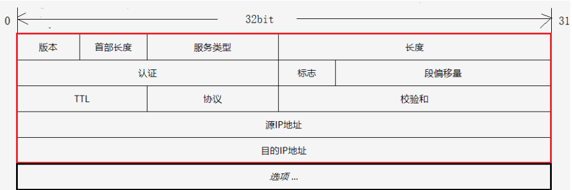
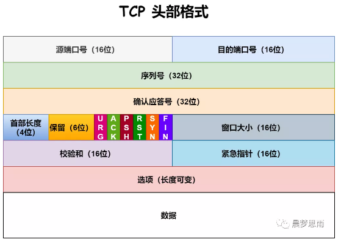
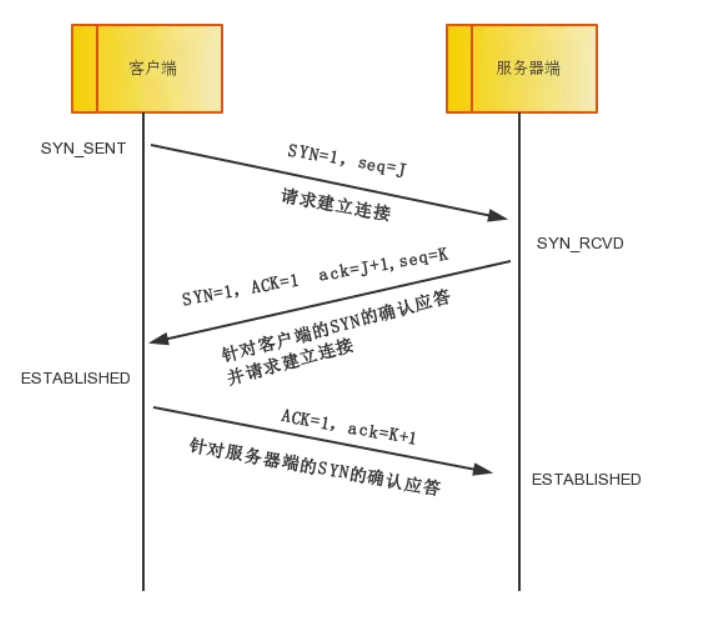
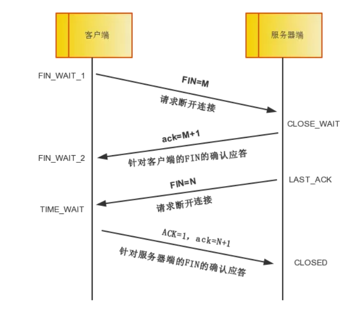
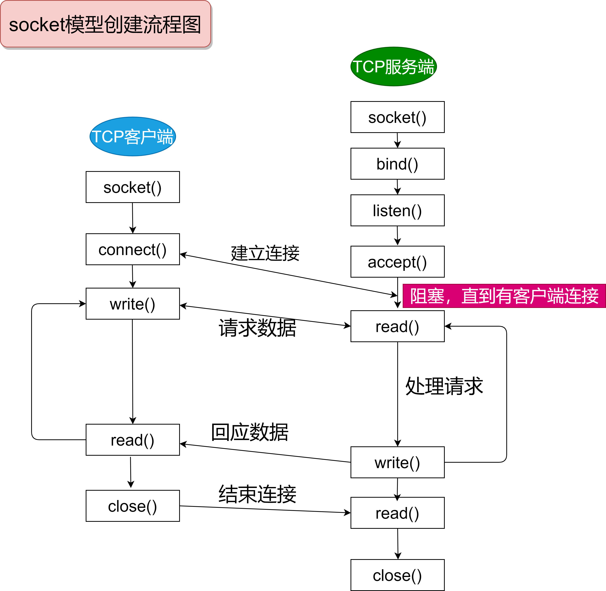

#  计算机网络

## 概念

```
简单定义:一些互相连接的、自洽的计算机的集合

分类
	按交换技术:1.电路交换网络 2.报文交换网络 3.分组交换网络
	按使用者:1.公用 2.专用
	按传输介质:1.有线 2.无线
	按覆盖范围:1.广域网(WAN) 2.城域网(MAN) 3.局域网(LAN) 4.个域网(PAN)
	按拓扑结构:1.总线型 2.星型 3.环形 4.网状型
	
性能指标
	速率:连接在计算机网络上的主机在数字信道上传送比特的速率,也称比特率/数据率
	带宽:标识网络通信线路所能传送数据的能力,即单位时间内从一点到另一点能通过的最高数据率
	吞吐量:单位时间内通过某个网络/信道/接口的数据量,受带宽的限制(或额定速率)
	时延:1.发送时延 2.传播时延 3.处理时延
	时延带宽积:传播时延 x 带宽
	往返时间:双向交互一次所需时间
	利用率:1.信道利用率,标识信道百分之几时间有数据通过(被利用) 2.网络利用率,全网络信道利用率加权平均
	丢包率:分组丢失率,指一定时间范围内,传输过程中丢失的分组数量与分组数量的比率
	
术语
	实体:任何可发送或接受信息的硬件或软件进程
	对等实体:收发双方同层次中的实体
	协议:控制两个对等实体进行逻辑通信的规则的集合
		语法:定义所交换信息格式
		语义:定义通信双方所要完成操作
		同步:定义通信双方的时序关系
	服务:在协议控制下,两个对等实体间的逻辑通信使得本层能够向上一层提供服务,同样使用本层协议需要使用下一层提供的服务
		协议是水平的,服务是垂直的,实体看得见相邻下层所提供服务,但不知到实现服务的具体协议
	原语:上层使用下层服务的形式,高层使用低层提供的服务,以及底层向高层提供服务都是通过服务访问原来进行交互的形式
	服务访问点SAP:同一系统中相邻两层的实体交换信息的逻辑接口,用于区分不同的服务类型
	协议数据单元(PDU):对等层次之间传送的数据包称为该层协议数据单元
	服务数据单元(SDU):同一系统内,层间交换的数据包
```

### Internet的构成

```
节点
	1.主机及其上运行的程序
	2.路由器、交换机等网络交换设备
边:通信链路
	1.接入网链路:主机连接到互联网的链路
	2.主干链路:路由器间的链路
协议:控制发送,接受消息
```

### 网络结构

```
网络边缘:主机,应用程序(客户端和服务器)

网络核心:互连的路由器,网络的网络

接入网、物理媒体:有线或无线通信链路
```

#### 网络边缘

```
端系统(主机):运行应用程序(Web,email等),在网络边缘

客户/服务器模式:客户端向服务器请求、接受服务(Web浏览器/服务器等)

对等模式:专门的服务器

采用网络设施的面向连接服务(TCP)
	目标:在端系统之间传输数据
	握手:数据传输之前做好准备
	TCP传输控制协议:Internet上面向连接的服务
```

#### 网络核心

```
路由器的网状网络

电路交换

分组交换:以分组为单位存储-转发
```

### 分组和延时

```
四种分组延时
	1.节点处理延时:检查bit级差错,检查分组首部和决定将组导向何处
	2.排队延时:在输出链路上等待传输的时间,依赖于路由器的拥塞程度
		取决于流量强度:a(分组到达队列的平均速率),流量强度 = La/R
						~0:平均排队延时小
						->1:延时很大
						>1:延时无穷大
	3.传输延时:R(链路带宽),L(分组长度),将分组发送到链路的时间=L/R,存储转发延时
	4.传播延时:d(物理链路长度),s(在媒体上的传播速度),传播延时=d/s

节点延时 = 处理延时 + 排队延时 + 传输延时 + 传播延时
```

### 吞吐量

```
概念:在源端和目标端之间传输的速率---->数据量/单位时间
	瞬间吞吐量:在一个时间点的速录
	平均吞吐量:在一个长时间内平均值
木桶效应:平均吞吐率大小取决于最小带宽的链路
瓶颈链路:端到端上限制吞吐率的链路
```

### 交换方式

```
电路交换:类似电话交换机接通电话线的方式(计算机网络不用,效率低下)
	从通信资源分配角度,交换就是按照某种方式动态分配传输线路资源
	步骤:1.建立连接(分配资源) 2.通话(资源占用) 3.释放连接(归还占用资源)
	特点:通信时延小,传输有序,没有冲突,使用范围广,实时性强,控制简单
		但是建连时间长,使用效率低,灵活性差,难以规格化
	
分组交换:
	发送方:构造分组,发送分组
	路由器:缓存分组,转发分组
	接收方:接受分组,还原数据
	特点:无需建连,线路利用率高,简化了存储管理,加速传输速度,减少了出错率和重发数据量
		但是存在转发时延,需要额外的信息量,不可靠(存在失序、丢失、重复分组)
报文交换
	特点:无需建连,动态分配线路,线路可靠性、利用率高,提供多目标服务
		但是存在转发时延,需要较大存储缓存空间,需要额外传输信息

```

### 分层结构

```
概念:用层次化方式实现复杂网络功能
	1.将网络复杂的功能分成功能明确的层次,每一层实现了其中一个或一组功能,功能中有其上层可以使用的功能(又称服务)
	2.本层协议实体相互交互执行本层的协议动作,目的是实现本层功能,通过接口为上层提供更好的服务
	3.实现本层协议时用到下层所提供的服务
	4.本层的服务:借助下层服务实现的本层协议实体之间交互带来的新功能(上层可以利用)+更下层所提供的服务
	
无连接的服务:两个对等层实体在通信前不需要建立一个连接,不预留资源:不需要双方都是活跃(如寄信)
	特点:不可靠,可能重复,可能失序
	具体:IP分组,数据包
	适用:传输零星数据
面向连接的服务:两个通信实体为进行通信而建立的一种结合
	过程:建立连接,通信,断开连接
	列子:网络层连接称为虚电路
	适用:大的数据块传输
	特点:保序,可靠

OSI七层
应用层-表示层-会话层-传输层-网络层-数据链路层-物理层	("物链网输会示用")

TCP/IP四层
应用层-传输层-网络层-网络接口层(亦可作链路层)	("网网传应")
```

### IP地址和MAC地址

```
IP地址全称互联网协议地址,本质是为互联网上的每一个网络和每一台主机配置的唯一一个逻辑地址,用来与物理地址区分

MAC地址全称媒体访问控制地址,亦称作局域网地址,以太网地址或物理地址.用于在网络中唯一表示一个网卡,一台设备可以有多个网卡,故而可以有多个MAC地址,MAC地址通俗理解为网卡的身份证

=>IP唯一,MAC不唯一
```

### 协议


```
协议:数据传输和解释的规则,如UDP,TCP,HTTP等

物理层:中继器,集线器、网线、HUB
数据链路层:ARQ,CSMA/CD,PPP,LCP,HDLC,ATM
网络层:IP,ICMP,IGMP,ARP,RARP
传输层:TCP,UDP,DCCP,SCTP,RTP,RSVP
应用层:FTP,SMTP,HTTP

TCP传输控制协议:面向连接的,可靠的基于字节流的传输层通信协议
UDP用户数据报协议:OSI七层模型中无连接的传输层协议,提供面向事务的不可靠的信息传送服务

HTTP超文本传输协议:最为广泛的一种网络协议
FTP文件传输协议

IP协议是因特网互联协议
ICMP协议是Internet控制报文协议,它是TCP/IP协议族的一个子协议,用于在IP主机,路由器之间传递控制消息
IGMP协议是Internet组管理协议,是因特网协议家族中的一个组播协议,该协议运行在主机和组播路由之间

ARP正向地址解析协议,通过已知IP,寻找对应主机的MAC地址
RARP反向地址转换协议,通过MAC地址确定IP地址
```

## 物理层

### 基本概念

```
物理层协议主要任务
	机械特性:指明接口所用接线器的形状和尺寸、引脚数目和排列、固定和锁定装置
	电气特性:指明在接口电缆的各条线上出现的电压的范围
	功能特性:指明某条线上出现的某一电平的电压表示何种意义
	过程特性:指明对于不同功能的各种可能事件的出现顺序
```

## 数据链路层

### 基本概念

```
链路:从一个结点到相邻节点的一段物理线路,中间没有其他交换结点
数据链路:指把实现通信协议的硬件和软件加到链路上,构成数据链路

封装成帧:指数据链路层给上层交付的协议数据单元添加帧头和帧尾使之成为帧
		帧头和帧尾作用之一就是帧定界
差错检测:检测帧在传输过程中是否产生误码(比特错误)
可靠传输:实现发送端发什么接收端就接收什么
```


## 应用层

### 应用层原理

```
可能应用的结构
	客户-服务器模式(C/S)
		服务器:一直运行,有固定的IP地址和周知的端口号(约定好)
		客户端:主动与服务器通信,与互联网有间歇性连接,可能是动态IP,不直接与其它客户端通信
	对等模式(P2P)
	混合体
		Napster
		即时通信

报文:将位于应用层的信息分组称为报文.报文是网络中交换与传输的数据单元,也是网络传输的单元.报文包含了将要发送的完整的数据信息,其长短不需一致.报文在传输过程中会不断地封装成分组、包、帧来传输,封装的方式就是添加一些控制信息组成的首部,那些就是报文头
```

#### 进程通信

```
进程:在主机上运行的程序
	客户端进程:发起通信的进程
	服务器进程:等待连接的进程

同一主机:使用进程间通信机制通信(操作系统定义)
不同主机:通过交换报文通信:1.使用OS提供的通信报文	2.按照应用协议交换报文
```

##### 分布式进程通信需要解决的问题

```
1.进程表示和寻址(服务用户)
	进程为了接收报文,必须有一个标识,即SAP
		主机:唯一的32为IP地址(但仅有IP无法唯一标示一个进程,因为一台端系统上有多个进程)
		采用传输层协议:TCPorUDP
		端口号
	一个进程:IP+port标识段节点
	本质上一对主机进程之间的通信由2个端节点构成
2.传输层-应用层提供服务
	位置:层间界面的SAP(层次系统的上下层之间进行通信的接口)(TCP/IP:socket)
		层间接口必须携带的信息:要传输的报文,谁传的(IP+port(TCP/UDP)),传给谁(对方进程标示IP+port(TCP/UDP))
		传输层实体(TCP\UDP实体)根据这些信息进行TCP报文段(UDP数据报)的封装
			源端口号、目标端口号、数据等
			将IP地址往下交给IP实体,用于封装IP数据报:源IP,目标IP
	形式:应用程序接口API(TCP/IP:socket API)
		
3.如何使用传输层提供的服务实现应用层之间的报文交换
	定义应用层协议:报文格式,解释,时序等
	编制程序,使用OS提供的API,调用网络基础设施提供通信服务传报文,实现应用时序等
```

### 应用层协议

```
概念:定义了运行在不同端系统上的应用进程如何相互交换报文
	公开协议:如HTTP,SMTP
	私有(专用)协议:Skype
	应用协议仅仅是应用的一个组成部分
		Web应用:HTTP协议,web客户端,web服务器,HTML
```


## TCP/IP

### IP

```
概念IP协议是TCP/IP协议族的核心协议和动力,其为上层协议提供无状态、无连接、不可靠的服务
IP协议组成
	1.IP头部信息:用于指定IP通信的源端IP地址、目的IP地址,直到IP分片和重组,以及指定部分通信行为
	2.IP数据包的路由和转发:发生在除目标机器之外的所有主机和路由器上,决定数据报是否应该转发以及如何转发
```

#### IP首部格式



```
1、4位版本号指定IP协议的版本。对于IPv4来说，其值是4.其他IPv4的扩展版本（如SIP协议和PIP协议），则具有不同的版本号。

2、4位头部长度标识该IP头部有多少个32bit字（4字节）。因为4位最大能表示15，所以IP头部最长是60字节。

3、8位服务类型包括一个3位的优先权字段，4位的TOS字段和1位的保留字段（必须置0）。4位的TOS字段

4、分别表示：最小延时，最大吞吐量，最高可靠性和最小费用。其中最多有一个能置位1，应用程序应该根据实际需要来设置它。比如像ssh和telnet这样的登陆程序需要的是最小延时服务，而文件传输程序ftp则需要最大吞吐量的服务。

5、16位总长度是指整个IP数据报的长度，以字节为单位，因此IP数据报的最大长度为65535字节。但由于MTU的限制，长度超过MTU的数据报都将被分片传输，所以实际传输的IP数据报的长度都远远没有达到最大值。

6、16位标识唯一地标识主机发送地每一个数据报。其初始值由系统随机生成，没发送一个数据报，其值就加1.该值在数据报分片时被复制到每个分片中，因此同一个数据报地所有分片都具有相同地标识。

7、3位标志字段地第一位保留。第二位表示"禁止分片"。如果设置了这个位，IP模块将不对数据报进行分片。在这种情况下，如果IP数据报长度超过MTU的话，IP模块将丢弃该数据报并返回一个ICMP差错报文。第三位表示“更多分片”。除了数据报的最后一个分片外，其他分片都要把它置1。

8、13位分片偏移是分片相对原始IP数据报开始处(仅指数据部分)的偏移。实际的偏移值是该值左移3位（乘8）后得到的。由于这个原因，除了最后一个IP分片外，每个IP分片的数据部分的长度必须是8的整数倍(这样才能保证后面的IP分片拥有一个合适的偏移量)。

9、8位生存时间(TTL)是数据报到达目的地之前允许经过的路由器跳数。TTL值被发送端设置(常见值位64)。数据报在转发过程中每经过一个路由，该值就被路由器减1。当TTL值减为0时，路由器将丢弃数据报，并向源端发送一个ICMP差错报文。TTL值可以防止数据报陷入路由循环。

10、8位协议用来区分上层协议，/etc/protocols文件定义了所有上层协议对应的protocol字段的数
值。其中ICMP是1，TCP是6，UDP是17。

11、16位头部校验和由发送端填充，接收端对其使用CRC算法以检验IP数据报头部在传输过程中是否损坏。

12、32位的源端IP地址和目的端IP地址用来标识数据报的发送端和接收端。一般情况下，这两个地址在整个数据报的传递过程中保持不变，而不论它中间经过多少个中转路由器。
IPv4最后一个选项字段是可变长的可选信息。这部分最多包含40个字节，因为IP头部最长是60字节（其中还包含前面讨论的20字节的固定部分）。
	//源IP和目的IP表示方式为点分十进制,但是发送时需转为二进制)

可用的IP选项包括：
             1、记录路由，告诉数据报途径的所有路由器都将自己的IP地址填入IP头部的选项部分，这样就可以跟踪数据报的传递路径。

             2、时间戳，告诉每个路由器都将数据报被转发的时间填入IP头部的选项部分，这样就可以测量途径路由之间数据报传输时间。

             3、松散源路由选择，指定一个路由器IP地址列表，数据报发送过程必须经过其中所有的路由器。

             4、严格源路由选择，和松散源路由选择类似，不过数据报只能经过被指定的路由器。
```


### TCP

```
TCP(Transmission control protocol)即传输控制协议,是一种面向连接、可靠的数据传输协议,它是为了在不可靠的互联网上提供可靠的端到端字节流而专门设计的一个传输协议

面向连接:数据传输之前客户端和服务器端必须建立连接
可靠的:数据传输是有序的要对数据进行校验

TCP运输连接有三个过程:
1.建立TCP连接,也就是通过三报文握手来建立TCP连接
2.数据传送,也就是基于已建立的TCP连接进行可靠的数据传输
3.释放连接,也就是在数据传输结束后,还要通过四报文挥手来释放TCP连接

TCP上的socket:对使用TCP协议的应用而言,socket是4元组的一个具有本地意义的标示
	4元组:源IP、源port、目标IP、目标port
	唯一指定了一个会话(两个进程之间的会话关系)
	应用使用这个标示,与远程应用进程通信
	不必在每个报文的发送都要指定4元组
```

#### TCP首部格式



```
1.源端口和目的端口各占2个字节,分别写入源端口和目的端口

2.序号占4字节.序号范围是[0，2^32 - 1],共2^32（即4294967296）个序号.序号增加到2^32-1后,下一个序号就又回到0.也就是说,序号使用mod 2^32运算.TCP是面向字节流的,在一个TCP连接中传送的字节流中的每一个字节都按顺序编号.整个要传送的字节流的起始序号必须在连接建立时设置.首部中的序号字段值则是指的是本报文段所发送的数据的第一个字节的序号.例如,一报文段的序号是301,而接待的数据共有100字节.这就表明:本报文段的数据的第一个字节的序号是301,最后一个字节的序号是400.显然,下一个报文段(如果还有的话)的数据序号应当从401开始,即下一个报文段的序号字段值应为401.这个字段的序号也叫“报文段序号”.

3.确认号占4字节,是期望收到对方下一个报文段的第一个数据字节的序号.例如,B正确收到了A发送过来的一个报文段,其序号字段值是501,而数据长度是200字节（序号501~700）,这表明B正确收到了A发送的到序号700为止的数据.因此,B期望收到A的下一个数据序号是701,于是B在发送给A的确认报文段中把确认号置为701.注意,现在确认号不是501,也不是700,而是701
总之:若确认号为= N,则表明:到序号N-1为止的所有数据都已正确收到

4.数据偏移占4位,它指出TCP报文段的数据起始处距离TCP报文段的起始处有多远.这个字段实际上是指出TCP报文段的首部长度.由于首部中还有长度不确定的选项字段,因此数据偏移字段是必要的,但应注意,“数据偏移”的单位是32位字（即以4字节的字为计算单位）.由于4位二进制数能表示的最大十进制数字是15,因此数据偏移的最大值是60字节,这也是TCP首部的最大字节（即选项长度不能超过40字节）.

5.保留占6位,保留为今后使用,但目前应置为0

下面有6个控制位，用来说明本报文段的性质。
6.紧急URG（URGent）当URG=1时,表明紧急指针字段有效.它告诉系统此报文段中有紧急数据,应尽快发送（相当于高优先级的数据）,而不要按原来的排队顺序来传送.例如,已经发送了很长的一个程序要在远地的主机上运行.但后来发现了一些问题,需要取消该程序的运行,因此用户从键盘发出中断命令.如果不使用紧急数据,那么这两个字符将存储在接收TCP的缓存末尾.只有在所有的数据被处理完毕后这两个字符才被交付接收方的应用进程,这样做就浪费了很多时间.
当URG置为1时,发送应用进程就告诉发送方的TCP有紧急数据要传送,于是发送方TCP就把紧急数据插入到本报文段数据的最前面,而在紧急数据后面的数据仍然是普通数据.这时要与首部中紧急指针（Urgent Pointer）字段配合使用

7.确认ACK（ACKnowledgment）仅当ACK = 1时确认号字段才有效,当ACK = 0时确认号无效.TCP规定,在连接建立后所有的传送的报文段都必须把ACK置为1

8.推送 PSH（PuSH）当两个应用进程进行交互式的通信时,有时在一端的应用进程希望在键入一个命令后立即就能收到对方的响应.在这种情况下,TCP就可以使用推送（push）操作.这时,发送方TCP把PSH置为1,并立即创建一个报文段发送出去.接收方TCP收到PSH=1的报文段,就尽快地（即“推送”向前）交付接收应用进程.而不用再等到整个缓存都填满了后再向上交付

9.复位RST（ReSeT）当RST=1时,表名TCP连接中出现了严重错误（如由于主机崩溃或其他原因）,必须释放连接,然后再重新建立传输连接.RST置为1还用来拒绝一个非法的报文段或拒绝打开一个连接

10.同步SYN（SYNchronization）在连接建立时用来同步序号.当SYN=1而ACK=0时,表明这是一个连接请求报文段.对方若同意建立连接,则应在响应的报文段中使SYN=1和ACK=1,因此SYN置为1就表示这是一个连接请求或连接接受报文

11.终止FIN（FINis,意思是“完”“终”）用来释放一个连接.当FIN=1时,表明此报文段的发送发的数据已发送完毕,并要求释放运输连接

12.窗口占2字节.窗口值是[0，2^16-1]之间的整数.窗口指的是发送本报文段的一方的接受窗口（而不是自己的发送窗口）.窗口值告诉对方:从本报文段首部中的确认号算起,接收方目前允许对方发送的数据量（以字节为单位）.之所以要有这个限制,是因为接收方的数据缓存空间是有限的.总之,窗口值作为接收方让发送方设置其发送窗口的依据
    例如,发送了一个报文段,其确认号是701,窗口字段是1000.这就是告诉对方:“从701算起,我（即发送方报文段的一方）的接收缓存空间还可接受1000个字节数据（字节序号是701~1700）,你在给我发数据时,必须考虑到这一点.”
	总之:窗口字段明确指出了现在允许对方发送的数据量,窗口值经常在动态变化.

13.检验和占2字节.检验和字段检验的范围包括首部和数据这两部分.和UDP用户数据报一样,在计算检验和时,要在TCP报文段的前面加上12字节的伪首部.伪首部的格式和UDP用户数据报的伪首部一样.但应把伪首部第4个字段中的17改为6（TCP的协议号是6）;把第5字段中的UDP中的长度改为TCP长度.接收方收到此报文段后,仍要加上这个伪首部来计算检验和.若使用TPv6,则相应的伪首部也要改变.

14.紧急指针占2字节.紧急指针仅在URG=1时才有意义,它指出本报文段中的紧急数据的字节数（紧急数据结束后就是普通数据）.因此,在紧急指针指出了紧急数据的末尾在报文段中的位置.当所有紧急数据都处理完时,TCP就告诉应用程序恢复到正常操作.值得注意的是,即使窗口为0时也可以发送紧急数据.

15.选项长度可变,最长可达4字节.当没有使用“选项”时,TCP的首部长度是20字节.

```


### 三次握手



```
概念:为了保证客户端和服务器端的可靠连接,TCP建立连接时必须要进行三次会话,也叫TCP三次握手,进行三次握手的目的是为了确认双方的接收能力和发送能力是否正常

TCP建立连接过程
1.最开始的时候客户端和服务器都是处于CLOSED关闭状态.主动打开连接的为客户端,被动打开连接的是服务器
2.TCP服务器进程先创建传输控制块TCB,时刻准备接受客户进程的连接请求,此时服务器就进入了 LISTEN 监听状态
3.第一次握手 TCP客户进程是先创建传输控制块TCB,然后向服务器发出连接请求报文,这是报文首部中的同部位SYN=1,同时选择一个初始序列号 seq=x ,此时,TCP客户端进程进入了 SYN-SENT 同步已发送状态
4.第二次握手 TCP服务器收到请求报文后,如果同意连接,则会向客户端发出确认报文.确认报文中应该 ACK=1,SYN=1,确认号是ack=x+1,同时也要为自己初始化一个序列号 seq=y,此时,TCP服务器进程进入了 SYN-RCVD 同步收到状态,
5.第三次握手 TCP客户端收到确认后,还要向服务器给出确认.确认报文的ACK=1，ack=y+1,自己的序列号seq=x+1,此时,TCP连接建立,客户端进入ESTABLISHED已建立连接状态触发三次握手,注x+1表示序列号为x+1之前的数据都已接收到


注:ACK位置携带一个mss(最大报文长度,选项值1024),SYN段可能携带数据,值为其地址长度
```

#### 滑动窗口

```
滑动窗口
可以假设一下，来优化一下PAR效率低的缺点，比如我让发送的每一个包都有一个id，接收端必须对每一个包进行确认，这样设备A一次多发送几个片段，而不必等候ACK，同时接收端也要告知它能够收多少，这样发送端发起来也有个限制，当然还需要保证顺序性，不要乱序，对于乱序的状况，我们可以允许等待一定情况下的乱序，比如说先缓存提前到的数据，然后去等待需要的数据，如果一定时间没来就DROP掉，来保证顺序性！

在TCP/IP协议栈中，滑动窗口的引入可以解决此问题，先来看从概念上数据分为哪些类

1. Sent and Acknowledged：这些数据表示已经发送成功并已经被确认的数据，比如图中的前31个bytes，这些数据其实的位置是在窗口之外了，因为窗口内顺序最低的被确认之后，要移除窗口，实际上是窗口进行合拢，同时打开接收新的带发送的数据
2. Send But Not Yet Acknowledged：这部分数据称为发送但没有被确认，数据被发送出去，没有收到接收端的ACK，认为并没有完成发送，这个属于窗口内的数据。
3. Not Sent，Recipient Ready to Receive：这部分是尽快发送的数据，这部分数据已经被加载到缓存中，也就是窗口中了，等待发送，其实这个窗口是完全有接收方告知的，接收方告知还是能够接受这些包，所以发送方需要尽快的发送这些包
4. Not Sent，Recipient Not Ready to Receive： 这些数据属于未发送，同时接收端也不允许发送的，因为这些数据已经超出了发送端所接收的范围

对于接收端也是有一个接收窗口的，类似发送端，接收端的数据有3个分类，因为接收端并不需要等待ACK所以它没有类似的接收并确认了的分类，情况如下
1.  Received and ACK Not Send to Process：这部分数据属于接收了数据但是还没有被上层的应用程序接收，也是被缓存在窗口内
2.  Received  Not ACK: 已经接收并，但是还没有回复ACK，这些包可能输属于Delay ACK的范畴了
3.  Not Received：有空位，还没有被接收的数据。

发送窗口和可用窗口
对于发送方来讲，窗口内的包括两部分，就是发送窗口（已经发送了，但是没有收到ACK），可用窗口，接收端允许发送但是没有发送的那部分称为可用窗口。
1. Send Window ： 20个bytes 这部分值是有接收方在三次握手的时候进行通告的，同时在接收过程中也不断的通告可以发送的窗口大小，来进行适应
2. Window Already Sent: 已经发送的数据，但是并没有收到ACK。

滑动窗口原理
TCP并不是每一个报文段都会回复ACK的，可能会对两个报文段发送一个ACK，也可能会对多个报文段发送1个ACK【累计ACK】，比如说发送方有1/2/3 3个报文段，先发送了2,3 两个报文段，但是接收方期望收到1报文段，这个时候2,3报文段就只能放在缓存中等待报文1的空洞被填上，如果报文1，一直不来，报文2/3也将被丢弃，如果报文1来了，那么会发送一个ACK对这3个报文进行一次确认。

举一个例子来说明一下滑动窗口的原理：
1. 假设32~45 这些数据，是上层Application发送给TCP的，TCP将其分成四个Segment来发往internet
2. seg1 32~34 seg3 35~36 seg3 37~41 seg4 42~45  这四个片段，依次发送出去，此时假设接收端之接收到了seg1 seg2 seg4
3. 此时接收端的行为是回复一个ACK包说明已经接收到了32~36的数据，并将seg4进行缓存（保证顺序，产生一个保存seg3 的hole）
4. 发送端收到ACK之后，就会将32~36的数据包从发送并没有确认切到发送已经确认，提出窗口，这个时候窗口向右移动
5. 假设接收端通告的Window Size仍然不变，此时窗口右移，产生一些新的空位，这些是接收端允许发送的范畴
6. 对于丢失的seg3，如果超过一定时间，TCP就会重新传送（重传机制），重传成功会seg3 seg4一块被确认，不成功，seg4也将被丢弃

就是不断重复着上述的过程，随着窗口不断滑动，将真个数据流发送到接收端，实际上接收端的Window Size通告也是会变化的，接收端根据这个值来确定何时及发送多少数据，从对数据流进行流控。


```


### 四次挥手



```
挥手请求可以是Client端，也可以是Server端发起的，我们假设是Client端发起：

第一次挥手： Client端发起挥手请求，向Server端发送标志位是FIN报文段，设置序列号seq，此时，Client端进入FIN_WAIT_1状态，这表示Client端没有数据要发送给Server端了。

第二次挥手：Server端收到了Client端发送的FIN报文段，向Client端返回一个标志位是ACK的报文段，ack设为seq加1，Client端进入FIN_WAIT_2状态，Server端告诉Client端，我确认并同意你的关闭请求。

第三次挥手： Server端向Client端发送标志位是FIN的报文段，请求关闭连接，同时Client端进入LAST_ACK状态。

第四次挥手 ： Client端收到Server端发送的FIN报文段，向Server端发送标志位是ACK的报文段，然后Client端进入TIME_WAIT状态。Server端收到Client端的ACK报文段以后，就关闭连接。此时，Client端等待2MSL的时间后依然没有收到回复，则证明Server端已正常关闭，那好，Client端也可以关闭连接了。

注:四次挥手断开连接,此时客户端处于半关闭状态,因为客户端有读写两个缓冲区,半关闭状态时写缓冲区会关闭,但保留读缓冲区,即关闭一个缓冲区,但是连接套接字不关闭
```

### 握手与挥手题解

```
第一次握手：客户端向服务器端发送连接请求报文段，包含自身数据通讯初始序号，进入SYN-SENT状态。
第二次握手：服务器端收到连接请求报文段后，如果同意，发送应答，包含自身数据通讯初始序号，进入SYN-RECEIVED状态。
第三次握手：客户端收到应答，最后向服务器端发送确认报文，进入ESTABLISHED状态，此时成功建立长连接。 
加分回答 
	客户端和服务器端刚开始都是处于CLOSED（关闭）状态。 要注意的是客户端主动打开连接，而服务器端是被动打开连接的。 服务器端的进程先创建TCB（传输控制块）准备接受客户端的连接请求。 客户端的进程也是先创建TCB（传输控制块），然后向服务器端发出连接请求报文段，这个报文段中的同步位SYN置为1，同时选择一个初始序号seq=x。TCP协议规定了SYN=1的报文段不可以携带数据，但是要消耗掉一个序号。这个时候客户端进入SYN-SENT状态。 
	服务器端收到连接请求报文之后，如果同意连接，就给客户端发送确认响应。在确认报文中应该将同步位SYN和ACK都置为1，而确认号是ACK+1。这时候服务器端也需要给自己选一个初始序号seq=y。值得注意的是这个确认报文也不能携带数据，同样要消耗掉一个序号。这时服务器端进入SYN-RECEIVED状态。 客户端进程收到服务器端的确认报文，最后还要向服务器端给出确认。确认报文段的ACK置为1，确认号是y+1，而自己的序号seq=x+1。TCP标准规定，ACK报文段可以携带数据，但是如果不携带数据就不消耗序号。
	在这个情况下，下一个数据报文的序号仍然是seq=x+1。到这时，TCP连接已经成功建立，A进入ESTABLISHED（已建立连接）状态。 到此TCP连接三次握手的过程就全部结束了。但是为什么一定要三次握手而不是两次，为什么客户端最后还需要发送一次确认报文呢？其实主要是为了防止已经失效的连接请求报文突然又被传送给了服务器端，然后产生错误。假设现在有一种情况，客户端发出的第一个连接请求报文段并没有丢失而是在某些网络节点上被滞留了，直到客户端和服务器端的新连接已经释放后的某个时间点，第一个连接请求报文段才到了服务器端，这时候服务器端以为客户端又发起了一次请求，于是服务器端向客户端发起了确认连接报文段，同意连接。假设不采用三次握手，这时候连接已经建立了，但是客户端并不知道这个情况，服务器端会一直等待客户端的数据报文，这样服务器端的资源就会被浪费，占用大量的资源。所以采用三次握手可以防止这种现象，保护网络和系统资源。
	
因为TCP是全双工通讯模式，在断开连接时两端都需要发送ACK和FIN。
第一次挥手：客户端认为数据发送完毕，需要向服务器端发送连接释放请求。
第二次挥手：服务器收到连接释放请求，告诉应用层释放TCP连接。然后发送ACK包，进入CLOSE-WAIT状态，此时表明客户端到服务器端的连接已经释放，不再接受客户端的数据。因为TCP是全双工的，所以服务器仍可以发送数据。
第三次挥手：当服务器端数据发送完毕，向客户端发送连接释放请求，进入LAST-ACK状态。第四次挥手：客户端收到连接释放请求，向服务器端发送确认应答报文，此时客户端进入TIME-WAIT状态，持续2倍的MSL（最长报文段寿命），若期间没有收到服务器端的数据报文，进入CLOSED状态。服务器端收到确认应答后，也进入CLOSED状态。 
加分回答 
TCP连接释放的过程比较复杂，客户端和服务器端都可以主动释放连接。下面是从客户端主动释放连接为例讲解四次挥手的详细过程： 
	客户端的应用进程先向TCP发出一个连接释放报文段，然后停止发送数据报，主动关闭TCP连接。客户端需要将连接释放报文段首部的终止控制FIN置为1，序号设置为u，u相当于前面传输的数据报文段的最后一个字节的序号加1。这时候客户端进入FIN-WAIT-1（终止等待1）状态，等待服务器端的确认。需要注意的是，FIN报文段也是即使不携带数据，它也消耗一个序号。 
	服务器在收到客户端发来的连接释放报文段请求之后就发出确认，确认号ack=u+1，这个报文段自己的序号是v，v相当于之前已经传送出去的最后一个报文段的序号加1。这时候服务器端进入CLOSE-WAIT（关闭等待）状态，这时候服务器端的TCP进程就要通知应用进程，客户端到服务器端的连接已经关闭了。需要注意的是，这个时候的TCP连接就处于一个半关闭（half-colse）的状态，尽管客户端已经没有数据要发送了，但是服务器端还是可以向客户端发送数据的，服务器端到客户端的连接并没有被释放掉。 
	如果服务器端也没有数据要发送给客户端了，那么应用进程就通知TCP释放连接。这时候服务器端发出的连接释放报文段请求的终止指令FIN也置为1。这时候服务器端的序号已经是w了，因为在半关闭状态服务器端可能又发送了一些数据，服务器也必须重复上次已经发送过的确认号ack=u+1。这时候服务器端进入LAST-ACK（最后确认）状态，等待客户端的确认。 
	客户端收到服务器端的连接释放请求报文段之后，必须发出确认。在确认报文段中把ACK置为1，确认号ack=w+1，而自己的序号是seq=u+1（根据TCP标准，FIN消耗了一个序号），然后进入TIME-WAIT（时间等待）状态，这时候连接并没有释放掉，必须等到2倍的MSL（最长报文段寿命）之后，连接才会释放。
```

## DNS

### 概念

DNS：域名服务，与HTTP一样位于TCP/IP分层的应用层协议，负责提供域名到IP地址的解析服务


​		**若要使用域名完成网络通讯，需先从域名服务器获取域名对应的IP地址**


## HTTP

### 相关知识


**使用http协议访问web流程**

​	1、有客户端和服务端双方参与交互

​	2、客户端发送请求：request

​	3、服务端根据请求给出响应：response

​	4、请求通过URL来指定要获取指定资源

​	5、响应内容可以是HTML网页，或者用json表示的数据，或者其他二进制文件内容

​	6、Web使用一种名为HTTP的协议作为规范，完成从客户端到服务端的一系列运作流程，而协议是指定的规则的约定。Web是建立在HTTP协议上的通信


**万维网构成**

HTML：超文本标记语言，是SGML标准通用标记语言的子集，作为文本内容描述的载体

HTTP：超文本传输协议，作为文档传输的协议，让通讯双方能够达成统一的共识，完成数据传输

URL：统一资源定位符，指定远端文档所在位置

URI：统一资源标识符


**HTTP的安全性**

1、HTTP是一个公开的协议，任何人都可以随时了解协议的细节，并可以模仿、模拟、伪造HTTP请求获取服务端资源

2、HTTP是为网络数据传输而生的，根本职责就是传输数据，那么网络上任何一个传输节点包括代理、网管、路由器等，都可以随时知道HTTP传输的内容

3、HTTP/1.1协议本省没有加密规则，所以整个报文体都是明文在网络上流转


### 概念

HTTP：超文本传输协议

​	1、HTTP专门用来在两点间传输内容的协议，包含请求方和响应方

​	2、HTTP不但可以传输文本，还可以传输音频、视频、文件

​	3、HTTP只是浏览器等客户端传输数据时使用的规范

​	4、HTTP是超文本的载体、传输的内容，不是HTML

​	5、HTTP不是编程语言，但是可以用语言模拟HTTP请求

​	**URL结构**


​	**请求报文和响应报文**


​	**HTTP状态码**


​	**HTTP首部结构**


​	**头部相关参数**


​	**无状态特性和身份认证技术**


### 请求方法

GET：获取资源，通常不带有报文体内容

HEAD：和GET一样，但是不返回报文体

POST：传输实体主体，带有报文体请求

OPTIONS：查询服务器针对指定资源支持的方法

PUT&DELETE：向服务器传输或删除文件等资源，由于安全问题一般网站不开放

TRACE&CONNECT：让Web服务器将之前的请求通信返回给客户端的方法，CONNECT用来建立传输通道


# 网络编程

## 网络通信过程

### 概念

```
数据经过封装后才能经链路传输

TCP/IP四层模型网络通信(传输前由顶至低逐层封装,传输后由底至顶逐层解封装)
应用层:用户数据
传输层(段):TCP首部+用户数据
网络层(数据报):IP首部+TCP首部+用户数据
网络接口层(链路层)(帧):以太网首部+IP首部+TCP首部+用户数据+以太网尾部

以太网帧格式:目的地址(6)+源地址(6)+类型(2)+数据(46~1500)+校验位CRC(4)(字节)
```

### 以太网帧协议

```
ARP协议:根据IP地址获取MAC地址(请求和应答同格式)
	以太网目的地址(6)+以太网源地址(6)+帧类型(2)+硬件类型(2)+协议类型(2)+硬件地址长度(1)+协议地址长度(1)+发送端以太网地址(6)+发送端IP地址(4)+目的以太网地址(6)+目的IP地址(4)
	
以太网帧协议:根据MAC地址完成数据报传输
```

### IP协议

```
位于网络层，负责将数据包递给对方
任何一个参与到网络上的设备都会用到IP协议，为系统分配对应的IP地址，IP地址是表明网络中每个设备的标签
IP地址需要转换为网卡的物理地址（MAC）才能真正完成数据通信

ipv4,ipv6,不同版本IP数据报首部版本位数和首部长度不一样,4+4或6+6

TTL:生存时间(time to live)(次数):到达目的地最多跳数,为0时路由器就会丢弃,是数据包在路由节点的跳转上限,经过一个就-1
源IP:32位,4字节(点分十进制,string类型,如192.168.1.108为一个点分十进制表示的字符串)
目的IP:32位,4字节
```

### TCP/UDP数据报格式

```
将大的数据分割成报文段
TCP：可靠的面向连接的
UDP：不可靠无连接的

TCP&UDP:源端口和目的端口号都为16位

TCP:序号32位    确认序号32位    标志位6位    窗口大小16位
```


## 网络应用程序设计模式

### C/S

```
client/server	客户端/服务器
优:可以缓存大量数据,可自定义协议,速度快,应用权限大
缺:安全性
```

### B/S

```
browser/server	浏览器/服务器
优:安全性,可跨平台,开发工作量小
缺:不能缓存大量数据,需严格遵守http
```


## 网络套接字

```
socket,通信过程中套接字一定成对出现,每个套接字由发送和接收两个缓冲区组成

在TCP/IP协议中,IP地址+TCP/UDP端口号唯一标识网络通信中的一个进程,IP地址+端口号就对应一个socket,欲建立连接的两个进程各有一个socket来标识,这两个socket pair就唯一标识一个连接
```


## 网络字节序

```
小端法:高位存高地址,低位存低地址
大端法:高位存低地址,低位存高地址

TCP/IP协议规定网络数据流采用大端法存储,但是计算机存储一般采用小端法


为使网路程序具有可移植性,使同样的C代码在大端和小端计算机上编译后都能正常运行,可调用<arpa/inet.h>做网络字节序和主机字节序的转换
eg.
	#include<arpa/inet.h>
	uint32_t htonl(uint32_t hostlong);
	uint16_t htons(uint16_t hostshort);
	uint32_t ntonl(uint32_t netlong);
	uint16_t ntons(uint16_t netlong);
	//h表示host,n表示network,转换数据存储表示类型
	
	htonl:本地-->网络(IP)
	htons:本地-->网络(port(端口))
	ntol:网络-->本地(IP)
    ntos:网络-->本地(port)
    
eg.
    #include<arpa/inet.h>
    
    int inet_pton(int af,const char *src,char* dst);//本地字节序(string)-->网络字节序(二进制)
    
    inet_ntop(int af,const char *src,char* dst,dst_size);
    const char *inet_ntop(int af,const void *src,char *dst,socklen_t size);//网络字节序-->本地字节序(string)
    //dst和dst_size可以缺省,此时会创建一个临时变量存储src的值,在函数结束后回收
    
    支持IPv4和IPv6的IP地址转换函数
    //af:使用的协议类型(AF_INET--IPv4;AF_INET6--IPv6;AF_UNIX--本地套接字)
    //src:需转换的点分十进制式的IP地址
    //dst:需传出的转换后的网络字节序的IP地址所存放的缓冲区
    //dst_size:缓冲区大小
    
    返回值
    inet_pton	1--成功	0--src给了无效的网络地址(异常)    	-1--失败
    inet_ntop	dst--成功    null--失败		
    
    
```


## Socket

### 概念

```
socket 的原意是“插座”,在计算机通信领域,socket 被翻译为“套接字”,它是计算机之间进行通信的一种约定或一种方式.

通过 socket 这种约定,一台计算机可以接收其他计算机的数据,也可以向其他计算机发送数据
socket 的典型应用就是 Web 服务器和浏览器:浏览器获取用户输入的 URL,向服务器发起请求,服务器分析接收到的 URL,将对应的网页内容返回给浏览器,浏览器再经过解析和渲染,就将文字、图片、视频等元素呈现给用户

例如我们每天浏览网页、QQ 聊天、收发 email 等等。
```

### sockaddr地址结构

```C++
struct sockaddr {
    unsigned short sa_family;  /* 地址族, AF_xxx */
    char sa_data[14];  /* 14字节的协议地址*/
};

struct sockaddr_in {
    unsigned short sin_family; /*地址类型*/
    unsigned short int sin_port; /* 端口号 */
    struct in_addr sin_addr; /* Internet地址 */
    unsigned char sin_zero[8]; /* 与struct sockaddr一样的长度 */
};
	
struct in_addr {
    unsigned long s_addr;	//32位IP地址
};

```


### Socket模型建立流程



#### 函数解析

##### socket()

```
作用:创建套接字
注:每个进程开启一个soeket连接,都会占用一个文件描述符,socket的文件描述符只有一个

头文件:<sys/socket.h>
函数原型:int socket(int domain,int type,int protocol);
参数解析
	domain:指定所选用IP地址协议,如AF_INET(IPV4)、AF_INET6(IPV6)、AF_UNIX\AF_LOCAL(本地)
	type:指定创建套接字选用数据传输协议,如SOCK_STREAM(流式协议,有保障的面向连接)、SOCK_DGRAM(报式协议,无保障的面向消息的)
	protocol:所选用协议的代表协议,默认为0(流式为TCP,报式UDP)
返回值:成功返回新套接字对应文件描述符,失败返回-1/error

扩充:协议簇
	AF_UNIX（本机通信）
	AF_INET（TCP/IP – IPv4）
	AF_INET6（TCP/IP – IPv6）
	其中 “type”参数指的是套接字类型，常用的类型有：
	SOCK_STREAM（TCP流,流式协议）
	SOCK_DGRAM（UDP数据报,报式协议）
	SOCK_RAW（原始套接字）
	//AF_地址族和PF_协议族常量的值是相同的（例如，AF_INET和PF_INET），因此可以使用任何一个常量
```

##### bind()

```
作用:给socket绑定IP和端口号

函数原型:int bind(int sockfd,const struct sockaddr *addr,socklen_t addrlen);
参数原型
	sockfd:socket返回值
		struct sockaddr_in addr;
		addr.sin_family = AF_INET;
		addr.sin_port = htons(8888);//端口号,由本地字节序转为网络字节序
		addr.sin_addr.s_addr = htonl(INADDR_ANY);//IP地址,本地字节序转为网络字节序,INADDR_ANY表示由系统选择网卡
	addr:(struct sockaddr*)&addr//强制转换数据类型,绑定地址结构
	addrlen:sizeof(addr) //地址结构大小
返回值:成功返回0,失败返回-1,原因存于errno

socklen_t – 无符号不透明整数类型,长度至少为32位
```

##### listen()

```
作用:设置同时与服务器连接的上限数.(同时进行3次握手的客户端数量)

函数原型:int listen(int sockfd,int backlog);
参数解析
	sockfd:socket返回值
	backlog:上限数值
返回值:成功返回0,失败返回-1,原因存于errno
```

##### accept()

```
作用:阻塞等待客户端连接,直到有客户端连接,成功返回一个与客户端成功连接的socket文件描述符
	//文件描述符:Linux 系统中,把一切都看做是文件,当进程打开现有文件或创建新文件时,内核向进程返回一个文件描述符,文件描述符就是内核为了高效管理已被打开的文件所创建的索引,用来指向被打开的文件,所有执行I/O操作的系统调用都会通过文件描述符

头文件:<sys/socket.h>
函数原型:int accept(int sockfd,struct sockaddr *addr,socklen_t *addrlen);
参数解析
	sockfd:socket函数返回值
	addr:传出参数,保存成功与服务器建立连接的客户端的地址结构(IP+port)
	addrlen:传入(addr的大小),传出(客户端addr的实际大小)
		赋值方式
			socklen_t clit_addr_len = sizeof(addr);
			&clit_addr_len 
返回值:成功返回一个能与服务器进行数据通信的socket对应的文件描述符,失败返回-1,原因存在errno
```

##### connect()

```
作用:用现有socket与服务器建立连接

函数原型:int connect(int sockfd,const struct sockaddr *addr,socklen_t addrlen);
参数解析
	sockfd:socket函数返回值
	addr:传入参数,服务器的地址结构(IP+port)
	addrlen:服务器地址结构大小长度
返回值:成功返回0,失败返回-1,存在errno
若不适用bind绑定客户端地质结构,采用隐式绑定,故而IP和Port都是系统自动传递
```

#### TCP通信流程分析

```
serve:
	socket() 创建socket -> bind() 绑定地址端口号 -> listen() 设置监听上限 -> accept() 阻塞监听客户端连接 -> read(fd) 读socket获取客户端数据 -> 小写转大写 toupper() -> write(fd)写应答 -> close()
	
client:
	socket() 创建socket -> connect() 与服务器建立连接 -> write() 写数据到socket -> read() 读转换后的数据 -> 显示读取结果 -> clse()
```

### Serve的实现

```C
/*
Serve流程
	socket()->bind()->listen()->accept()->read()->write()->close()
*/


#include<stdio.h>
#include<stdlib.h>
#include<string.h>
#include<errno.h>	//errno宏头文件
#include<unistd.h>	//read等函数头文件
#include<pthread.h>
#include<ctype.h>
#include<sys/socket.h>	//socket函数头文件
#include<arpa/inet.h>	//ip地址转换函数头文件

#define SERVE_PORT 9527

void sys_err(const char* str){
    prror(str);
    exit(1);
}

int main(int arg,char*argv[]){
    int lfd = 0,cfd = 0;
    char* buf[BUFSIZ],clit_ip[1024];	//#define BUFSIZ 4096,system default
    
    struct sockaddr_in serv_addr,clit_addr;
    socklen_t serv_addr_len,clit_addr_len;
    
    serv_addr.sin_family = AF_INET; //设置IP地址类型
    serv_addr.sin_port = htons(SERVE_PORT);	//设置服务端端口号
    serv_addr.sin_addr.s_addr = htonl(INADDR_ANY);
    serv_addr_len = sizeof(serv_addr);
    
    clit_addr_len = sizeof(clit_addr);
    
    lfd = socket(AF_INET,SOCK_STREAM,0);   //创建套接字,成功返回新套接字对应文件描述符,失败返回-1
    if(lfd == -1){
        sys_err("socket error"); //创建socket错误
    }
    
    bind(lfd,(struct sockaddr*)&serv_addr,serv_addr_len); //绑定socket相关信息
    
    listen(fd,1000);  //监听
    
    cfd = accept(lfd,(struct sockaddr*)&clit_addr,&clit_addr_len); //阻塞等待连接
    if(cfd == -1){
        sys_err("accept error"); //尝试连接失败
    }
    
    printf("client ip:%s port:%d",
          	inet_ntop(AF_INET,&clit_addr.sin_addr.s_addr,clit_addr_len)),
    		ntos(clit_addr.sin_port));//打印客户端IP和端口号
    
    while(1){
        ret = read(cfd,buf,sizeof(buf));//ret接收客户端发送的文件大小,存在buf缓冲区
        write(STDOUT,buf,ret);//服务端打印输出接收到的文件描述符
        if(*buf == '0') {
            printf("serve close!!!\n");
            close(lfd);
            close(cfd);
            return 0;}//终止条件
        for(i = 0;i<ret;i++){
			buf[i] = toupper(buf[i]);//大写接收信息
        }
        write(cfd,buf,ret);//写回接收信息，即确认消息
    }
}
```

### Client实现

```C
/*
	Client流程
		socket()->connect()->write()->read()->close()
*/

#include<stdio.h>
#include<stdlib.h>
#include<string.h>
#include<pthread.h>
#include<errno.h>

#incldue<sys/socket.h>
#include<arpa/inet.h>

void sys_err(char *str){
	perror(str);
    exit(1);
}

int main(int arg,char* argv){
    int cfd,ret;
    
    struct sockaddr_in serv; //创建socket对象
    socklen_t serv_ip_len;
    
    serv.sin_family = AF_INET;
    serv.sin_port = htons(9527); //服务端端口号
    inet_pton(AF_INET,"127.0.0.1",(struct sockaddr_in *)& serv.sin_addr.s_addr);	//将文本形式的服务端ip转为数值形式存入serv.sin_addr.s_addr
    
    cfd = sorcket(AF_INET,SOCK_STREAM,0);	//创建socket套接字，成功新套接字对应文件描述符，否则-1
    if(cld == -1)
    {
        sys_err("socket error");
    }
    
    ret = connect(cfd,(struct sockaddr*)&serv,sizeof(serv));	//建立连接连接,成功返回0
    if(ret != 0)
    {
        sys_err("connect error");
    }
    
    int count = 5;
    while(count--){
        write(cfd,"hello\n",6);	//写入cfd并发送给服务端
        ret = read(cfd,buf,sizeof(buf));	//读出服务端返回信息
        write(STDOUT_FILENO,buf,sizeof(buf));	//输出在屏幕
        sleep(1);
    }
    
    close(cfd);
    
}
```

## 并发服务器

