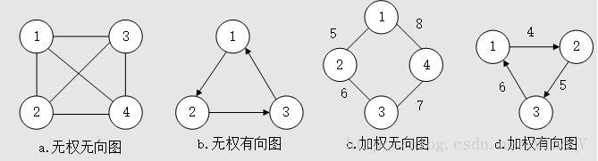
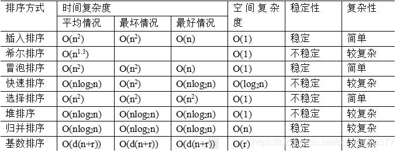

# 算法


## 二叉树

### 创建树

```
创建树的结构体
	struct Treee{
		char val;
		Tree *Lchild = NULL;
		Tree *Rchild = NULL;
	}Tree,*TreeNode;
创建节点//创建单个没有任何连接的节点
	TreeNode createNode(char data){
		TreeNode newNode = (TreeNode)malloc(sizeof(Tree));
		newNode->val = data;
		newNode->Lchild = NULL;
		newNode->Rchild = NULL;
	}
连接节点生成树
	void ConnectNode(TreeNode root,TreeNode Lchild,TreeNode Rchild){
		root->Lchild = Lchild;
		root->Rchild = Rchild;
	}
```


## 图

### 概念



**基本概念**	图就是用线连接在一起的点的集合

**两要素**	边和点

### 创建图

```C++
class Edge;
//节点
class Node {
public:
	int value;//点的值
	int in;//入度
	int out;//出度
	list<Node*> nexts;//由该节点射出的点
	list<Edge*> edges;//由该节点射出的边
	Node(int val) {
		value = val;
		in = 0;out = 0;
	}
};
//边
class Edge {//有向边，无向边可由有向边转化
public:
	int weight;//权重
	Node* from;
	Node* to;
	Edge(int wei,Node* fr,Node* t) {
		weight=wei;
		from = fr;
		to = t;
	}
};
//图
class Graph {
public://int为编号，Node*为结点信息，比如入度、出度
	unordered_map<int, Node*> nodes;
	unordered_set<Edge*> edge;//边的信息
	Graph(){}
};
```


### 搜索

#### 深度优先(DFS)

#### 广度优先(BFS)

#### 拓扑排序

### 最短路径

#### Dijkstra

#### Bellman_fod

#### spfa

#### Floyd

### 最小生成树

#### prim


## 查找


## 排序




### 冒泡排序（Bubble Sort）

```C++
比较相邻的元素。如果第一个比第二个大，就交换他们两个。
对每一对相邻元素作同样的工作，从开始第一对到结尾的最后一对。在这一点，最后的元素应该会是最大的数。
针对所有的元素重复以上的步骤，除了最后一个。
持续每次对越来越少的元素重复上面的步骤，直到没有任何一对数字需要比较。
通过两层循环控制：
第一个循环（外循环），负责把需要冒泡的那个数字排除在外；
第二个循环（内循环），负责两两比较交换。

时负:O(n^2)

void BubbleSort(int* arr,int arr_size){
    for(int i =0;i < arr_size-1;i++){
        for(int j =0;j < arr_size-1-i;j++){
            if(arr[j]<arr[j+1]){
                int temp = arr[j+1];
                arr[j+1] = arr[j];
                arr[j] = temp;
            }
        }
    }
}
```


### 插入排序（Insertion Sort）

```C++
类似扑克牌齐牌方式,把第一个数据当做已排好数据,之后的每一个新数据与之前已有数据比较,小则交换,否则不变

1.从第一个元素开始，该元素可以认为已经被排序
2.取出下一个元素，在已经排序的元素序列中从后向前扫描
3.如果该元素（已排序）大于新元素，将该元素移到下一位置
4.重复步骤3，直到找到已排序的元素小于或者等于新元素的位置
5.将新元素插入到该位置后
6.重复步骤2~5

时间复杂度:	最好情况(n)	最坏情况(n^2)
空间复杂度:	O(1)
稳定性:稳定

void InsertSort(int* arr,int arr_size) {
	for (int i = 0; i < arr_size-1; i++) {
		int end = i;
		int temp = arr[end + 1];
		while (end >= 0) {
			if (temp < arr[end]) {
				arr[end+1] = arr[end];
				end--;
			}

			else break;
		}

		arr[end + 1] = temp;
	}
}
```


### 希尔排序（Shell Sort）

```C++
可理解为分组插排
1.先取一个小于n的整数d1作为第一个增量(一般取n/2)，把文件的全部记录分成d1个组。
2.所有距离为d1的倍数的记录放在同一个组中，在各组内进行直接插入排序。
3.取第二个增量d2小于d1重复上述的分组和排序，直至所取的增量dt=1(dt小于dt-l小于…小于d2小于d1)，即所有记录放在同一组中进行直接插入排序为止

时间复杂度：

void ShellSort(int* arr, int arr_size) {
	int gap = arr_size >> 1;
	while (gap != 0) {
		for (int i = 0; i < arr_size-gap; i++) {
			int end = i;
			int temp = arr[end + gap];
			while (end >= 0) {
				if (temp < arr[end]) {
					arr[end] = arr[end + gap];
					end -= gap;
				}
				else break;
			}
			arr[end + gap] = temp;
		}
		gap >>= 1;
	}
}
```


### 选择排序（Selection Sort）

```C++
首先在未排序序列中找到最小（大）元素，存放到排序序列的起始位置，然后，再从剩余未排序元素中继续寻找最小（大）元素，然后放到已排序序列的末尾。以此类推，直到所有元素均排序完毕。
选择排序的思想其实和冒泡排序有点类似，都是在一次排序后把最小的元素放到最前面，或者将最大值放在最后面。但是过程不同，冒泡排序是通过相邻的比较和交换。而选择排序是通过对整体的选择，每一趟从前往后查找出无序区最小值，将最小值交换至无序区最前面的位置。
void SelectSort(int* arr, int arr_size){
    //标记起始元素位置
    int beg = 0;
    //标记末尾元素位置
    int end = arr_size - 1;
    
    while(beg < end){
        //标记未排序最大,最小元素位置
        int _min = beg,_max = beg;
        
        for(int i =beg+1;i <= end;i++){
            //标记目前最大/最小元素位置
            if(arr[i] < arr[_min])	_min = i;
            if(arr[i] > arr[_max])	_max = i;
        }
        //交换目前已找到最小元素位置
        swap(arr[_min],arr[beg]);
        //若该次遍历没有更大元素,则最小元素位置交换后初始标记最大元素位置已经改变
        if(_max == beg)	_max = _min;
        //交换目前已找到最大元素位置
        swap(arr[_max],arr[end]);
        
        beg++;
        end--;
    }
}
```


### 快速排序（Quick Sort）

```C++
快速排序使用分治法（Divide and conquer）策略来把一个序列（list）分为两个子序列（sub-lists）。

1.从数列中挑出一个元素，称为 “基准”（pivot），
2.重新排序数列，所有元素比基准值小的摆放在基准前面，所有元素比基准值大的摆在基准的后面（相同的数可以到任一边）。在这个分区退出之后，该基准就处于数列的中间位置。这个称为分区（partition）操作。
3递归地（recursive）把小于基准值元素的子数列和大于基准值元素的子数列排序。
递归到最底部时，数列的大小是零或一，也就是已经排序好了。这个算法一定会结束，因为在每次的迭代（iteration）中，它至少会把一个元素摆到它最后的位置去。

void QuickSort(int* arr, int arr_beg, int arr_end) {
    //若未排序数列长度不大于1,则不用排序
	if (arr_beg >= arr_end)	return;
    //标记哨兵元素和序列左右标尺
	int mid = arr_end;
	int left = arr_beg, right = arr_end - 1;
	
	while (left < right) {
        //左侧标尺找大,右侧标尺找小
		if (arr[left] < arr[mid] && left < right)	left++;
		if (arr[right] >= arr[mid] && right > left)	right--;
		
        //左右大小元素位置交换
		swap(arr[left], arr[right]);
	}
    //交换哨兵元素位置
	if (arr[left] >= arr[arr_end])	swap(arr[left], arr[arr_end]);
	else left++;
	
    //递归排序一次快排后的左右序列
	QuickSort(arr, arr_beg, left - 1);
	QuickSort(arr, left + 1, arr_end);
}
```

### 归并排序（Merge Sort）

```C++
归并排序实质是将已有序列依次划分为不同的子序列直到每个序列只有一个元素,然后再根据划分的顺序依次合并为更大的序列知道序列长度与原来序列一致

void MergeSortPort(int* arr,int arr_size){
	int *temp_arr = new int[size(arr)];
    
    if(temp_arr){
        MergeSort(arr,temp_arr,0,arr_size - 1);
        delete temp_arr;
    }
    else cout<<"faild to allocate memory!!!"<<endl;
	
}

void MergeSort(int* arr,int* temp_arr,int left,iright){
	if(left < right){
        //只有数组元素个数大于1时才需要分区
        //找中间点
        int mid = (left + right)/2;
        //递归划分左右半区
        MergeSort(arr,temp_arr,left,mid);
        MergeSort(arr,temp_arr,mid+1,right);
        //合并已划分区域
        Merge(arr,temp_arr,left,right,mid);
    }
}

//合并分区
void Merge(int* arr,int* temp_arr,int left,int right,int mid){
    //分别标记左右半区未合并元素
    int temp_l = left,temp_r = mid+1;
    //临时数组下标
    int temp = left;
    
    //合并元素
   	while (temp_l <= mid && temp_r <= right) {
		if (arr[temp_l] < arr[temp_r])	temp_arr[temp++] = arr[temp_l++];
		else	temp_arr[temp++] = arr[temp_r++];
	}
    //合并左半区剩余元素
    while(temp_l <= mid){
        temp_arr[temp++] = arr[temp_l++];
    }
    //合并右半区剩余元素
    while(temp_r <= right){
        temp_arr[temp++] = arr[temp_r++];
    }
    
    //合并数组
	while (left <= right) {
		arr[left] = temp_arr[left];
		left++;
	}
}
```


### 堆排序（Heap Sort）

```C++
利用完全二叉有序树存储序列,而用数组存储这个二叉树
顺序:建堆->排序->建堆	本质:利用大顶/小顶堆的性质找到最大/最小元素实现排序

//大顶堆或小顶堆
父节点:下标为i的元素其父节点下标为(i-1)/2
左孩子:下标为i的元素其左孩子下标为i*2+1
右孩子:下标为i的元素其右孩子下标为i*2+2

//排序算法入口
void HeapSortPort(int* arr,int arr_size){
   	
    //建堆
    for(int i = (arr_size)/2 - 1;i >= 0; i--){
        HeapCreate(arr,arr_size,i);
    }
    
    //排序
    int n = arr_size - 1;
    while(n>0){
        swap(arr[0],arr[n--]);
        for(int i = (n-1) / 2;i>=0;i--){
            HeapCreate(arr,n+1,i);
        }
    }
}
//以大顶堆为例
void HeapCreate(int* arr,int arr_size,int n){
    //arr_size为数组长度,n为对应操作元素下标
    int target = n;
    int l_son = n*2 + 1;
    int r_son = n*2	+ 2;
    
    //建大顶堆
    if(l_son < arr_size && arr[l_son] > arr[target])	target = l_son;
    if(r_son < arr_size && arr[r_son] > arr[target])	target = r_son;
    
    if(target ){
        swap(arr[target],arr[n]);
    }
    
    HeapCreate(arr,arr_size,target);
}
 
```


### 计数排序（Counting Sort） 

```
统计相同元素出现次数,根据统计的结果将序列回收到原来的序列中,计数排序只适用于范围集中且重复数据较高的数据

实现:通过STL中map容器可实现数组元素的统计
```


